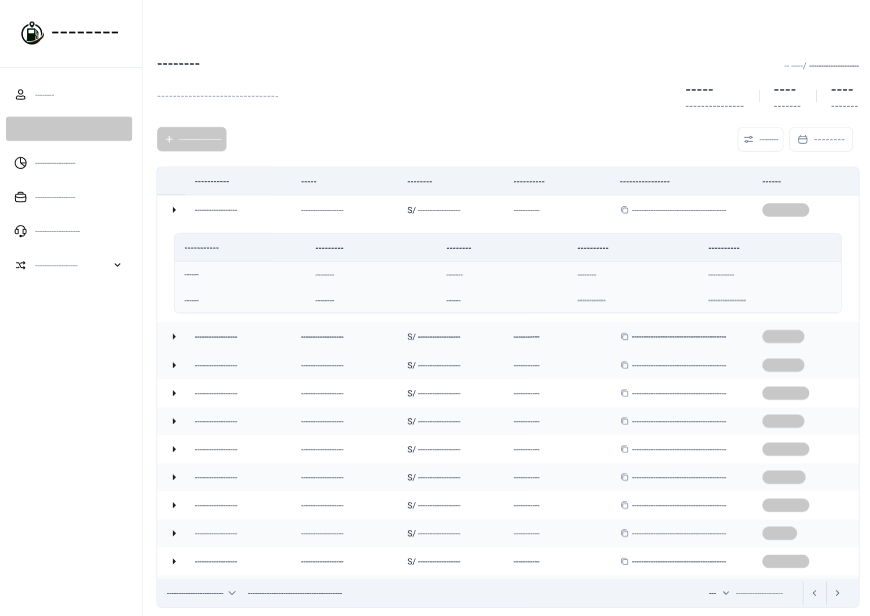
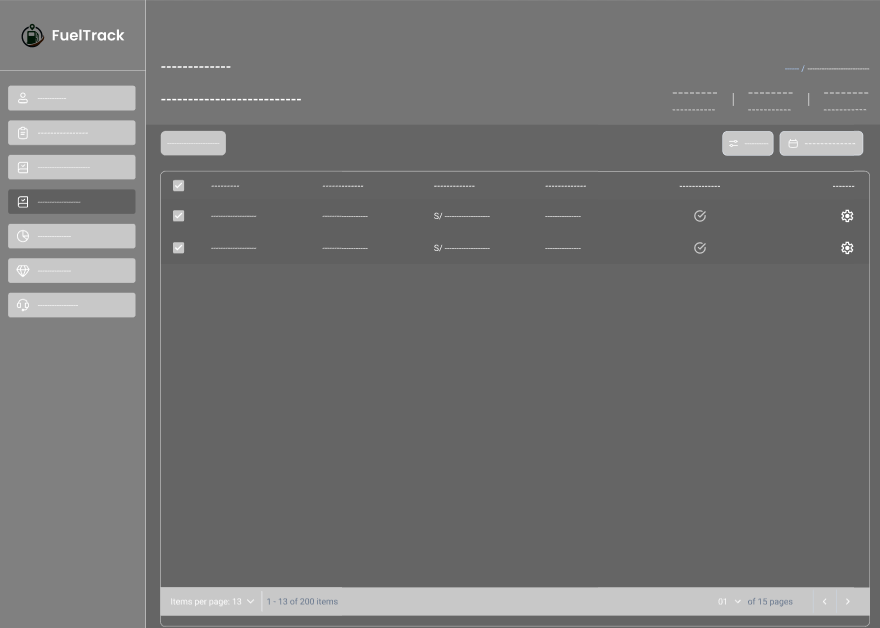
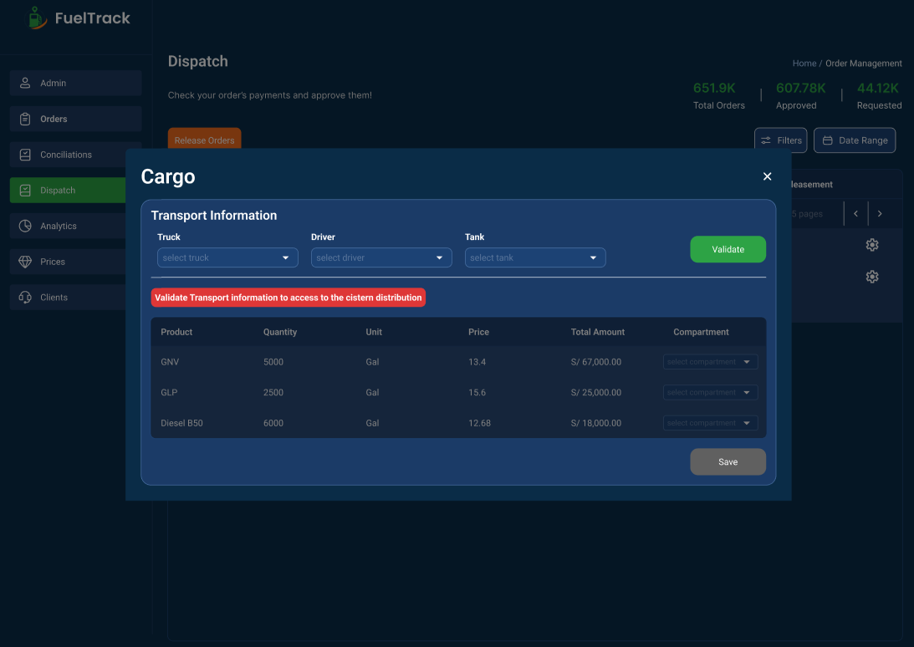

    
  <h2>Informe de Trabajo Final</h2>
  
<strong>Universidad:</strong> Universidad Peruana de Ciencias Aplicadas

  
<strong>Ciclo:</strong> 2025-20

  
<strong>Curso:</strong> Desarrollo de Aplicaciones Open Source

  
<strong>Sección:</strong> 1ASI0729-2520-7394

  
<strong>Profesor:</strong> Hugo Allan Mori Paiva

<h2 align="center">Relación de Integrantes:</h3>

  <table>
    <tr>
      <th><strong>Código</strong></th>
      <th><strong>Apellidos y Nombres</strong></th>
    </tr>
    <tr>
      <td>u202324041</td>
      <td>Giorgio Marzouk Awad Vargas</td>
    </tr>
    <tr>
      <td>u201817507</td>
      <td>Manuel Angel Sanchez Arenas</td>
    </tr>
    <tr>
      <td>u20231c019</td>
      <td>Saul Ortega Muñoz</td>
    </tr>
    <tr>
      <td>u202320684</td>
      <td>Alberto Alejandro Ponce Perales</td>
    </tr>
  </table>

<strong>Mes y Año:</strong> Spetiembre 2025

## Registro de Versiones del Informe

<table border>
  <thead>
    <tr>
      <th><b>Versión</b></th>
      <th><b>Fecha</b></th>
      <th><b>Autores</b></th>
      <th><b>Descripción de Modificación</b></th>
    </tr>
  </thead>
  <tbody>
    <tr>
      <td>TB1</td>
      <td>16/09/2025</td>
      <td>
        - Giorgio Marzouk Awad Vargas  
        - Manuel Ángel Sánchez Arenas  
        - Saul Ortega Muñoz  
        - Alberto Alejandro Ponce Perales
      </td>
      <td>
        Se incluyeron los siguientes capítulos:  
        • Estructura del informe  
        • Capítulo I: Introducción  
        • Capítulo II: Requirements Elicitation & Analysis  
        • Capítulo III: Requirements Specification  
        • Capítulo IV: Product Design  
        • Capítulo V: Product Implementation, Validation & Deployment  
        • Configuración inicial del repositorio y del Landing Page  
        • Aplicación de GitFlow y convenciones de commits
      </td>
    </tr>    
  </tbody>
</table>

## Project Report Collaboration Insights

**Link del repositorio del informe:**  
[https://github.com/1ASI0729-2520-7394-Grupo4/Report](https://github.com/1ASI0729-2520-7394-Grupo4/Report)

**Link del repositorio de la Landing Page:**  
[https://github.com/1ASI0729-2520-7394-Grupo4/landing-page](https://github.com/1ASI0729-2520-7394-Grupo4/landing-page)

**Link de los repositorios de la organización:**  
[https://github.com/orgs/1ASI0729-2520-7394-Grupo4/repositories](https://github.com/orgs/1ASI0729-2520-7394-Grupo4/repositories)

## Contenido

- [Registro de Versiones del Informe](#registro-de-versiones-del-informe)
- [Project Report Collaboration Insights](#project-report-collaboration-insights)
- [Contenido](#contenido)
- [Student Outcome](#student-outcome)
- [Capítulo I: Introducción](#capítulo-i-introducción)
  - [1.1 Startup Profile](#11-startup-profile)
    - [1.1.1 Descripción de la Startup](#111-descripción-de-la-startup)
    - [1.1.2 Perfiles de integrantes del equipo](#112-perfiles-de-integrantes-del-equipo)
  - [1.2 Solution Profile](#12-solution-profile)
    - [1.2.1 Antecedentes y problemática](#121-antecedentes-y-problemática)
    - [1.2.2 Lean UX Process](#122-lean-ux-process)
      - [1.2.2.1 Lean UX Problem Statements](#1221-lean-ux-problem-statements)
      - [1.2.2.2 Lean UX Assumptions](#1222-lean-ux-assumptions)
      - [1.2.2.3 Lean UX Hypothesis Statements](#1223-lean-ux-hypothesis-statements)
      - [1.2.2.4 Lean UX Canvas](#1224-lean-ux-canvas)
  - [1.3 Segmentos objetivo](#13-segmentos-objetivo)
- [Capítulo II: Requirements Elicitation & Analysis](#capítulo-ii-requirements-elicitation--analysis)
  - [2.1 Competidores](#21-competidores)
    - [2.1.1 Análisis competitivo](#211-análisis-competitivo)
    - [2.1.2 Estrategias y tácticas frente a competidores](#212-estrategias-y-tácticas-frente-a-competidores)
  - [2.2 Entrevistas](#22-entrevistas)
    - [2.2.1 Diseño de entrevistas](#221-diseño-de-entrevistas)
    - [2.2.2 Registro de entrevistas](#222-registro-de-entrevistas)
    - [2.2.3 Análisis de entrevistas](#223-análisis-de-entrevistas)
  - [2.3 Needfinding](#23-needfinding)
    - [2.3.1 User Personas](#231-user-personas)
    - [2.3.2 User Task Matrix](#232-user-task-matrix)
    - [2.3.3 User Journey Mapping](#233-user-journey-mapping)
    - [2.3.4 Empathy Mapping](#234-empathy-mapping)
    - [2.3.5 As-is Scenario Mapping](#235-as-is-scenario-mapping)
  - [2.4 Ubiquitous Language](#24-ubiquitous-language)
- [Capítulo III: Requirements Specification](#capítulo-iii-requirements-specification)
  - [3.1 To-Be Scenario Mapping](#31-to-be-scenario-mapping)
  - [3.2 User Stories](#32-user-stories)
  - [3.3 Impact Mapping](#33-impact-mapping)
  - [3.4 Product Backlog](#34-product-backlog)
-[Capítulo IV: Product Design](#capítulo-iv-product-design)
  - [4.1 Style Guidelines](#41-style-guidelines)
    - [4.1.1 General Style Guidelines](#411-general-style-guidelines)
    - [4.1.2 Web Style Guidelines](#412-web-style-guidelines)
  - [4.2 Information Architecture](#43-information-architecture)
    - [4.2.1 Organization Systems](#421-organization-systems)
    - [4.2.2 Labeling System](#422-labeling-system)
    - [4.2.3 SEO Tags and Meta Tags](#423-seo-tags-and-meta-tags)
    - [4.2.4 Searching Systems](#424-searching-systems)
    - [4.2.5 Navigation System](#425-navigation-system)
  - [4.3 Landing Page UI Design](#43-landing-page-ui-design)
    - [4.3.1 Landing Page Wireframe](#431-landing-page-wireframe)
    - [4.3.2 Landing Page Mock-up](#432-landing-page-mock-up)
  - [4.4 Web Applications UX/UI Design](#44-web-applications-uxui-design)
    - [4.4.1 Web Applications Wireframes](#441-web-applications-wireframes)
    - [4.4.2 Web Applications Mock-ups](#442-web-applications-mock-ups)
    - [4.4.3 Web Applications User Flow Diagrams](#443-web-applications-user-flow-diagrams)
  - [4.5 Web Applications Prototyping](#45-web-applications-prototyping)
  - [4.6 Domain-Driven Software Architecture](#46-domain-driven-software-architecture)
    - [4.6.1 Software Architecture Context Diagram](#461-software-architecture-context-diagram)
    - [4.6.2 Software Architecture Container Diagrams](#462-software-architecture-container-diagrams)
    - [4.6.3 Software Architecture Components Diagrams](#463-software-architecture-components-diagrams)
  - [4.7 Software Object-Oriented Design](#47-software-object-oriented-design)
    - [4.7.1 Class Diagrams](#471-class-diagrams)
    - [4.7.2 Class Dictionary](#472-class-dictionary)
  - [4.8 Database Design](#48-database-design)
    - [4.8.1 Database Diagram](#481-database-diagram)
- [Capítulo V: Product Implementation, Validation & Deployment](#capítulo-v-product-implementation-validation--deployment)
  - [5.1 Software Configuration Management](#51-software-configuration-management)
    - [5.1.1 Software Development Environment Configuration](#511-software-development-environment-configuration)
    - [5.1.2 Source Code Management](#512-source-code-management)
    - [5.1.3 Source Code Style Guide & Conventions](#513-source-code-style-guide--conventions)
    - [5.1.4 Software Deployment Configuration](#514-software-deployment-configuration)
  - [5.2 Landing Page, Services & Applications Implementation](#52-landing-page-services--applications-implementation)
    - [5.2.1 Sprint 1](#521-sprint-1)
      - [5.2.1.1 Sprint Planning](#5211-sprint-planning-1)
      - [5.2.1.2 Aspect Leaders and Collaborators](#5212-aspect-leaders-and-collaborators)
      - [5.2.1.3 Sprint Backlog 1](#5213-sprint-backlog-1)
      - [5.2.1.4 Development Evidence for Sprint Review](#5214-development-evidence-for-sprint-review)
      - [5.2.1.5 Execution Evidence for Sprint Review](#5215-execution-evidence-for-sprint-review)
      - [5.2.1.6 Services Documentation Evidence for Sprint Review](#5216-services-documentation-evidence-for-sprint-review)
      - [5.2.1.7 Software Deployment Evidence for Sprint Review](#5217-software-deployment-evidence-for-sprint-review)
      - [5.2.1.8 Team Collaboration Insights during Sprint](#5218-team-collaboration-insights-during-sprint)
  - [5.3. Validation Interviews](#53-validation-interviews)
    - [5.3.1. Diseño de entrevistas](#531-diseño-de-entrevistas)
    - [5.3.2. Registro de entrevistas](#532-registro-de-entrevistas)
    - [5.3.3. Evaluaciones heuristicas](#533-evaluaciones-heuristicas)
  - [5.4. Video About-the-Product](#54-video-about-the-product)
- [Conclusiones](#conclusiones)
- [Bibliografia](#bibliografia)
- [Anexos](#anexos)

## Student Outcome

<table border>
  <thead>
    <tr>
      <th width="25%"><b>Criterio Específico</b></th>
      <th><b>Acciones Realizadas</b></th>
      <th><b>Conclusiones</b></th>
    </tr>
  </thead>
  <tbody>
    <tr>
      <td width="25%"><b>Comunica oralmente con efectividad a rangos de audiencia</b></td>
      <td>
        <b>Giorgio Awad</b> 
        TB1: Para esta entrega, me encargué de redactar las estrategias y tácticas frente a competidores, así como también elaborar el diseño de entrevistas y su respectivo registro. Asimismo, elaboré el User Task     Matrix. 
        <b>Manuel Sanchez</b> 
        TB1: Como el miembro con experiencia en el rubro de venta de combustibles, tuve que detallar la información a mis compañeros para poder compartir una misma visión al hacer nuestra propuesta. 
        <b>Saul Ortega</b> 
        TB1: Para esta entrega, me encargué de realizar entrevistas a usuarios dentro del Lean UX Process, así como también del análisis de la información obtenida. Posteriormente, expuse los hallazgos al equipo y a los stakeholders, adaptando mi comunicación oral al tipo de audiencia para asegurar una comprensión clara y efectiva de los resultados. 
        <b>Alberto Ponce</b> 
        TB1: En esta entrega participé en la recoleccion de las entrevistas, la construcción de las User Personas, definiendo perfiles claros a partir de las entrevistas. También colaboré en la User Task Matrix, priorizando las tareas según frecuencia e importancia. Asimismo, apoyé en el diseño de los User Journey Mapping, destacando puntos de dolor y motivaciones de los usuarios. 
      </td>
      <td>
        Consideramos que la comunicación oral fue aplicada de manera clara y estratégica, logrando exponer hallazgos, transmitir insights y sostener discusiones con efectividad frente a diferentes audiencias. Gracias a ello, se alcanzó una comprensión común del problema y se sentaron bases sólidas para proponer soluciones innovadoras en el marco del Lean UX Process.
      </td>
    </tr>
    <tr>
      <td width="25%"><b>Comunica por escrito con efectividad a diferentes rangos de audiencia</b></td>
      <td>
        <b>Giorgio Awad</b> 
        TB1: Para esta entrega, me encargué de redactar las estrategias y tácticas frente a competidores, así como también elaborar el diseño de entrevistas y su respectivo registro. Asimismo, elaboré el User Task     Matrix.  
        <b>Manuel Sanchez</b> 
        TB1: Para esta entrega le di prioridad a la explicación de nuestra propuesta, problemática, hipótesis, etc. 
        <b>Saul Ortega</b> 
        TB1: Para esta entrega, elaboré reportes y resúmenes de los hallazgos de entrevistas, adaptando el lenguaje y nivel de detalle según la audiencia para asegurar una comunicación escrita clara y efectiva.. 
        <b>Alberto Ponce</b> 
        TB1: Para esta entrega me encargué de redactar y organizar la información de las User Personas. También participé en la documentación del User Task Matrix y del User Journey Mapping, resumiendo hallazgos de manera estructurada. Adapté mi redacción para mantener un lenguaje profesional, preciso y accesible. 
      </td>
      <td>
        La comunicación escrita se utilizó de forma clara y estratégica, adaptando el nivel de detalle y el lenguaje según la audiencia. Esto permitió documentar hallazgos, explicar la problemática y presentar propuestas de manera efectiva, logrando que toda la información fuera comprendida y validada en el marco del Lean UX Process.
      </td>
    </tr>
  </tbody>
</table>

 

# Capítulo I: Introducción

## 1.1 Startup Profile

### 1.1.1 Descripción de la Startup

**FuelTrack**: Startup innovador dedicado a la gestión de la compraventa de combustible entre empresas solicitantes y proveedores. Fundada por estudiantes de la Universidad Peruana de Ciencias Aplicadas, nuestra propuesta se centra en la digitalización de un sector tradicionalmente dependiente de procesos manuales, brindando una solución tecnológica que garantiza eficiencia, transparencia y un control más riguroso de las operaciones. 

**Misión**: Nuestra misión es desarrollar soluciones tecnológicas avanzadas que transformen el mercado de combustible, eliminando los medios informales y reduciendo el margen de error, mediante una plataforma web intuitiva y accesible. 

**Visión**: Nuestra visión es posicionarnos como líderes en la digitalización del sector energético, ofreciendo a las empresas una herramienta que facilite una gestión más eficiente, segura y sostenible, contribuyendo al progreso tecnológico y a la mejora de la competitividad del sector. 

### 1.1.2 Perfiles de integrantes del equipo

<table border>
  <thead>
    <tr>
      <th>Foto</th>
      <th>Nombre completo</th>
      <th>Código</th>
      <th>Carrera</th>
      <th>Habilidades técnicas</th>
    </tr>
  </thead>
  <tbody>
    <tr>
      <td></td>
      <td>Giorgio Marzouk Awad Vargas</td>
      <td>u202324041</td>
      <td>Ingeniería de Software</td>
      <td>Considero ser alguien que aporta ideas nuevas al equipo, que a largo plazo contribuyen con la resolución de cualquier problema que se presente. Asimismo, soy capaz de adaptarme al momento de trabajar en equipo, convirtiéndome en un compañero polifuncional.</td>
    </tr>
    <tr>
      <td></td>
      <td>Manuel Angel Sanchez Arenas</td>
      <td>u201817507</td>
      <td>Ingeniería de Software</td>
      <td>Desarrollo Fullstack: ASP.NetCORE MVC con Razor. Java básico. React.js</td>
    </tr>
    <tr>
      <td></td>
      <td>Saul Ortega Muñoz</td>
      <td>u20231c019</td>
      <td>Ingenieria de Software</td>
      <td>Soy una persona colaborativa y comunicativa, con facilidad para adaptarme a distintos roles y situaciones dentro de un equipo. Me caracterizo por la empatía, la responsabilidad y la organización, cualidades que me permiten aportar soluciones de manera proactiva. </td>
    </tr>
    <tr>
      <td></td>
      <td>Alberto Alejandro Ponce Perales</td>
      <td>u202320684</td>
      <td>Ingeniería de Software</td>
      <td>Estudiante de la carrera de Ingeniería de Software en la UPC. Actualmente cuento con conocimientos en lenguajes de programación como C + + y manejo de Java. Considero que mis mayores virtudes son: la responsabilidad, capacidad de adaptarme, trabajar en equipo y la resiliencia.</td>
    </tr>
  </tbody>
</table>

---

## 1.2 Solution Profile

### 1.2.1 Antecedentes y problemática

- **What? (¿Qué?)**  
  La problemática principal es la falta de un sistema centralizado y digital para gestionar los pedidos de combustible, lo que genera errores humanos, duplicación de esfuerzos y retrasos en las entregas.

- **When? (¿Cuándo?)**  
  El problema se presenta constantemente en el proceso de gestión de pedidos, especialmente cuando hay un alto volumen de solicitudes o múltiples pedidos a coordinar.

- **Where? (¿Dónde?)**  
  El problema ocurre en empresas solicitantes de combustible y proveedores, tanto en áreas urbanas como rurales, donde la infraestructura digital aún no está optimizada.

- **Who? (¿Quién?)**  
  Los principales afectados son las empresas solicitantes (medianas y grandes), los proveedores de combustible y los encargados de la logística y gestión de pedidos.

- **Why? (¿Por qué?)**  
  El problema radica en la falta de integración entre los métodos actuales de gestión (como correos y aplicaciones de mensajería), que dificultan un control centralizado y preciso de los pedidos.

- **How? (¿Cómo?)**  
  Los procesos actuales son desorganizados, utilizando diversas plataformas desconectadas, lo que impide tener un flujo de trabajo eficiente y controlado.

- **How Much? (¿Cuánto?)**  
  La magnitud del problema es considerable, pues cada día se pierden horas valiosas debido a la ineficiencia y los errores, lo que incrementa los costos operativos y puede generar pérdidas económicas significativas.

### 1.2.2 Lean UX Process

Para el desarrollo de FuelTrack, utilizamos el enfoque Lean UX, que nos permite validar nuestras hipótesis, enfocarnos en la experiencia del usuario y reducir riesgos desde las etapas iniciales. A través de prototipos, pruebas con empresas, simulaciones y ciclos de retroalimentación continua, adaptamos nuestra plataforma a las necesidades reales del mercado de combustible.

#### 1.2.2.1 Lean UX Problem Statements
 
**Solicitantes de Combustible (Empresas Compradoras)**
- **Problema:** Empresas de sectores industriales, mineros y de construcción coordinan sus pedidos de combustible mediante canales informales (llamadas, correos, mensajería), lo que genera desorganización, errores y ausencia de trazabilidad. 
- **Impacto:** Incertidumbre sobre el estado de los despachos y posibles interrupciones en sus operaciones debido a errores por mala coordinación.  
- **Riesgo:** La facilidad a la adaptación puede verse afectada si la plataforma no es intuitiva o no se adapta a procesos actuales.  
- **How Might We...?:** ¿Cómo podemos diseñar una experiencia que permita registrar y gestionar pedidos en menos de 3 minutos, con tasa de error <5% y adopción del 80% en el primer mes?  

**Proveedores de Combustible (Empresas Distribuidoras)**
- **Problema:** Gestionan múltiples pedidos, conciliaciones y despachos con procesos manuales, lo que aumenta la carga administrativa (asumida por los operadores del área) y el riesgo de errores logísticos.  
- **Impacto:** Baja eficiencia operativa y menor satisfacción del cliente.  
- **Riesgo:** Posible resistencia a la implementación si los beneficios no son inmediatos.  
- **How Might We...?:** ¿Cómo podemos demostrar que nuestra plataforma reduce el tiempo de gestión en un 40%, disminuye errores logísticos en un 60% y mejora la satisfacción del cliente en +1 punto en encuestas durante los primeros 3 meses?  

#### 1.2.2.2 Lean UX Assumptions

**Business Assumptions (Suposiciones de Negocio)**

* Las empresas están buscando formas de reducir errores y retrasos logísticos para optimizar sus costos operativos.
* Los proveedores estan dispuestos a invertir para mejorar su nivel de servicio y aumentar su competitividad en el mercado.
* Las empresas usuarias apreciarán tener un mayor control sobre sus órdenes y ser capaces de seguirlas en una plataforma centralizada.
* La dificil trazabilidad de los pedidos y las fallas en la comunicación hace que dejar los métodos informales sea una necesidad crítica para todo el sector.

**User Assumptions (Suposiciones de Usuario)**

* *¿Quién es el usuario?*
  Los usuarios principales serían los encargados logísticos de los proovedores y las empresas solicitantes de combustible.
* *¿Dónde encaja nuestro producto en su trabajo o vida?*
  FuelTracks encajaría en el día a día de los usuarios como una plataforma de gestión centralizada, que ayudaría a coordinar, rastrear y organizar pedidos de combustible. Reemplazando así los sistemas no ligados que se utilizan hoy en día.
* *¿Qué problemas tiene nuestro producto que resolver?*
  FuelTracks debe resolver la desorganización causada por métodos informales de venta, reducir errores humanos y mejorar la experiencia del cliente.
* *¿Cuándo y cómo es nuestro producto usado?*
  Será utilizado diariamente por solicitantes y los proveedores por igual. Por el lado de los usuarios solicitantes, usarán la plataforma para registrar y monitorear pedidos de combustible, y por el lado de proveedores para gestionar la recepción, programación y entrega de dichos pedidos.
* *¿Qué características son importantes?*
  El seguimiento de pedidos en tiempo real, actualizaciones de estado mediante notificiaciones, historial de entregas, paneles de control y una interfaz clara y rápida.
* *¿Cómo debe verse nuestro producto y cómo debe comportarse?*
  El producto debe presentar una interfaz limpia y profesional. Adaptada al perfil corporativo de los clientes objetivos. Debe ser eficiente, permitiendo la creación, modificación y seguimiento de pedidos en pocos clics. También debe ser altamente confiable, debido al alto valor y magnitud de las órdenes que se realizarán en la plataforma

**Feature Assumptions**

* Creemos que al proporcionar una plataforma centralizada con trazabilidad en tiempo real, ayudaremos a las empresas a reducir errores y mejorar la eficiencia logística.
* Creemos que al ofrecer una interfaz clara y rápida con funciones de seguimiento, aumentaremos la adopción entre proveedores y solicitantes.
* Creemos que al automatizar la gestión de pedidos, los usuarios reducirán su dependencia de métodos informales y ganarán en control y visibilidad.
* Creemos que al integrar notificaciones en tiempo real sobre estados de pedido, mejoraremos la coordinación entre actores y reduciremos los retrasos.
*  Creemos que al incluir visualización de métricas, facilitaremos la toma de decisiones y la optimización operativa de los proveedores.

#### 1.2.2.3 Lean UX Hypothesis Statements

**Hypothesis Statement 01:**
* *Creemos* que la centralización de los pedidos en nuestra plataforma reducirá el margen de errores causados por problemas de coordinación entre las empresas solicitantes y los proveedores drásticamente.
* *Sabremos* que hemos tenido éxito
* *Cuando* luego de los primeros tres meses de uso se reporte que más de un 70% de los pedidos realizados fueron confirmados sin necesidad de correcciones posteriores.

**Hypothesis Statement 02:**
* *Creemos* que ofrecer más herramientas para el control y seguimiento de pedidos mejorará la satisfacción de los clientes solicitantes.
* *Sabremos* que hemos tenido éxito
* *Cuando* se observe una reducción del 30% en llamadas de seguimiento.

**Hypothesis Statement 03:**
* *Creemos* que la plataforma permitirá a los proveedores optimizar el proceso de gestión de los pedidos y reducir el tiempo que toma cumplir con cada uno.
* *Sabremos* que hemos tenido éxito
* *Cuando* los proveedores logren reducir en un 20% el tiempo promedio entre confirmación y entrega de pedidos.

**Hypothesis Statement 04:**
* *Creemos* que las notificaciones automáticas sobre el estado de los pedidos reducirán la necesidad de una gran cantidad de operadores comerciales de alta disponibilidad.
* *Sabremos* que hemos tenido éxito
* *Cuando* las solicitudes de información por parte de clientes disminuyan en un 40% y el tiempo promedio de atención se reduzca en un 60% tras el primer trimestre de uso.

#### 1.2.2.4 Lean UX Canvas

## 1.3 Segmentos objetivo

**A. Empresas solicitantes de combustible**

Empresas medianas y grandes que requieren de combustible de forma constante para el desarrollo de sus operaciones. Utilizan este recurso para alimentar maquinaria, vehículos o equipos, y buscan procesos más ágiles, ordenados y confiables para su gestión de pedidos. Además, mantienen un contrato de exclusividad con un proveedor de combustible, lo que les permite tener un flujo constante de pedidos y una relación comercial estable.

*Necesidades:*
* Asegurar el abastecimiento oportuno de combustible.
* Reducir errores derivados de la informalidad en los procesos.
* Mantener constante comunicación con proveedores.
  
**B. Proveedores de combustible**
Son empresas dedicadas a la distribución de combustibles, atendiendo principalmente a clientes corporativos o industriales. Buscan herramientas que les permitan, optimizar sus operaciones y diferenciarse en un mercado cada vez más competitivo.

*Motivaciones:*
* Mejorar la experiencia del cliente mediante canales digitales.
* Reducir errores en la entrega por información incompleta o mal gestionada.
* Optimizar la planificación logística y distribución.

# Capítulo II: Requirements Elicitation & Analysis

## 2.1. Competidores.

En el mercado existen diversas soluciones digitales enfocadas en la gestión de combustible y flotas que compiten de manera directa o indirecta con FuelTrack. Entre ellas destaca **Zavgar**, una plataforma SaaS que ayuda a las empresas con flotas vehiculares a optimizar costos y controlar el consumo de combustible. Otro competidor importante es **FuelCloud**, que ofrece una solución integrada de hardware y software para garantizar seguridad y precisión en el despacho de combustible, principalmente en empresas con tanques propios. Finalmente, **Wialon** se presenta como una plataforma internacional de gestión de flotas que combina monitoreo GPS, análisis operativos y control de combustible, dirigida a compañías logísticas y de transporte.

### 2.1.1. Análisis competitivo.

<table border="2">
  <tr>
    <th colspan="6" style="text-align:left">Competitive Analysis Landscape</th>
  </tr>
  <tr>
    <td colspan="1"><strong>¿Por qué llevar a cabo este análisis?</strong></td>
    <td colspan="5">Este análisis se está llevando a cabo porque queremos conocer las ventajas y desventajas de nuestra aplicación frente a la competencia, y cómo nos diferenciamos de ellas.</td>
  </tr>
  <tr>
    <td colspan="2"><strong></strong></td>
    <td><strong>FuelTrack</strong> </td>
    <td><strong>Zavgar</strong> </td>
    <td><strong>FuelCloud</strong> </td>
    <td><strong>Wialon</strong> </td>
  </tr>

  <tr>
    <th rowspan="3">Perfil</th>
    <td><strong>Visión general</strong></td>
    <td>Plataforma web que digitaliza y estructura el proceso completo de pedido de combustible entre empresas y proveedores.</td>
    <td>SaaS para la gestión de consumo de combustible de flotas, con enfoque en eficiencia, monitoreo y costos.</td>
    <td>Solución con hardware/software para el control físico del despacho de combustible.</td>
    <td>Plataforma de gestión de flotas con control de combustible, GPS y reportes operativos.</td>
  </tr>
  <tr>
    <td><strong>Ventaja competitiva</strong></td>
    <td>Especialización en el flujo completo de pedido, despacho y análisis; integración de pagos y logística; UI intuitiva.</td>
    <td>No requiere hardware; ofrece métricas, control de gastos y reportes sobre consumo.</td>
    <td>Control físico preciso del combustible, monitoreo en tiempo real.</td>
    <td>Seguimiento en tiempo real, visualización de rutas, integración con sensores de combustible.</td>
  </tr>
  <tr>
    <td><strong>¿Qué valor ofrece al cliente?</strong></td>
    <td>Trazabilidad total, eficiencia operativa, reportes de consumo y validación segura de pedidos.</td>
    <td>Optimización de costos y control sobre el uso de combustible en flotas.</td>
    <td>Seguridad y precisión operativa en el control de combustible.</td>
    <td>Trazabilidad de flotas, alertas automáticas, análisis de rutas y consumo de combustible.</td>
  </tr>
  <tr>
    <th rowspan="2">Perfil de Marketing</th>
    <td><strong>Mercado objetivo</strong></td>
    <td>Empresas que solicitan combustible a proveedores.</td>
    <td>Empresas con flotas vehiculares que desean monitorear y reducir el consumo de combustible.</td>
    <td>Empresas con tanques de combustible propios.</td>
    <td>Empresas logísticas, distribuidoras y de transporte de combustible.</td>
  </tr>
  <tr>
    <td><strong>Estrategias de marketing</strong></td>
    <td>Alianzas con proveedores, demostraciones de ahorro, marketing de contenido enfocado en eficiencia.</td>
    <td>Enfoque digital, contenido técnico, integración con proveedores de tarjetas de combustible.</td>
    <td>Ferias industriales, distribuidores, venta consultiva entre empresas.</td>
    <td>Alianzas con distribuidores de GPS, marketing técnico, ferias de transporte.</td>
  </tr>
  <tr>
    <th rowspan="3">Perfil de Producto</th>
    <td><strong>Productos & Servicios</strong></td>
    <td>Plataforma para gestión completa de pedidos, seguimiento, reportes, validación y alertas.</td>
    <td>Plataforma web con módulo de abastecimiento, reportes de consumo, integración GPS y tarjetas.</td>
    <td>Hardware IoT y software para gestión, y control de combustible.</td>
    <td>Plataforma SaaS + app móvil con monitoreo, alertas, mapas y módulos personalizables.</td>
  </tr>
  <tr>
    <td><strong>Precios & Costos</strong></td>
    <td>Modelo SaaS con suscripción escalable según volumen y servicios.</td>
    <td>SaaS con modelos por flota activa o vehículos monitoreados.</td>
    <td>Venta e instalación de hardware + licencias de software.</td>
    <td>Modelo SaaS modular, basado en vehículos activos y funcionalidades activadas.</td>
  </tr>
  <tr>
    <td><strong>Canales de distribución</strong></td>
    <td>Web app responsive, potencial app móvil futura.</td>
    <td>Web app, marketing digital y comunidad de flotas.</td>
    <td>Plataforma web + hardware instalado en sitio.</td>
    <td>Red de partners global, distribuidores locales e integradores de sistemas GPS.</td>
  </tr>
  <tr>
    <th rowspan="4">Análisis SWOT</th>
    <td><strong>Fortalezas</strong></td>
    <td>Enfoque especializado, experiencia de usuario optimizada, integraciones clave, análisis avanzado de consumo.</td>
    <td>Implementación ágil, sin hardware, fácil adopción en empresas medianas.</td>
    <td>Control físico riguroso, solución probada en industrias exigentes.</td>
    <td>Plataforma robusta, cobertura internacional, integración con más de 2,400 dispositivos GPS.</td>
  </tr>
  <tr>
    <td><strong>Debilidades</strong></td>
    <td>Nueva en el mercado, menor reconocimiento de marca, necesita consolidar confianza.</td>
    <td>No gestiona el flujo completo del pedido, enfoque parcial en flotas.</td>
    <td>Alto costo, dependencia de hardware, menor adaptabilidad en mercados emergentes.</td>
    <td>No gestiona pedidos entre proveedor y solicitante, requiere configuración técnica inicial.</td>
  </tr>
  <tr>
    <td><strong>Oportunidades</strong></td>
    <td>Alta informalidad en el sector, digitalización creciente en logística, necesidad de trazabilidad y control.</td>
    <td>Mayor conciencia en eficiencia de flotas y digitalización de costos operativos.</td>
    <td>Nuevos mercados industriales con enfoque en seguridad y control.</td>
    <td>Creciente necesidad de control logístico y monitoreo de distribución en países en desarrollo.</td>
  </tr>
  <tr>
    <td><strong>Amenazas</strong></td>
    <td>Aparición de soluciones similares, resistencia al cambio en empresas tradicionales, competencia ERP.</td>
    <td>SaaS especializados con mayor cobertura funcional (ERP, proveedores, logística).</td>
    <td>SaaS ágiles y sin hardware físico, que ofrecen soluciones más accesibles.</td>
    <td>SaaS más específicos y ligeros, enfocados exclusivamente en la trazabilidad de entregas.</td>
  </tr>
</table>

### 2.1.2. Estrategias y tácticas frente a competidores.

**FuelTrack** aplicará diversas estrategias para afrontar la competencia y aprovechar las oportunidades que ofrece el sector.

#### a. Diferenciación a través de especialización
Una de las principales estrategias de **FuelTrack** es la **especialización en el flujo completo de pedido de combustible**. A diferencia de soluciones como **Zavgar**, que están orientadas principalmente al control y análisis del consumo de combustible en flotas, nuestra plataforma se enfoca en las **interacciones B2B** entre empresas solicitantes y proveedores. Esto nos permite ofrecer un control dedicado del pedido, gestión de la logística, y reportes detallados de consumo y entregas, lo cual no está presente en la mayoría de las plataformas competidoras.

- **Táctica**: Desarrollar funcionalidades para la validación automática de pagos, gestión de stock en tiempo real y la optimización del transporte logrando la automatización de procesos que solo eran logrados de forma manual. Esto crea una ventaja frente a competidores como **FuelCloud**, que se centran más en el control físico del combustible y menos en la administración a nivel operativo.

#### b. Innovación en la interfaz de usuario y experiencia

El sistema de **FuelTrack** está diseñado para ofrecer una **experiencia de usuario optimizada**, algo que **Wialon**, **FuelCloud** y la propia **OSINERGMIN** no abordan en sus plataformas. Al ser una solución especializada y dirigida a una tarea específica, podemos dedicar más recursos en crear una interfaz intuitiva y procesos bien definidos brindando comodidad y seguridad a nuestros usuarios.

- **Táctica**: Diseñar una **interfaz intuitiva y consistente** que permita a los usuarios acceder a reportes de consumo, validar pedidos y coordinar logística con facilidad. Además, ofrecer **soporte y formación continua** para asegurar que los usuarios aprovechen al máximo todas las funcionalidades del sistema.

#### c. Flexibilidad en precios y modelo SaaS escalable
El modelo de precios de **FuelTrack** ofrece **planes escalables basados en suscripción**, lo que hace que sea más accesible para medianas y grandes empresas. Esto es más competitivo frente a **Wialon**, que puede no ser una opción viable para empresas que solo requieren una solución de pedidos de combustible. También es más asequible que **FuelCloud**, que requiere una inversión considerable en hardware, instalación y mantenimiento.

- **Táctica**: Ofrecer un modelo de suscripción flexible y **precios competitivos**, con **múltiples niveles de suscripción** adaptados a las necesidades de diferentes empresas. Esto permitirá que empresas de menor tamaño puedan acceder a la plataforma sin comprometer su presupuesto, a la vez que se asegura el crecimiento a largo plazo a medida que la empresa crece.

#### d. Aprovechamiento de la digitalización en la logística
El sector de la logística está experimentando una transformación digital acelerada. **FuelTrack** se aprovechará de esta tendencia buscando la integración de la plataforma con otras soluciones logísticas (como los sistemas de gestión de vehículos o flotas). De esta forma podemos ofrecer una solución más completa y eficiente.

- **Táctica**: Colaborar con empresas de **gestión de flotas** para optimizar el proceso de asignación de vehículos, cisternas y choferes. También se considerará la posibilidad de integrar **sensores IoT** en los camiones de reparto para un control más preciso sobre el combustible transportado y la entrega.

#### e. Expansión hacia mercados internacionales
Si bien **FuelTrack** está inicialmente orientada a empresas locales, el modelo de negocio y la flexibilidad de la plataforma la hacen ideal para expandirse a **mercados internacionales**. Competidores como **Wialon** ya tienen presencia en mercados globales, pero su enfoque en empresas grandes y sus altos costos de implementación pueden ser una barrera para empresas de menor tamaño, limitando su alcance.

- **Táctica**: Iniciar la expansión en mercados emergentes donde la digitalización en la logística es una necesidad creciente. Esto incluirá la **localización de la plataforma** (idioma, moneda, regulaciones locales) para facilitar la adaptabilidad de los nuevos mercados.

## 2.2. Entrevistas.

### 2.2.1. Diseño de entrevistas.

**A. Proveedores de Combustible**

**Preguntas:**

1. ¿Cuál es su cargo dentro de la empresa proveedora?
2. ¿Qué tipos de clientes atienden principalmente (logística, construcción, minería, agroindustria)?
3. ¿Qué volumen de operaciones realizan mensualmente?
4. ¿Cómo gestionan actualmente los pedidos y contratos de sus clientes?
5. ¿Qué problemas han experimentado con los métodos tradicionales (llamadas, correos, planillas)?
6. ¿Utilizan algún software especializado para ventas o logística? 
7. ¿Qué características valoraría más en una plataforma digital para gestionar pedidos?
8. ¿Considera que una solución que centralice cotizaciones, contratos y entregas sería útil para su empresa?
9. ¿Qué tan importante es para ustedes tener reportes históricos y comparativos de ventas?
10. ¿Qué estrategias usan actualmente para fidelizar clientes, y cómo cree que una plataforma como FuelTrack podría apoyarlos?

---

**B. Empresas Solicitantes**

**Preguntas:**

1. ¿Cuál es su cargo en la empresa? 
2. ¿Hace cuánto tiempo trabaja en el sector energético/logístico? 
3. ¿Qué volumen de combustible gestionan aproximadamente al mes? 
4. ¿Cómo gestionan actualmente la compra y control de combustible? 
5. ¿Qué herramientas usan (Excel, llamadas, correos, sistemas propios)? 
6. ¿Cuáles son los principales problemas que enfrentan con su sistema actual?
7. ¿Qué tan importante es para usted contar con trazabilidad en tiempo real? 
8. ¿Qué dispositivos utilizan para gestionar pedidos (PC, móvil, tablet)? 
9. ¿Qué información considera más valiosa al momento de comprar combustible (precio, tiempo de entrega, historial de proveedor, etc.)? 
10. ¿Cómo afecta la falta de transparencia en los precios a sus decisiones de compra? 
11. ¿Le interesaría recibir notificaciones en tiempo real sobre cambios de precio o estado de sus pedidos? 
12. ¿Qué barreras considera que dificultarían implementar una solución digital como FuelTrack en su empresa?

### 2.2.2. Registro de entrevistas

#### **A. Proveedores de Combustible**  

**Entrevista 1**  
- **Nombres:** Wilber Franz
- **Apellidos:** Toledo Mamani
- **Edad:** 26 
- **Distrito:** San Miguel
- **Captura de la entrevista:** 

  

  

- **Duración:** 4 min 30 seg
- **URL de Entrevista:** [Ver video](https://upcedupe-my.sharepoint.com/:v:/g/personal/u202324041_upc_edu_pe/ESQiYkHNmUFCrcIMB9GPSYYBBzVdFlgerQtqhPSVk3u5dg?e=7wfR8G&nav=eyJyZWZlcnJhbEluZm8iOnsicmVmZXJyYWxBcHAiOiJTdHJlYW1XZWJBcHAiLCJyZWZlcnJhbFZpZXciOiJTaGFyZURpYWxvZy1MaW5rIiwicmVmZXJyYWxBcHBQbGF0Zm9ybSI6IldlYiIsInJlZmVycmFsTW9kZSI6InZpZXcifX0%3D)  

**Entrevista 2**  
- **Nombres:** Renato
- **Apellidos:** Calvo
- **Edad:** 25
- **Distrito:** Cercado de Lima
- **Captura de la entrevista:** 

  

  

- **Duración:** 4 min 48 seg
- **URL de Entrevista:** [Ver video](https://upcedupe-my.sharepoint.com/:v:/g/personal/u202324041_upc_edu_pe/Ec1x5o0yCKJHto72auvJEgsBFIOcS5AiCYAoO2uHmkneWA?e=2IR0y1&nav=eyJyZWZlcnJhbEluZm8iOnsicmVmZXJyYWxBcHAiOiJTdHJlYW1XZWJBcHAiLCJyZWZlcnJhbFZpZXciOiJTaGFyZURpYWxvZy1MaW5rIiwicmVmZXJyYWxBcHBQbGF0Zm9ybSI6IldlYiIsInJlZmVycmFsTW9kZSI6InZpZXcifX0%3D)  

**Entrevista 3**  
- **Nombres:** Lewis
- **Apellidos:** Rengifo
- **Edad:** 25
- **Distrito:** Rimac
- **Captura de la entrevista:** 

  

  

- **Duración:** 8 min 22 seg
- **URL de Entrevista:** [Ver video](https://upcedupe-my.sharepoint.com/:v:/g/personal/u202320684_upc_edu_pe/Eeswz4FpSAdCvZIpFVka_U0BnHgqiuY2Qlv81t5EiqkSnA?e=gO3ZmP&nav=eyJyZWZlcnJhbEluZm8iOnsicmVmZXJyYWxBcHAiOiJTdHJlYW1XZWJBcHAiLCJyZWZlcnJhbFZpZXciOiJTaGFyZURpYWxvZy1MaW5rIiwicmVmZXJyYWxBcHBQbGF0Zm9ybSI6IldlYiIsInJlZmVycmFsTW9kZSI6InZpZXcifX0%3D)  

---

#### **B. Empresas Solicitantes**  

**Entrevista 1**  
- **Nombres:** Carlos Alonso
- **Apellidos:** Sampen Navarrete
- **Edad:** 22
- **Distrito:** Magdalena
- **Captura de la entrevista:**

  

  

- **Duración:** 4 min 51 seg
- **URL de Entrevista:** [Ver video](https://upcedupe-my.sharepoint.com/:v:/g/personal/u20231c019_upc_edu_pe/EZ_nhGYmv_tMu4-N8jyqtqkBm_HUypEjcf-g4nklT0b2Rg?nav=eyJyZWZlcnJhbEluZm8iOnsicmVmZXJyYWxBcHAiOiJTdHJlYW1XZWJBcHAiLCJyZWZlcnJhbFZpZXciOiJTaGFyZURpYWxvZy1MaW5rIiwicmVmZXJyYWxBcHBQbGF0Zm9ybSI6IldlYiIsInJlZmVycmFsTW9kZSI6InZpZXcifX0%3D&e=rVonNr)  

**Entrevista 2**  
- **Nombres:** Franccesco
- **Apellidos:** Cruzate
- **Edad:** 22
- **Distrito:** Magdalena
- **Captura de la entrevista:**

  

- **Duración:** 3 min 22 seg
- **URL de Entrevista:** [Ver video](https://upcedupe-my.sharepoint.com/:v:/g/personal/u20231c019_upc_edu_pe/EZ-HXJ3KuiNFoXwUPpJYd70BIurcLECXami-EhvDLMZs0Q?nav=eyJyZWZlcnJhbEluZm8iOnsicmVmZXJyYWxBcHAiOiJTdHJlYW1XZWJBcHAiLCJyZWZlcnJhbFZpZXciOiJTaGFyZURpYWxvZy1MaW5rIiwicmVmZXJyYWxBcHBQbGF0Zm9ybSI6IldlYiIsInJlZmVycmFsTW9kZSI6InZpZXcifX0%3D&e=FScLB9) 

**Entrevista 3**
- **Nombres:**  Enrique
- **Apellidos:**  Gutierrez
- **Edad:**  25
- **Distrito:** Santiago de Surco
- **Captura de la entrevista:**

  

- **Duración:** 5 min y 26 seg
- **URL de Entrevista:** [Ver video](https://upcedupe-my.sharepoint.com/:v:/g/personal/u202320684_upc_edu_pe/EZkjSGSfpKxEre5gwdhpUYgBjye3ZmSvOHd4aX2o6a6t9A?e=TJqLEt&nav=eyJyZWZlcnJhbEluZm8iOnsicmVmZXJyYWxBcHAiOiJTdHJlYW1XZWJBcHAiLCJyZWZlcnJhbFZpZXciOiJTaGFyZURpYWxvZy1MaW5rIiwicmVmZXJyYWxBcHBQbGF0Zm9ybSI6IldlYiIsInJlZmVycmFsTW9kZSI6InZpZXcifX0%3D)

### 2.2.3. Análisis de entrevistas

#### **A. Proveedores de Combustible**

#### Características Objetivas
| Característica         | Entrevista 1                                                                                   | Entrevista 2                                                                 | Entrevista 3 |
|-------------------------|------------------------------------------------------------------------------------------------|------------------------------------------------------------------------------|--------------|
| Gestión de pedidos      | Correos electrónicos y llamadas; pedidos registrados en base de datos interna; contratos en PDF | Llamadas telefónicas y correos electrónicos; contratos en PDF y Excel.       |          Pedidos gestionados por CRM, pero con interacción limitada con otras áreas.    |
| Herramientas usadas     | Software básico para facturación e inventario; no unificado para pedidos.                      | ERP básico para facturación; no adaptado a pedidos/logística.               |         CRM para clientes e inventario; falta integración completa de procesos.     |
| Pasos del proceso       | Cliente solicita → registro en base interna → contratos en PDF → coordinación manual → entrega | Cliente solicita → registro en Excel/PDF → coordinación telefónica → entrega |       Cliente solicita → registro en CRM → validación manual → entrega.       |
| Validación de stock     | Inventario controlado en software básico, pero no integrado al pedido.                         | No en tiempo real; se hace manualmente con reportes internos.               |        Validación en CRM, pero datos limitados y no integrados.      |
| Seguimiento de pedidos  | Seguimiento manual fuera del sistema; visibilidad limitada.                                    | No hay trazabilidad en tiempo real; depende de llamadas y correos.          |        Limitado a reportes internos del CRM; sin alertas automáticas.      |
| Conciliación de pagos   | Hecha con software de facturación, pero requiere cruce manual.                                 | Hecha con ERP y conciliación manual entre facturas y entregas.              |       Conciliación parcial en CRM, requiere validación externa.       |

#### Características Subjetivas
| Aspecto                       | Entrevista 1                                                                                   | Entrevista 2                                                                 | Entrevista 3 |
|--------------------------------|------------------------------------------------------------------------------------------------|------------------------------------------------------------------------------|--------------|
| Frustraciones principales      | Ineficiencia, pérdida de información, dificultad para rastrear pedidos.                        | Pérdida de correos, duplicidad de pedidos, falta de control en tiempo real.  |        Información dispersa en múltiples fuentes; alto trabajo manual.      |
| Percepción del proceso actual  | Demasiado manual; consume tiempo que podría dedicarse al cliente.                              | Manual, lento y propenso a errores.                                          |            Poco integrado; requiere doble registro y seguimiento manual.  |
| Deseo de mejoras               | Visibilidad en tiempo real, unificación de contratos, cotizaciones y entregas.                 | Historial centralizado, pedidos directos en plataforma, seguimiento entregas |        Integración total del CRM con métricas, notificaciones y trazabilidad completa.      |
| Disposición a integrar plataforma | Muy alta; lo ven como invaluable para eficiencia y fidelización.                               | Alta; consideran que ahorraría tiempo y reduciría errores.                   |       Alta; consideran que aumentaría la productividad y liberaría recursos humanos.       |

#### **B. Empresas Solicitantes**

#### Características Objetivas
<table border>
  <thead>
    <tr>
      <th>Característica</th>
      <th>Entrevista 1</th>
      <th>Entrevista 2</th>
      <th>Entrevista 3</th>
    </tr>
  </thead>
  <tbody>
    <tr>
      <td>Cargo/Rol</td>
      <td>Asistente de operaciones</td>
      <td>Jefe de operaciones de flota</td>
      <td>Responsable de logística</td>
    </tr>
    <tr>
      <td>Nivel educativo</td>
      <td>Educacion superior</td>
      <td>Educación superior</td>
      <td>Educación superior</td>
    </tr>
    <tr>
      <td>Herramientas principales</td>
      <td>Excel, llamadas y correos electronicos</td>
      <td>Excel, correos, llamadas, WhatsApp</td>
      <td>Hojas de cálculo y sistema parcial de control de inventario</td>
    </tr>
    <tr>
      <td>Medio actual de solicitud</td>
      <td>Pedidos a proveedores por llamadas/correos</td>
      <td>Pedidos coordinados por correo/llamadas, incidencias por WhatsApp</td>
      <td>Solicitudes vía sistema interno y correos electrónicos</td>
    </tr>
    <tr>
      <td>Validación de pedidos</td>
      <td>Se revisa manualmente en Excel (vales, facturas, consumo por vehículo)</td>
      <td>Control de consumos, rendimientos y asignaciones en Excel</td>
      <td>Validación parcial en sistema interno, pero con registros manuales complementarios</td>
    </tr>
    <tr>
      <td>Autorización de pagos</td>
      <td>Implícito, depende de la revisión manual (no hay un sistema claro)</td>
      <td>No especificado, ligado a reportes consolidados</td>
      <td>Proceso manual con revisión del área administrativa</td>
    </tr>
    <tr>
      <td>Reportes de consumo</td>
      <td>Consolidados en Excel (proceso lento, con riesgo de errores)</td>
      <td>Reportes semanales en Excel, con retrasos y errores manuales</td>
      <td>Reportes mensuales en sistema interno + Excel; visibilidad limitada</td>
    </tr>
  </tbody>
</table>

#### Características Subjetivas
<table border>
  <thead>
    <tr>
      <th>Aspecto</th>
      <th>Entrevista 1</th>
      <th>Entrevista 2</th>
      <th>Entrevista 3</th>
    </tr>
  </thead>
  <tbody>
    <tr>
      <td>Frustración con métodos manuales</td>
      <td>Alta: errores de transcripción y tiempo perdido al consolidar datos</td>
      <td>Alta: errores manuales, reportes retrasados, difícil seguimiento</td>
      <td>Alta: duplicación de registros y procesos lentos</td>
    </tr>
    <tr>
      <td>Problemas con retrasos/entregas incompletas</td>
      <td>Sí: falta de trazabilidad genera confusión</td>
      <td>Sí: poca velocidad de información en tiempo real</td>
      <td>Sí: errores en consolidación generan entregas tardías</td>
    </tr>
    <tr>
      <td>Importancia de trazabilidad</td>
      <td>Muy alta: permite actuar de inmediato ante problemas o retrasos</td>
      <td>Muy alta: clave para prevenir pérdidas y planificar mejor</td>
      <td>Muy alta: consideran esencial para eficiencia y control</td>
    </tr>
    <tr>
      <td>Deseo de mejoras (automatización/plataforma centralizada)</td>
      <td>Sí: interés en trazabilidad en tiempo real y notificaciones automáticas</td>
      <td>Sí: alertas en tiempo real y sistema centralizado</td>
      <td>Sí: integración completa con proveedores y transparencia en precios</td>
    </tr>
    <tr>
      <td>Percepción de informalidad en proceso actual</td>
      <td>Dependencia de métodos manuales y poca transparencia en precios</td>
      <td>Uso de WhatsApp, falta de integración y sistema central</td>
      <td>Consideran que los procesos actuales son poco confiables y dispersos</td>
    </tr>
  </tbody>
</table>

## 2.3. Needfinding.

### 2.3.1. User Personas.

#### A. Proveedores de Combustible

  

#### B. Empresas Solicitantes

  

 

### 2.3.2. User Task Matrix.

<table border>
  <thead>
    <tr>
      <th>Tarea</th>
      <th>Carlos Herrera – Frecuencia</th>
      <th>Carlos Herrera – Importancia</th>
      <th>David Torres – Frecuencia</th>
      <th>David Torres – Importancia</th>
    </tr>
  </thead>
  <tbody>
    <tr>
      <td>Revisar nivel de stock de combustible</td>
      <td>Alta</td>
      <td>Muy alta</td>
      <td>Media</td>
      <td>Alta</td>
    </tr>
    <tr>
      <td>Realizar pedido de combustible</td>
      <td>Alta</td>
      <td>Muy alta</td>
      <td>Media</td>
      <td>Alta</td>
    </tr>
    <tr>
      <td>Validar confirmación de pedido</td>
      <td>Alta</td>
      <td>Muy alta</td>
      <td>Alta</td>
      <td>Alta</td>
    </tr>
    <tr>
      <td>Hacer seguimiento a la entrega</td>
      <td>Alta</td>
      <td>Muy alta</td>
      <td>Media</td>
      <td>Media</td>
    </tr>
    <tr>
      <td>Supervisar descarga y recepción</td>
      <td>Media</td>
      <td>Alta</td>
      <td>Baja</td>
      <td>Media</td>
    </tr>
    <tr>
      <td>Evaluar proceso post-servicio</td>
      <td>Media</td>
      <td>Alta</td>
      <td>Media</td>
      <td>Alta</td>
    </tr>
    <tr>
      <td>Gestionar atención al cliente</td>
      <td>Media</td>
      <td>Alta</td>
      <td>Alta</td>
      <td>Muy alta</td>
    </tr>
    <tr>
      <td>Revisar encuestas o feedback</td>
      <td>Baja</td>
      <td>Media</td>
      <td>Alta</td>
      <td>Muy alta</td>
    </tr>
  </tbody>
</table>

### 2.3.3. User Journey Mapping.

Para el solicitante, el proceso inicia con la emisión de un pedido a través de correo electrónico o llamada telefónica. Posteriormente, se realiza la verificación manual del depósito, se espera la aprobación del proveedor, se coordina el despacho y, finalmente, la entrega queda registrada de forma manual.

En el caso del proveedor, el recorrido comienza con la recepción del pedido, seguido por la revisión del estado de cuenta del cliente. Después se aprueba el pedido de manera manual, se asigna la planta y el vehículo correspondiente, y en diversas ocasiones es necesario reprogramar la entrega debido a inconvenientes de disponibilidad.

a. User Persona 1: Empresas solicitantes de combustible

b. User Persona 2: Proveedores de combustible

### 2.3.4. Empathy Mapping.
**User Persona 1: Carlos Herrera**

**User Persona 2: David Torres**

### 2.4. Big Picture Event Storming

## 2.5. Ubiquitous Language.

<table border="1">
  <thead>
    <tr>
      <th>Término</th>
      <th>Definición</th>
      <th>Segmentos relacionados</th>
    </tr>
  </thead>
  <tbody>
    <tr>
      <td><strong>Requester (Solicitante)</strong></td>
      <td>Usuario representante de una empresa que requiere abastecimiento de combustible</td>
      <td>Solicitante</td>
    </tr>
    <tr>
      <td><strong>Supplier (Proveedor)</strong></td>
      <td>Empresa que ofrece combustibles al por mayor y compite mediante precios, descuentos y promociones.</td>
      <td>Proveedor</td>
    </tr>
    <tr>
      <td><strong>Fuel (Combustible)</strong></td>
      <td>Recurso energético que es ofertado por los proveedores. Ejemplos: gasohol, diésel, GNV.</td>
      <td>Solicitante, Proveedor</td>
    </tr>
    <tr>
      <td><strong>Plant (Planta)</strong></td>
      <td>Punto de distribución del combustible perteneciente a al proveedor.</td>
      <td>Solicitante, Proveedor</td>
    </tr>
    <tr>
      <td><strong>Price per gallon (Precio por galón)</strong></td>
      <td>Valor económico que el proveedor establece por cada galón de combustible. Puede variar según planta, tipo de combustible, etc.</td>
      <td>Solicitante, Proveedor</td>
    </tr>
    <tr>
      <td><strong>Discount (Descuento)</strong></td>
      <td>Reducción aplicada sobre el precio ofrecido, ya sea por volumen, fidelización u otras condiciones.</td>
      <td>Solicitante, Proveedor</td>
    </tr>
    <tr>
      <td><strong>Quotation (Cotización)</strong></td>
      <td>Propuesta formal que un proveedor genera detallando precios, productos, entre otras condiciones</td>
      <td>Solicitante, Proveedor</td>
    </tr>
    <tr>
      <td><strong>Price Table (Tabla de precios)</strong></td>
      <td>Grilla o tabla que muestra los precios ofrecidos por planta, proveedor y tipo de combustible.</td>
      <td>Solicitante</td>
    </tr>
    <tr>
      <td><strong>Negotiation (Negociación)</strong></td>
      <td>Intercambio de condiciones entre solicitante y proveedor para alcanzar un acuerdo favorable para ambas partes.</td>
      <td>Solicitante, Proveedor</td>
    </tr>
    <tr>
      <td><strong>Consumption Volume (Volumen de consumo)</strong></td>
      <td>Cantidad de combustible estimada que una empresa solicita regularmente en un periodo determinado.</td>
      <td>Solicitante</td>
    </tr>
    <tr>
      <td><strong>Purchase History (Historial de compras)</strong></td>
      <td>Registro de cotizaciones y compras o pedidos previos hechos por el solicitante dentro del sistema.</td>
      <td>Solicitante</td>
    </tr>
  </tbody>
</table>

# Capitulo III: Requirements Specifications

## 3.1 User Stories

<table border>
  <thead>
    <tr>
      <th>User Story ID</th>
      <th>Título</th>
      <th>Descripción</th>
      <th>Criterios de Aceptación</th>
      <th>Epic ID</th>
    </tr>
  </thead>
  <tbody>
    <tr>
      <td>US01</td>
      <td>Ver sección Home</td>
      <td>Como visitante (proveedor), quiero ver una sección de inicio que resuma el valor de FuelTrack para comprender rápidamente el objetivo del sistema.</td>
      <td><b>Escenario 1: Visualización de resumen del sistema</b>   Dado que el visitante (proveedor) accede al sitio web, Cuando se encuentra en la sección Home, Entonces puede ver un resumen claro del sistema.  <b>Escenario 2: Acceso a call to action desde Home</b>   Dado que el visitante (proveedor) revisa la sección Home, Cuando desliza hacia abajo, Entonces encuentra un botón que lo invita a conocer más sobre FuelTrack.</td>
      <td>EP01</td>
    </tr>
    <tr>
      <td>US02</td>
      <td>Ver sección About Us</td>
      <td>Como visitante de ambos segmentos, quiero conocer quiénes están detrás de FuelTrack para confiar en el sistema.</td>
      <td><b>Escenario 1: Información visible del equipo</b>   Dado que el visitante de ambos segmentos accede a About Us, Cuando se carga la sección, Entonces puede leer una descripción del equipo detrás del sistema.  <b>Escenario 2: Ver valores o misión</b>   Dado que el visitante de ambos segmentos revisa la sección completa, Cuando llega al final del contenido, Entonces puede conocer los valores o misión de la empresa.</td>
      <td>EP01</td>
    </tr>
    <tr>
      <td>US03</td>
      <td>Ver sección How it works?</td>
      <td>Como visitante de ambos segmentos, quiero entender cómo funciona FuelTrack paso a paso para evaluar si se ajusta a mis necesidades.</td>
      <td><b>Escenario 1: Comprensión del flujo de pedidos</b>   Dado que el visitante de ambos segmentos accede a How it works?, Cuando lee la sección, Entonces entiende el flujo de pedido desde solicitud hasta entrega.  <b>Escenario 2: Interacción clara entre usuarios</b>   Dado que el visitante de ambos segmentos busca claridad, Cuando revisa la sección, Entonces puede comprender cómo interactúan solicitante y proveedor.</td>
      <td>EP01</td>
    </tr>
    <tr>
      <td>US04</td>
      <td>Enviar mensaje de contacto</td>
      <td>Como visitante de ambos segmentos, quiero enviar un mensaje desde Contact Us para solicitar más información.</td>
      <td><b>Escenario 1: Envío exitoso de mensaje</b>   Dado que el visitante de ambos segmentos completa el formulario correctamente, Cuando presiona “Enviar”, Entonces el mensaje es registrado para revisión.  <b>Escenario 2: Validación de campos obligatorios</b>   Dado que el visitante de ambos segmentos deja campos vacíos, Cuando intenta enviar el formulario, Entonces el sistema muestra una advertencia.  <b>Escenario 3: Confirmación visual del envío</b>   Dado que el visitante de ambos segmentos envía el formulario exitosamente, Cuando el mensaje es registrado, Entonces recibe una confirmación visual o notificación.</td>
      <td>EP01</td>
    </tr>
    <tr>
      <td>US05</td>
      <td>Registrar nuevo pedido</td>
      <td>Como solicitante, quiero registrar un pedido con tipo y cantidad de combustible para que el proveedor lo procese.</td>
      <td><b>Escenario 1: Registro exitoso del pedido</b>   Dado que el solicitante accede al formulario de pedidos, Cuando completa los campos requeridos, Entonces puede enviar un nuevo pedido.  <b>Escenario 2: Validación de campos</b>   Dado que el solicitante deja un campo obligatorio vacío, Cuando intenta enviar el pedido, Entonces el sistema muestra un mensaje de error.  <b>Escenario 3: Confirmación del cambio de estado</b>   Dado que el solicitante envió el pedido, Cuando el proveedor lo aprueba, Entonces su estado se actualiza automáticamente.</td>
      <td>EP02</td>
    </tr>
    <tr>
      <td>US06</td>
      <td>Consultar estado del pedido</td>
      <td>Como solicitante, quiero ver el estado de mis pedidos para saber si están aprobados, en tránsito o entregados.</td>
      <td><b>Escenario 1: Consulta de estado en el panel</b>   Dado que el solicitante accede a su panel, Cuando revisa la lista de pedidos, Entonces ve el estado actualizado.  <b>Escenario 2: Actualización dinámica de estado</b>   Dado que el solicitante está visualizando el panel de pedidos, Cuando el pedido cambia de estado, Entonces el cambio se refleja correctamente al recargar el panel.</td>
      <td>EP02</td>
    </tr>
    <tr>
      <td>US07</td>
      <td>Confirmar recepción de pedido</td>
      <td>Como solicitante, quiero confirmar que recibí el pedido para que el proveedor lo cierre.</td>
      <td><b>Escenario 1: Confirmación exitosa de recepción</b>   Dado que el solicitante recibió el pedido, Cuando lo confirma en el sistema, Entonces su estado cambia a “Despachado”.  <b>Escenario 2: Prevención de doble confirmación</b>   Dado que el solicitante ya confirmó la entrega, Cuando intenta volver a confirmar, Entonces el sistema bloquea la acción y notifica al usuario.</td>
      <td>EP02</td>
    </tr>
    <tr>
      <td>US08</td>
      <td>Registrar información de pago</td>
      <td>Como solicitante, quiero ingresar la información de los pagos correspondientes para validar el pedido ante el proveedor.</td>
      <td><b>Escenario 1: Registro exitoso de depósitos</b>   Dado que el solicitante ingresa la información depósitos, Cuando registra el pedido, Estos quedan vinculados a el.  <b>Escenario 2: Validación del formulario de ingreso de depósitos</b>   Dado que el solicitante intenta los datos del depósito, Cuando excede el límite de caracteres, Entonces el sistema muestra un mensaje de error.  <b>Escenario 3: Validación de depósitos ya registrados</b>   Dado que el solicitante ingresa un depósito con un número de operación repetido, Cuando intenta seguir con el registro, Entonces el sistema notifica el error.</td>
      <td>EP02</td>
    </tr>
    <tr>
      <td>US09</td>
      <td>Ver historial de pedidos</td>
      <td>Como solicitante, quiero ver mis pedidos anteriores para tener control sobre mi consumo.</td>
      <td><b>Escenario 1: Visualización del historial</b>   Dado que el solicitante accede al historial, Cuando se listan los pedidos, Entonces puede ver fecha, tipo y estado de cada uno.  <b>Escenario 2: Historial vacío</b>   Dado que el solicitante aún no ha realizado pedidos, Cuando accede al historial, Entonces se muestra un mensaje informativo.  <b>Escenario 3: Acceso a detalles desde historial</b>   Dado que el solicitante ve la lista de pedidos anteriores, Cuando selecciona uno, Entonces puede revisar sus detalles.</td>
      <td>EP02</td>
    </tr>
    <tr>
      <td>US10</td>
      <td>Ver pedidos pendientes</td>
      <td>Como proveedor, quiero ver todos los pedidos pendientes para analizarlos y tomar acción.</td>
      <td><b>Escenario 1: Listado de pedidos pendientes</b>   Dado que el proveedor accede al panel, Cuando ve los pedidos pendientes, Entonces puede revisar sus detalles básicos.  <b>Escenario 2: Filtro por fechas o cliente</b>   Dado que el proveedor tiene muchos pedidos, Cuando aplica filtros por fecha o empresa, Entonces puede localizar los pedidos relevantes.</td>
      <td>EP03</td>
    </tr>
    <tr>
      <td>US11</td>
      <td>Aprobar pedido</td>
      <td>Como proveedor, quiero aprobar pedidos según los depósitos hechos a mis cuentas bancarias.</td>
      <td>
        <b>Escenario 1: Aprobación de pedido con depósitos válidos</b> 
        Dado que el proveedor tiene el pago completo del pedido, 
        Cuando intenta lo aprueba, 
        Entonces el estado cambia a “Aprobado”.  
        <b>Escenario 2: No aprobar el pedido por pago incompleto</b> 
        Dado que el proveedor no cuenta con los depósitos suficientes para completar el pago del pedido, 
        Cuando intenta aprobarlo, 
        Entonces se muestra un mensaje indicando que el pedido no fue pagado por completo.  
      </td>
      <td>EP03</td>
    </tr>
    <tr>
      <td>US12</td>
      <td>Marcar pedido como despachado</td>
      <td>Como proveedor, quiero marcar cuándo un pedido sale a entrega para notificar al cliente.</td>
      <td>
        <b>Escenario 1: Despacho exitoso de un pedido</b> 
        Dado que el proveedor tiene un pedido aprobado, 
        Cuando marca el pedido como despachado, 
        Entonces el estado cambia a “Despachado”.  
        <b>Escenario 2: Restricción de despacho sin aprobación previa</b> 
        Dado que el proveedor intenta despachar un pedido sin pasar por la liberación correspondiente, 
        Cuando ejecuta la acción, 
        Entonces el sistema impide el cambio de estado y muestra un mensaje.  
      </td>
      <td>EP03</td>
    </tr>
    <tr>
      <td>US13</td>
      <td>Cerrar pedido</td>
      <td>Como proveedor, quiero cerrar el pedido cuando el cliente confirme la entrega para finalizar el proceso.</td>
      <td>
        <b>Escenario 1: Cierre correcto del pedido tras confirmación</b> 
        Dado que el solicitante ya confirmó la entrega, 
        Cuando el proveedor cierra el pedido, 
        Entonces este no puede modificarse más.  
        <b>Escenario 2: Intento de cierre sin confirmación previa</b> 
        Dado que el proveedor intenta cerrar el pedido, 
        Cuando el solicitante aún no ha confirmado la entrega, 
        Entonces el sistema impide esta acción.  
      </td>
      <td>EP03</td>
    </tr>
    <tr>
      <td>US14</td>
      <td>Generar reporte de ventas</td>
      <td>Como proveedor, quiero generar reportes de ventas para tener registro de operaciones realizadas.</td>
      <td>
        <b>Escenario 1: Generación de reporte con datos disponibles</b> 
        Dado que el proveedor selecciona un rango de fechas válido, 
        Cuando solicita el reporte, 
        Entonces se genera un archivo con los datos de ventas.  
        <b>Escenario 2: Generación sin datos en el rango</b> 
        Dado que el proveedor selecciona un rango sin ventas, 
        Cuando solicita el reporte, 
        Entonces el sistema informa que no hay resultados.  
        <b>Escenario 3: Descarga del archivo generado</b> 
        Dado que el reporte se genera correctamente, 
        Cuando finaliza el proceso, 
        Entonces el proveedor puede descargar el archivo.  
      </td>
      <td>EP03</td>
    </tr>
    <tr>
      <td>US15</td>
      <td>Iniciar sesión</td>
      <td>Como usuario registrado, quiero iniciar sesión con correo y contraseña para acceder a mi cuenta.</td>
      <td>
        <b>Escenario 1: Inicio de sesión exitoso</b> 
        Dado que el usuario registrado ingresa credenciales válidas, 
        Cuando presiona iniciar sesión, 
        Entonces accede a su dashboard.  
        <b>Escenario 2: Error por credenciales incorrectas</b> 
        Dado que el usuario registrado ingresa datos incorrectos, 
        Cuando intenta iniciar sesión, 
        Entonces el sistema muestra un mensaje de error.  
        <b>Escenario 3: Validación de campos vacíos</b> 
        Dado que el usuario deja campos vacíos, 
        Cuando intenta iniciar sesión, 
        Entonces el sistema solicita completar los campos.  
      </td>
      <td>EP04</td>
    </tr>
    <tr>
      <td>US16</td>
      <td>Recuperar contraseña</td>
      <td>Como usuario registrado, quiero recuperar mi contraseña para volver a acceder si la olvidé.</td>
      <td>
        <b>Escenario 1: Envío de enlace de recuperación</b> 
        Dado que el usuario registrado ingresa su correo válido, 
        Cuando solicita recuperación, 
        Entonces recibe un enlace al correo.  
        <b>Escenario 2: Error por correo no registrado</b> 
        Dado que el usuario ingresa un correo inexistente, 
        Cuando solicita recuperación, 
        Entonces se le informa que el correo no está registrado.  
        <b>Escenario 3: Validación de campo vacío</b> 
        Dado que el usuario no completa el campo de correo, 
        Cuando intenta enviar la solicitud, 
        Entonces el sistema solicita completarlo.  
      </td>
      <td>EP04</td>
    </tr>
    <tr>
      <td>US17</td>
      <td>Cerrar sesión</td>
      <td>Como usuario registrado, quiero poder cerrar sesión para mantener segura mi cuenta.</td>
      <td>
        <b>Escenario 1: Cierre exitoso de sesión</b> 
        Dado que el usuario está autenticado, 
        Cuando selecciona “Cerrar sesión”, 
        Entonces la sesión se finaliza y es redirigido al login.  
        <b>Escenario 2: Confirmación de cierre de sesión</b> 
        Dado que el usuario cierra sesión, 
        Cuando termina la acción, 
        Entonces el sistema muestra un mensaje de despedida o confirmación.  
      </td>
      <td>EP04</td>
    </tr>
    <tr>
      <td>US18</td>
      <td>Ver resumen de pedidos (Solicitante)</td>
      <td>Como solicitante, quiero ver un resumen de mis pedidos para identificar cuántos están en proceso o completados.</td>
      <td>
        <b>Escenario 1: Visualización de resumen con datos disponibles</b> 
        Dado que el solicitante tiene pedidos registrados, 
        Cuando accede a su dashboard, 
        Entonces visualiza los KPIs por estado: pendientes, aprobados, despachados, finalizados y rechazados.  
        <b>Escenario 2: Sin pedidos registrados</b> 
        Dado que el solicitante no tiene pedidos, 
        Cuando accede al dashboard, 
        Entonces ve un mensaje informando “No hay pedidos registrados”.  
        <b>Escenario 3: Error al cargar datos del resumen</b> 
        Dado que el solicitante accede al dashboard, 
        Cuando ocurre un error de carga, 
        Entonces el sistema muestra un mensaje e intenta recargar los datos automáticamente.  
      </td>
      <td>EP05</td>
    </tr>
    <tr>
      <td>US19</td>
      <td>Ver resumen de pedidos (Proveedor)</td>
      <td>Como proveedor, quiero ver un resumen de pedidos gestionados y pendientes para organizar a los clientes.</td>
      <td>
        <b>Escenario 1: Visualización de KPIs con datos</b> 
        Dado que el proveedor tiene pedidos registrados, 
        Cuando accede a su dashboard, 
        Entonces ve KPIs de pedidos: pendientes, aprobados, rechazados, despachados y finalizados.  
        <b>Escenario 2: Sin datos registrados</b> 
        Dado que no hay pedidos registrados, 
        Cuando se carga el dashboard, 
        Entonces los KPIs se muestran con valor cero y un mensaje informativo.  
        <b>Escenario 3: Fallo en la carga del resumen</b> 
        Dado que el proveedor accede al dashboard, 
        Cuando hay un error de conexión, 
        Entonces se muestra una alerta con opción para reintentar.  
      </td>
      <td>EP05</td>
    </tr>
    <tr>
      <td>US20</td>
      <td>Endpoint: Login</td>
      <td>Como developer, quiero un endpoint para autenticar usuarios.</td>
      <td>
        <b>Escenario 1: Autenticación exitosa</b> 
        Dado que el developer incluye credenciales válidas en el request, 
        Cuando lo envía al endpoint de autenticación, 
        Entonces recibe un token JWT y un status 200 como respuesta.  
        <b>Escenario 2: Credenciales inválidas</b> 
        Dado que el developer incluye credenciales incorrectas en el request, 
        Cuando se procesa la solicitud, 
        Entonces se retorna status 401 con un mensaje de error.  
        <b>Escenario 3: Error interno del servidor</b> 
        Dado que el developer realiza un request y ocurre un problema en el backend, 
        Cuando se procesa la autenticación, 
        Entonces se retorna status 500 con un mensaje genérico de error.  
      </td>
      <td>EP06</td>
    </tr>
    <tr>
      <td>US21</td>
      <td>Endpoint: Recuperar contraseña</td>
      <td>Como developer, quiero un endpoint para que permita enviar correo de recuperación.</td>
      <td>
        <b>Escenario 1: Solicitud válida</b> 
        Dado que el developer envía un request con un correo que existe en la base de datos, 
        Cuando el request llega al endpoint de recuperación, 
        Entonces el sistema genera un token y envía el correo de recuperación.  
        <b>Escenario 2: Correo inexistente</b> 
        Dado que el developer envía un request con un correo no registrado, 
        Cuando se procesa la solicitud, 
        Entonces se retorna status 404 y no se envía ningún correo.  
        <b>Escenario 3: Error en el envío del correo</b> 
        Dado que el developer ejecuta la acción y ocurre un fallo en el servicio de correo, 
        Cuando se intenta enviar el mensaje, 
        Entonces se retorna status 500 y se registra el error en los logs del servidor.  
      </td>
      <td>EP06</td>
    </tr>
    <tr>
      <td>US22</td>
      <td>Endpoint: Logout</td>
      <td>Como developer, quiero un endpoint para cerrar sesión.</td>
      <td>
        <b>Escenario 1: Logout exitoso</b> 
        Dado que el developer envía un token de sesión válido, 
        Cuando llama al endpoint de logout, 
        Entonces la sesión se invalida y se retorna status 200.  
        <b>Escenario 2: Token inválido o expirado</b> 
        Dado que el developer incluye un token no válido o expirado, 
        Cuando se llama al endpoint de logout, 
        Entonces se retorna status 401 y no se realiza ninguna acción.  
        <b>Escenario 3: Falla del servidor</b> 
        Dado que el developer realiza un request y ocurre un error interno en el servidor, 
        Cuando se procesa el logout, 
        Entonces se retorna status 500 con un mensaje genérico.  
      </td>
      <td>EP06</td>
    </tr>
    <tr>
      <td>US23</td>
      <td>Endpoint: Crear pedido</td>
      <td>Como developer, quiero un endpoint para registrar un nuevo pedido de combustible.</td>
      <td>
        <b>Escenario 1: Petición con datos completos</b> 
        Dado que el developer envía una petición con todos los campos requeridos, 
        Cuando se procesa el POST, 
        Entonces se retorna status 201 con el ID del nuevo pedido.  
        <b>Escenario 2: Petición incompleta</b> 
        Dado que el developer envía una petición con campos obligatorios faltantes, 
        Cuando se procesa la solicitud, 
        Entonces se retorna status 400 con un mensaje de validación.  
      </td>
      <td>EP07</td>
    </tr>
    <tr>
      <td>US24</td>
      <td>Endpoint: Consultar pedidos por usuario</td>
      <td>Como developer, quiero un endpoint para obtener todos los pedidos de un usuario.</td>
      <td>
        <b>Escenario 1: Usuario con pedidos registrados</b> 
        Dado que el usuario tiene pedidos en el sistema, 
        Cuando se llama al endpoint, 
        Entonces retorna un array con sus pedidos y status 200.  
        <b>Escenario 2: Usuario sin pedidos</b> 
        Dado que el usuario no ha realizado pedidos, 
        Cuando se ejecuta la solicitud, 
        Entonces retorna un array vacío con status 200.  
      </td>
      <td>EP07</td>
    </tr>
    <tr>
      <td>US25</td>
      <td>Asignar vehículo a pedido</td>
      <td>Como proveedor, quiero asignar un vehículo a un pedido aprobado para organizar la logística.</td>
      <td>
        <b>Escenario 1: Asignación válida</b> 
        Dado que el proveedor tiene un pedido aprobado y un vehículo libre disponible, 
        Cuando selecciona el vehículo para asignarlo, 
        Entonces queda asignado correctamente al pedido.  
        <b>Escenario 2: Vehículo ocupado</b> 
        Dado que el proveedor intenta asignar un vehículo que ya está ocupado, 
        Cuando realiza la acción, 
        Entonces el sistema muestra un mensaje indicando que el vehículo no está disponible.  
        <b>Escenario 3: Falla durante la asignación</b> 
        Dado que el proveedor intenta asignar un vehículo y ocurre un error en el backend, 
        Cuando se ejecuta la asignación, 
        Entonces se muestra un mensaje de error y no se vincula ningún vehículo.  
      </td>
      <td>EP08</td>
    </tr>
    <tr>
      <td>US26</td>
      <td>Asignar conductor a pedido</td>
      <td>Como proveedor, quiero asignar un conductor para completar la información de despacho.</td>
      <td>
        <b>Escenario 1: Conductor disponible</b> 
        Dado que el proveedor tiene un pedido con vehículo asignado y el conductor está libre, 
        Cuando selecciona al conductor, 
        Entonces este se vincula correctamente al pedido.  
        <b>Escenario 2: Conductor ya asignado en misma franja horaria</b> 
        Dado que el conductor está asignado a otro pedido en el mismo horario, 
        Cuando se intenta asignarlo, 
        Entonces el sistema bloquea la acción y muestra un mensaje de conflicto.  
        <b>Escenario 3: Error al guardar</b> 
        Dado que el proveedor intenta guardar la asignación y ocurre una falla técnica, 
        Cuando realiza la acción, 
        Entonces se muestra un mensaje de error y no se realiza el vínculo.  
      </td>
      <td>EP08</td>
    </tr>
    <tr>
      <td>US27</td>
      <td>Validar disponibilidad de transporte</td>
      <td>Como proveedor, quiero saber qué vehículos están disponibles antes de asignarlos para vincularlos correctamente.</td>
      <td>
        <b>Escenario 1: Vehículo no disponible por superposición</b> 
        Dado que el proveedor visualiza el listado de vehículos, 
        Cuando un vehículo está asignado a otro pedido para la misma fecha y hora estimada, 
        Entonces el sistema lo muestra como no disponible.  
        <b>Escenario 2: Vehículo disponible</b> 
        Dado que el proveedor visualiza un vehículo sin conflictos de agenda, 
        Cuando se carga el listado de vehículos, 
        Entonces dicho vehículo se muestra como seleccionable.  
        <b>Escenario 3: Conflicto en tiempo real</b> 
        Dado que el proveedor intenta seleccionar un vehículo que fue asignado recientemente por otro usuario, 
        Cuando realiza la acción, 
        Entonces el sistema bloquea la selección y muestra un mensaje de actualización.  
      </td>
      <td>EP08</td>
    </tr>
    <tr>
      <td>US28</td>
      <td>Ver perfil de usuario</td>
      <td>Como usuario registrado, quiero ver mis datos de perfil para revisar mi información registrada.</td>
      <td>
        <b>Escenario 1: Visualización exitosa del perfil</b> 
        Dado que el usuario tiene sesión activa, 
        Cuando accede a su perfil, 
        Entonces ve su nombre, correo y rol.  
        <b>Escenario 2: Error en la carga de datos</b> 
        Dado que el usuario accede a su perfil y ocurre un error al obtener los datos, 
        Cuando se carga la vista, 
        Entonces se muestra un mensaje de error y se sugiere reintentar.  
        <b>Escenario 3: Restricción de datos de otros usuarios</b> 
        Dado que el usuario tiene sesión activa, 
        Cuando intenta ver otro perfil, 
        Entonces el sistema restringe el acceso y muestra su propia información.  
      </td>
      <td>EP09</td>
    </tr>
    <tr>
      <td>US29</td>
      <td>Editar datos de perfil</td>
      <td>Como usuario registrado, quiero editar mis datos para mantener mi información actualizada.</td>
      <td>
        <b>Escenario 1: Edición y guardado exitoso</b> 
        Dado que el usuario modifica uno o más campos del formulario, 
        Cuando la información ingresada es válida, 
        Entonces el sistema guarda los cambios correctamente.  
        <b>Escenario 2: Campo obligatorio vacío</b> 
        Dado que el usuario deja un campo obligatorio vacío, 
        Cuando intenta guardar, 
        Entonces el sistema muestra un mensaje de validación indicando el campo requerido.  
        <b>Escenario 3: Error del servidor al guardar</b> 
        Dado que el usuario intenta guardar y ocurre un fallo en el servidor, 
        Cuando se realiza la acción, 
        Entonces se muestra un mensaje de error y los datos ingresados permanecen visibles.  
      </td>
      <td>EP09</td>
    </tr>
    <tr>
      <td>US30</td>
      <td>Ver sección de preguntas frecuentes</td>
      <td>Como visitante de ambos segmentos, quiero acceder a una sección de preguntas frecuentes para resolver dudas rápidamente.</td>
      <td>
        <b>Escenario 1: Visualización de preguntas comunes</b> 
        Dado que el visitante accede a la sección, 
        Cuando se carga el contenido, 
        Entonces puede leer las preguntas y respuestas más frecuentes.  
        <b>Escenario 2: Organización por categorías</b> 
        Dado que el visitante accede a la sección de preguntas frecuentes con muchas entradas, 
        Cuando navega por la sección, 
        Entonces puede visualizarlas clasificadas en categorías.  
        <b>Escenario 3: Error al cargar FAQs</b> 
        Dado que el visitante accede a la sección y ocurre un fallo en la carga, 
        Cuando intenta visualizar las preguntas frecuentes, 
        Entonces se muestra un mensaje de error o un contenido informativo alternativo.  
      </td>
      <td>EP10</td>
    </tr>
    <tr>
      <td>US31</td>
      <td>Acceder a información de contacto rápido</td>
      <td>Como usuario de ambos segmentos, quiero ver datos de contacto directo (teléfono o correo) para hacer consultas urgentes.</td>
      <td>
        <strong>Escenario 1: Visualización de datos de contacto</strong> 
        Dado que el usuario accede a la sección de soporte, 
        Cuando se carga la página, 
        Entonces puede visualizar claramente el correo de soporte y número telefónico.  
        <strong>Escenario 2: Acceso al correo de cliente</strong> 
        Dado que el usuario hace clic en la dirección de correo, 
        Cuando tiene una app de correo configurada, 
        Entonces se abre automáticamente su aplicación de correo predeterminada.  
        <strong>Escenario 3: Falla en la configuración de contacto</strong> 
        Dado que el usuario accede a la página y los datos de contacto no están bien configurados, 
        Cuando se carga la sección de contacto, 
        Entonces el sistema muestra un mensaje genérico invitando a intentar más tarde.  
      </td>
      <td>EP10</td>
    </tr>
    <tr>
      <td>US32</td>
      <td>Buscar pedido por código</td>
      <td>Como usuario de ambos segmentos, quiero buscar un pedido específico por su código para encontrarlo rápidamente.</td>
      <td>
        <strong>Escenario 1: Pedido encontrado</strong> 
        Dado que el usuario escribe un código válido, 
        Cuando existe un pedido con ese código, 
        Entonces se muestra el resultado correspondiente.  
        <strong>Escenario 2: Pedido no encontrado</strong> 
        Dado que el usuario digita un código no correspondiente a ningún pedido, 
        Cuando finaliza la búsqueda, 
        Entonces el sistema muestra un mensaje de que no hay coincidencias.  
      </td>
      <td>EP11</td>
    </tr>
    <tr>
      <td>US33</td>
      <td>Filtrar pedidos por estado</td>
      <td>Como usuario de ambos segmentos, quiero filtrar mis pedidos por estado (pendiente, aprobado, entregado) para facilitar la revisión.</td>
      <td>
        <strong>Escenario 1: Aplicar filtro correctamente</strong> 
        Dado que el usuario selecciona un estado, 
        Cuando se aplica el filtro, 
        Entonces solo se muestran los pedidos con ese estado.  
        <strong>Escenario 2: No hay pedidos en ese estado</strong> 
        Dado que el usuario selecciona un estado que no tiene coincidencias, 
        Cuando ejecuta el filtro, 
        Entonces se muestra un mensaje indicando que no hay pedidos para ese estado.  
      </td>
      <td>EP11</td>
    </tr>
    <tr>
      <td>US34</td>
      <td>Recibir notificación de aprobación</td>
      <td>Como solicitante, quiero recibir una notificación cuando un pedido sea aprobado o rechazado para estar informado.</td>
      <td>
        <strong>Escenario 1: Visualización de notificación</strong> 
        Dado que el proveedor cambia el estado del pedido, 
        Cuando el solicitante inicia sesión, 
        Entonces ve una notificación del evento.  
        <strong>Escenario 2: Pedido actualizado desde otra sesión</strong> 
        Dado que el solicitante aún no ha leído la notificación, 
        Cuando actualiza la interfaz, 
        Entonces la notificación se mantiene visible hasta que sea marcada como leída.  
      </td>
      <td>EP12</td>
    </tr>
    <tr>
      <td>US35</td>
      <td>Notificación de pedido despachado</td>
      <td>Como solicitante, quiero recibir una notificación cuando un pedido haya sido despachado para estar informado.</td>
      <td>
        <strong>Escenario 1: Pedido marcado como despachado</strong> 
        Dado que el proveedor marca el pedido como despachado, 
        Cuando el solicitante consulta su cuenta, 
        Entonces puede ver la notificación correspondiente.  
        <strong>Escenario 2: Visualización posterior del evento</strong> 
        Dado que el pedido fue despachado anteriormente, 
        Cuando el solicitante accede en otro momento, 
        Entonces la notificación sigue disponible hasta ser archivada o leída.  
      </td>
      <td>EP12</td>
    </tr>
    <tr>
      <td>US36</td>
      <td>Ver listado de empresas</td>
      <td>Como proveedor, quiero ver una lista de empresas solicitantes para identificar a mis clientes frecuentes.</td>
      <td>
        <strong>Escenario 1: Visualización del listado</strong> 
        Dado que el proveedor accede al módulo de empresas, 
        Cuando se carga el listado, 
        Entonces se muestran nombre, pedidos activos y total histórico por empresa.  
        <strong>Escenario 2: Lista vacía o sin datos</strong> 
        Dado que el proveedor accede al módulo y no hay empresas registradas, 
        Cuando se carga la vista, 
        Entonces se muestra un mensaje indicando que no hay empresas disponibles.  
      </td>
      <td>EP13</td>
    </tr>
    <tr>
      <td>US37</td>
      <td>Ver detalles de empresa</td>
      <td>Como proveedor, quiero ver información detallada de una empresa solicitante para analizar su historial de pedidos.</td>
      <td>
        <strong>Escenario 1: Acceso a detalle de empresa</strong> 
        Dado que el proveedor selecciona una empresa, 
        Cuando se carga el detalle, 
        Entonces visualiza pedidos realizados, cantidades solicitadas y fechas.  
        <strong>Escenario 2: Empresa sin historial de pedidos</strong> 
        Dado que el proveedor selecciona una empresa que aún no ha realizado pedidos, 
        Cuando se accede a su perfil, 
        Entonces se muestra un mensaje indicando que no hay historial disponible.  
      </td>
      <td>EP13</td>
    </tr>
    <tr>
      <th>User Story ID</th>
      <th>Título</th>
      <th>Descripción</th>
      <th>Criterios de Aceptación</th>
      <th>Epic ID</th>
    </tr>
  </thead>
  <tbody>
    <tr>
      <td>US38</td>
      <td>Ver gráfico de consumo (Solicitante)</td>
      <td>Como solicitante, quiero ver un gráfico de mi consumo mensual para tener control sobre el uso del combustible.</td>
      <td>
        <strong>Escenario 1: Gráfico con datos disponibles</strong> 
        Dado que el solicitante ha realizado pedidos, 
        Cuando accede al módulo de reportes, 
        Entonces se visualiza un gráfico con galones consumidos por mes.  
        <strong>Escenario 2: Sin datos de consumo</strong> 
        Dado que el solicitante no ha hecho pedidos aún, 
        Cuando accede al gráfico, 
        Entonces se muestra un mensaje de que no hay datos suficientes.  
      </td>
      <td>EP14</td>
    </tr>
    <tr>
      <td>US39</td>
      <td>Ver gráfico de ventas (Proveedor)</td>
      <td>Como proveedor, quiero ver un gráfico de ventas por mes para monitorear el rendimiento del negocio.</td>
      <td>
        <strong>Escenario 1: Datos disponibles para graficar</strong> 
        Dado que el proveedor ha despachado pedidos, 
        Cuando accede al módulo de reportes, 
        Entonces se visualiza un gráfico con las ventas mensuales totales.  
        <strong>Escenario 2: Sin pedidos registrados</strong> 
        Dado que el proveedor no ha realizado ventas aún, 
        Cuando accede al gráfico, 
        Entonces se muestra un mensaje de que no hay datos suficientes.  
      </td>
      <td>EP14</td>
    </tr>
    <tr>
      <td>US40</td>
      <td>Descargar reporte PDF</td>
      <td>Como usuario de ambos segmentos, quiero descargar un resumen de pedidos o ventas en formato PDF para archivarlo o compartirlo.</td>
      <td>
        <strong>Escenario 1: Generación de PDF con datos</strong> 
        Dado que el usuario hace clic en "Descargar", 
        Cuando hay datos en el periodo seleccionado, 
        Entonces se genera un archivo PDF descargable.  
        <strong>Escenario 2: No hay datos en el periodo seleccionado</strong> 
        Dado que el usuario no tiene registros en el periodo seleccionado, 
        Cuando se solicita la descarga, 
        Entonces el sistema notifica que no hay contenido para exportar.  
        <strong>Escenario 3: Falla en la generación del PDF</strong> 
        Dado que el usuario intenta descargar el archivo y ocurre un error en el backend al generar el PDF, 
        Cuando hace clic en el botón de descargar, 
        Entonces se muestra un mensaje de error sin afectar la sesión.  
      </td>
      <td>EP14</td>
    </tr>
    <tr>
      <td>US41</td>
      <td>Ver sección Benefits</td>
      <td>Como visitante de ambos segmentos, quiero conocer las principales ventajas con las que puedo contar para evaluar la implementación de la plataforma.</td>
      <td>
        <strong>Escenario 1: Visualizar beneficios</strong> 
        Dado que el visitante de ambos segmentos accede a la sección "¿Por qué elegir Fueltrack?", 
        Cuando visualiza los múltiples beneficios, 
        Entonces puede identificar nuestra ventajas frente a nuestros competidores  
        <strong>Escenario 2: Visualizar beneficios </strong> 
        Dado que el visitante de ambos segmentos accede a la sección "¿Por qué elegir Fueltrack?", 
        Cuando observa la lista de beneficios, 
        Entonces ve como le podría beneficiar usar Fueltrack  
      </td>
      <td>EP01</td>
    </tr>
    <tr>
      <td>US42</td>
      <td>Ver sección Lo que Dicen Nuestros Clientes</td>
      <td>Como visitante de ambos segmentos, quiero conocer los testimonios de los usuarios de FuelTrack para tener confianza en la plataforma y saber que otras empresas ya la están usando.</td>
      <td>
        <strong>Escenario 1: Ver testimonios de clientes</strong> 
        Dado que el visitante de ambos segmentos está interesado en los comentarios de los clientes, 
        Cuando accede a la sección, 
        Entonces puede leer un breve testimonio sobre experiencias usando FuelTrack.  
        <strong>Escenario 2: Visualizar testimonios recientes</strong> 
        Dado que el visitante de ambos segmentos accede a la sección y esta se actualiza regularmente, 
        Cuando se carga la información, 
        Entonces visualiza las últimos testimonios que se han unido a FuelTrack.  
      </td>
      <td>EP01</td>
    </tr>
    <tr>
      <td>US43</td>
      <td>Ver sección Planes y Precios</td>
      <td>Como visitante (ambos segmentos), quiero saber que planes se adecuan a mis necesidades para poder iniciar un proceso de registro o solicitud.</td>
      <td>
        <strong>Escenario 1: Ver información sobre ser solicitante de combustible</strong> 
        Dado que el visitante entra a la sección Precios y Planes, 
        Cuando visualiza los diferentes precios y las features incluidas, 
        Entonces entiende que existe flexibilidad para adaptar Fueltrack a su empresa.  
        <strong>Escenario 2: Seleccionar un plan</strong> 
        Dado que el visitante está interesado en obtener un plan específico, 
        Cuando hace clic en el call to action, 
        Entonces es redirigido a la página de registro.  
      </td>
      <td>EP01</td>
    </tr>
    <tr>
      <td>US44</td>
      <td>Cambiar idioma</td>
      <td>Como visitante de ambos segmentos, quiero poder cambiar entre inglés y español para entender la plataforma en mi idioma preferido.</td>
      <td>
        <strong>Escenario 1: Cambiar idioma a español</strong> 
        Dado que el visitante de ambos segmentos está viendo la página en inglés, 
        Cuando selecciona la opción de español, 
        Entonces toda la interfaz de la página se muestra en español.  
        <strong>Escenario 2: Cambiar idioma a inglés</strong> 
        Dado que el visitante está viendo la página en español, 
        Cuando selecciona la opción de inglés, 
        Entonces toda la interfaz de la página se muestra en inglés.  
      </td>
      <td>EP01</td>
    </tr>
  </tbody>
</table>

## 3.2 Impact Mapping

Solicitantes:

Proveedores:

## 3.3 Product Backlog

<table border="1" cellspacing="0" cellpadding="6">
  <thead>
    <tr>
      <th>#Orden</th>
      <th>ID</th>
      <th>Título</th>
      <th>Descripción</th>
      <th>Story Points</th>
    </tr>
  </thead>
  <tbody>
    <tr>
      <td>01</td>
      <td>US-01</td>
      <td>Ver sección Home</td>
      <td>Como visitante (proveedor), quiero ver una sección de inicio que resuma el valor de FuelTrack para comprender rápidamente el objetivo del sistema</td>
      <td>3</td>
    </tr>
    <tr>
      <td>02</td>
      <td>US-02</td>
      <td>Ver sección About Us</td>
      <td>Como visitante de ambos segmentos, quiero conocer quiénes están detrás de FuelTrack para confiar en el sistema</td>
      <td>2</td>
    </tr>
    <tr>
      <td>03</td>
      <td>US-03</td>
      <td>Ver sección How it works?</td>
      <td>Como visitante de ambos segmentos, quiero entender cómo funciona FuelTrack paso a paso para evaluar si se ajusta a mis necesidades</td>
      <td>3</td>
    </tr>
    <tr>
      <td>04</td>
      <td>US-41</td>
      <td>Ver sección Main Suppliers</td>
      <td>Como visitante de ambos segmentos, quiero conocer los principales proveedores de combustible que trabajan con FuelTrack para confiar en la plataforma</td>
      <td>1</td>
    </tr>
    <tr>
      <td>05</td>
      <td>US-42</td>
      <td>Ver sección Our Clients</td>
      <td>Como visitante de ambos segmentos, quiero conocer a las empresas que utilizan FuelTrack para tener confianza en la plataforma y saber que otras empresas ya la están usando</td>
      <td>3</td>
    </tr>
    <tr>
      <td>06</td>
      <td>US-43</td>
      <td>Ver sección Are You A Fuel Requester?</td>
      <td>Como visitante (solicitante), quiero saber si cumplo con los requisitos de solicitante de combustible para poder iniciar un proceso de registro o solicitud</td>
      <td>5</td>
    </tr>
    <tr>
      <td>07</td>
      <td>US-44</td>
      <td>Cambiar idioma</td>
      <td>Como visitante de ambos segmentos, quiero poder cambiar entre inglés y español para entender la plataforma en mi idioma preferido</td>
      <td>8</td>
    </tr>
    <tr>
      <td>08</td>
      <td>US-04</td>
      <td>Enviar mensaje de contacto</td>
      <td>Como visitante de ambos segmentos, quiero enviar un mensaje desde Contact Us para solicitar más información</td>
      <td>5</td>
    </tr>
    <tr>
      <td>09</td>
      <td>US-30</td>
      <td>Ver sección de preguntas frecuentes</td>
      <td>Como visitante de ambos segmentos, quiero acceder a una sección de preguntas frecuentes para resolver dudas rápidamente</td>
      <td>3</td>
    </tr>
    <tr>
      <td>10</td>
      <td>US-31</td>
      <td>Acceder a información de contacto rápido</td>
      <td>Como usuario de ambos segmentos, quiero ver datos de contacto directo (teléfono o correo) para hacer consultas urgentes</td>
      <td>2</td>
    </tr>
    <tr>
      <td>11</td>
      <td>US-05</td>
      <td>Registrar nuevo pedido</td>
      <td>Como solicitante, quiero registrar un pedido con tipo y cantidad de combustible para que el proveedor lo procese</td>
      <td>5</td>
    </tr>
    <tr>
      <td>12</td>
      <td>US-06</td>
      <td>Consultar estado del pedido</td>
      <td>Como solicitante, quiero ver el estado de mis pedidos para saber si están aprobados, en tránsito o entregados</td>
      <td>3</td>
    </tr>
    <tr>
      <td>13</td>
      <td>US-09</td>
      <td>Ver historial de pedidos</td>
      <td>Como solicitante, quiero ver mis pedidos anteriores para tener control sobre mi consumo</td>
      <td>3</td>
    </tr>
    <tr>
      <td>14</td>
      <td>US-18</td>
      <td>Ver resumen de pedidos (Solicitante)</td>
      <td>Como solicitante, quiero ver un resumen de mis pedidos para identificar cuántos están en proceso o completados</td>
      <td>5</td>
    </tr>
    <tr>
      <td>15</td>
      <td>US-34</td>
      <td>Recibir notificación de aprobación</td>
      <td>Como solicitante, quiero recibir una notificación cuando un pedido sea aprobado o rechazado para  estar informado</td>
      <td>2</td>
    </tr>
    <tr>
      <td>16</td>
      <td>US-35</td>
      <td>Notificación de pedido despachado</td>
      <td>Como solicitante, quiero recibir una notificación cuando un pedido haya sido despachado para estar informado</td>
      <td>2</td>
    </tr>
    <tr>
      <td>17</td>
      <td>US-08</td>
      <td>Subir comprobante de pago</td>
      <td>Como solicitante, quiero subir el comprobante para validar el pedido ante el proveedor</td>
      <td>3</td>
    </tr>
    <tr>
      <td>18</td>
      <td>US-07</td>
      <td>Confirmar recepción de pedido</td>
      <td>Como solicitante, quiero confirmar que recibí el pedido para que el proveedor lo cierre</td>
      <td>2</td>
    </tr>
    <tr>
      <td>19</td>
      <td>US-10</td>
      <td>Ver pedidos pendientes</td>
      <td>Como proveedor, quiero ver todos los pedidos pendientes para analizarlos y tomar acción</td>
      <td>2</td>
    </tr>
    <tr>
      <td>20</td>
      <td>US-11</td>
      <td>Aprobar o rechazar pedido</td>
      <td>Como proveedor, quiero aceptar o rechazar pedidos según el stock disponible para evitar conflictos de distribución</td>
      <td>5</td>
    </tr>
    <tr>
      <td>21</td>
      <td>US-12</td>
      <td>Marcar pedido como despachado</td>
      <td>Como proveedor, quiero marcar cuándo un pedido sale a entrega para notificar al cliente</td>
      <td>2</td>
    </tr>
    <tr>
      <td>22</td>
      <td>US-13</td>
      <td>Cerrar pedido</td>
      <td>Como proveedor, quiero cerrar el pedido cuando el cliente confirme la entrega para finalizar el proceso</td>
      <td>3</td>
    </tr>
    <tr>
      <td>23</td>
      <td>US-25</td>
      <td>Asignar vehículo a pedido</td>
      <td>Como proveedor, quiero asignar un vehículo a un pedido aprobado para organizar la logística</td>
      <td>5</td>
    </tr>
    <tr>
      <td>24</td>
      <td>US-26</td>
      <td>Asignar conductor a pedido</td>
      <td>Como proveedor, quiero asignar un conductor para completar la información de despacho</td>
      <td>5</td>
    </tr>
    <tr>
      <td>25</td>
      <td>US-27</td>
      <td>Validar disponibilidad de transporte</td>
      <td>Como proveedor, quiero saber qué vehículos están disponibles antes de asignarlos para vincularlos correctamente</td>
      <td>8</td>
    </tr>
    <tr>
      <td>26</td>
      <td>US-19</td>
      <td>Ver resumen de pedidos (Proveedor)</td>
      <td>Como proveedor, quiero ver un resumen de pedidos gestionados y pendientes para organizar a los clientes</td>
      <td>5</td>
    </tr>
    <tr>
      <td>27</td>
      <td>US-14</td>
      <td>Generar reporte de ventas</td>
      <td>Como proveedor, quiero generar reportes de ventas para tener registro de operaciones realizadas</td>
      <td>3</td>
    </tr>
    <tr>
      <td>28</td>
      <td>US-36</td>
      <td>Ver listado de empresas</td>
      <td>Como proveedor, quiero ver una lista de empresas solicitantes para identificar a mis clientes frecuentes</td>
      <td>3</td>
    </tr>
    <tr>
      <td>29</td>
      <td>US-37</td>
      <td>Ver detalles de empresa</td>
      <td>Como proveedor, quiero ver información detallada de una empresa solicitante para analizar su historial de pedidos</td>
      <td>3</td>
    </tr>
    <tr>
      <td>30</td>
      <td>US-38</td>
      <td>Ver gráfico de consumo (Solicitante)</td>
      <td>Como solicitante, quiero ver un gráfico de mi consumo mensual para tener control sobre el uso del combustible</td>
      <td>5</td>
    </tr>
    <tr>
      <td>31</td>
      <td>US-39</td>
      <td>Ver gráfico de ventas (Proveedor)</td>
      <td>Como proveedor, quiero ver un gráfico de ventas por mes para monitorear el rendimiento del negocio</td>
      <td>5</td>
    </tr>
    <tr>
      <td>32</td>
      <td>US-40</td>
      <td>Descargar reporte PDF</td>
      <td>Como usuario de ambos segmentos, quiero descargar un resumen de pedidos o ventas en formato PDF para archivarlo o compartirlo</td>
      <td>3</td>
    </tr>
    <tr>
      <td>33</td>
      <td>US-32</td>
      <td>Buscar pedido por código</td>
      <td>Como usuario de ambos segmentos, quiero buscar un pedido específico por su código para encontrarlo rápidamente</td>
      <td>2</td>
    </tr>
    <tr>
      <td>34</td>
      <td>US-33</td>
      <td>Filtrar pedidos por estado</td>
      <td>Como usuario de ambos segmentos, quiero filtrar mis pedidos por estado (pendiente, aprobado, entregado) para facilitar la revisión</td>
      <td>2</td>
    </tr>
    <tr>
      <td>35</td>
      <td>US-28</td>
      <td>Ver perfil de usuario</td>
      <td>Como usuario registrado, quiero ver mis datos de perfil para revisar mi información registrada</td>
      <td>2</td>
    </tr>
    <tr>
      <td>36</td>
      <td>US-29</td>
      <td>Editar datos de perfil</td>
      <td>Como usuario registrado, quiero editar mis datos para mantener mi información actualizada</td>
      <td>3</td>
    </tr>
    <tr>
      <td>37</td>
      <td>US-15</td>
      <td>Iniciar sesión</td>
      <td>Como usuario registrado, quiero iniciar sesión con correo y contraseña para acceder a mi cuenta</td>
      <td>3</td>
    </tr>
    <tr>
      <td>38</td>
      <td>US-16</td>
      <td>Recuperar contraseña</td>
      <td>Como usuario registrado, quiero recuperar mi contraseña para volver a acceder si la olvidé</td>
      <td>3</td>
    </tr>
    <tr>
      <td>39</td>
      <td>US-17</td>
      <td>Cerrar sesión</td>
      <td>Como usuario registrado, quiero poder cerrar sesión para mantener segura mi cuenta</td>
      <td>1</td>
    </tr>
    <tr>
      <td>40</td>
      <td>US-20</td>
      <td>Endpoint: Login</td>
      <td>Como developer, quiero un endpoint para autenticar usuarios</td>
      <td>3</td>
    </tr>
    <tr>
      <td>41</td>
      <td>US-21</td>
      <td>Endpoint: Recuperar contraseña</td>
      <td>Como developer, quiero un endpoint para que permita enviar correo de recuperación</td>
      <td>3</td>
    </tr>
    <tr>
      <td>42</td>
      <td>US-22</td>
      <td>Endpoint: Logout</td>
      <td>Como developer, quiero un endpoint para cerrar sesión</td>
      <td>2</td>
    </tr>
    <tr>
      <td>43</td>
      <td>US-23</td>
      <td>Endpoint: Crear pedido</td>
      <td>Como developer, quiero un endpoint para registrar un nuevo pedido de combustible</td>
      <td>3</td>
    </tr>
    <tr>
      <td>44</td>
      <td>US-24</td>
      <td>Endpoint: Consultar pedidos por usuario</td>
      <td>Como developer, quiero un endpoint para obtener todos los pedidos de un usuario</td>
      <td>3</td>
    </tr>
  </tbody>
</table>

# Capítulo IV: Product Design

## 4.1. Style Guidelines

En esta sección se presentan los estándares que definen el formato y el diseño de la solución, asegurando la calidad en su implementación.

### 4.1.1. General Style Guidelines

Con estas decisiones en el diseño visual buscamos reflejar innovación que incentive a la formalidad en los procesos de comercialización, es asi como demostramos modernidad y calidad, valores que van alineados a nuestro proyecto

**Color**

Seleccionamos esta gama de colores porque armoniza con el diseño del logo y refleja la temática de nuestra aplicación, asegurando la identidad de la marca.

**Tipografia**

Seleccionamos esta tipografía por su excelente legibilidad en diversos entornos, lo que nos permite diferenciarnos frente a la competencia y aportar una identidad única a nuestra marca.

**Branding**

El nombre de nuestro producto es FuelTrack, contamos con un logo que representa claramente nuestro rubro, dandole un toque moderno y simple, ademas usar colores que seran caractristicos en nuestra empresa y amigables a la vista de nuestros clientes

### 4.1.2. Web Style Guidelines

Nuestra página web ha sido diseñada para brindar una navegación cómoda y accesible desde cualquier dispositivo. Para lograrlo, utilizamos un diseño basado en el patrón en Z, el cual dirige de forma natural la atención del usuario hacia los elementos más importantes de la interfaz, facilitando la comprensión rápida de la información clave.

## 4.2. Information Architecture

### 4.2.1. Organization Systems

El Sistema de Organización de FuelTrack tiene como objetivo facilitar la interacción fluida entre los usuarios (compradores y proveedores) y la plataforma mediante una **jerarquía visual clara**. Esta jerarquía destaca las funciones clave —como la **gestión de pedidos de combustible**, el **registro de depósitos** y la **carga de documentos**— permitiendo que los usuarios accedan rápidamente a las acciones más importantes desde la pantalla principal.

- **Agrupación lógica de funciones**: Las funcionalidades están organizadas por bloques temáticos (“Record Deposits”, “Upload Documents”, “Track Orders”), lo que permite a los usuarios identificar rápidamente las opciones disponibles y su propósito.
  
- **Accesibilidad inmediata**: La interfaz principal resalta las opciones más utilizadas mediante una disposición vertical y centrada, optimizada tanto para escritorio como para dispositivos móviles.
  
- **Menú de navegación**: Se mantiene fijo en la parte superior para facilitar el acceso constante a secciones clave como "How it Works", "Pricing" y "Sign Up".
  
- **Reducción de fricción**: Al minimizar la cantidad de clics necesarios para ejecutar acciones comunes, el sistema organiza la información de forma que prioriza la eficiencia y la experiencia del usuario.

Este sistema asegura que tanto usuarios nuevos como recurrentes puedan navegar por FuelTrack con facilidad, incrementando la productividad y reduciendo los errores de operación.

### 4.2.2. Labeling Systems

Las etiquetas que utilizaremos para la página serán diseñadas para ser claras, directas y fáciles de entender, enfocándose en la eficiencia y simplicidad para usuarios con distintos niveles de experiencia tecnológica.

---

**Principios generales**

- Se limita el uso de **2-3 palabras** por ítem.
- Se mantiene la **consistencia terminológica** en todas las pantallas.
- Las etiquetas son descriptivas y responden a acciones directas, estados o categorías claras.

---

Algunas de las etiquetas principales de nuestras secciones serán las siguientes:

**Gestión de Pedidos**
- `Nuevo Pedido`
- `Estado de Pedido`
- `Historial de Pedidos`
- `Ver Detalles`
- `Confirmar Entrega`

**Pagos y Facturación**
- `Métodos de Pago`
- `Mis Facturas`
- `Resumen de Pagos`
- `Confirmar Pago`

**Reportes**
- `Reporte de Pedidos`
- `Reporte de Pagos`
- `Resumen de Actividad`
- `Generar Informe`

**Navegación general**
- `Inicio`
- `Mi Cuenta`
- `Soporte`
- `Cerrar Sesión`

---

**Asociaciones y agrupaciones**

- Las etiquetas se agrupan en **módulos lógicos** (por ejemplo: pedidos, pagos, reportes) con un menú lateral y dashboard central de fácil acceso.
- Las acciones están asociadas a sus contextos inmediatos: por ejemplo, `Nuevo Pedido` solo aparece cuando se selecciona la opción `Gestión de Pedidos`.
- Los mensajes del sistema son claros y directos: `Pedido Confirmado`, `Pago Realizado`, `Entrega Programada`.

---

Estas etiquetas están diseñadas para que los usuarios puedan navegar de manera sencilla y sin confusiones, optimizando la experiencia para empresas que desean una solución eficiente y fácil de usar.

### 4.2.3. SEO Tags and Meta Tag

Landing Page:
- Title (SEO Tag): FuelTrack | Simplify Fuel Order Management
- Description (Meta Tag): Optimize your fuel ordering process with FuelTrack — a centralized platform for buyers and suppliers to record deposits, upload documents, and track orders.
- Keywords (Meta Tag): Fuel, Track, Ordering, Fuel management, Supplier platform, Track fuel orders, Fuel deposits, Order management software
- Author (Meta Tag): FuelTrack Team

Web Application:
- Title (SEO Tag): FuelTrack | Manage Fuel Orders and Deposits
- Description (Meta Tag): Access your dashboard to record deposits, manage documents, and monitor fuel order status in real time.
- Keywords (Meta Tag): Fuel order tracking, Deposit management, Supplier dashboard, Fuel logistics, FuelTrack Web App
- Author (Meta Tag): FuelTrack Team

### 4.2.4. Searching Systems

Para garantizar una navegación fluida y centrada de nuestra plataforma, vamos a implementar las siguientes acciones y técnicas tanto para la pagina como la aplicación web:

- Menú de navegación: En la pagina, utilizaremos el Navigation Bar donde contiene enlaces visibles a las secciones más importantes de la plataforma, principalmente de sus caracteristicas y para el registro o ingreso de la cuenta. De esta forma, los nuevos usuarios se informarán rápidamente y a los usuarios existentes les permitirán acceder a sus cuentas fácilmente.
- Navegación Visual Guiada: El contenido está organizado en bloques visuales de las secciones determinadas en la barra principal, permitiendo al usuario desplazarse verticalmente para descubrir las funcionalidades de manera fluida.
- Responsive Design: Esta será construida para que se adapte al tipo de dispositivos del usuario. Por ejemplo, la resolución de la pagina estará optimizada según como sea redimensionada, tendrá compatibilidad tanto en dispositivos de escritorio como en portatiles. De esta forma, los usuarios realizarán sus tareas sin que el cambio de maquina sea un problema.

### 4.2.5. Navigation Systems

Para la plataforma, implementamos un sistema de búsqueda por texto y por categorias para que los usuarios, especialmente para los proveedores, puedan localizar los pedidos que sean realizado o se están llevando a cabo. Se incluirá filtros de la siguiente manera:

Busqueda por texto: El usuario tendrá una tabla de pedidos donde en cada categoria, razón social, numero de pedido, nombre de banco y demás, del pedido tendra un mini buscador estandár para buscar sus pedidos registrados o pendientes y entregará los resultados según el tipo de información que detecte automaticamente. Además, habrá un boton llamado "Busqueda avanzada" donde se realizará una busqueda más especifica siempre y cuando complete todas las categorias.

Busqueda por categoris: El usuario se le brindará un sistema automatico de filtro de datos de las categorias ya existentes para que pueda optimizar su tiempo en tareas de mayor importancia. Por ejemplo, el sistema se encargará de filtrar todas las ubicaciones detectadas de tus pedidos registrados o pendientes y se podrá seleccionar las que quieras aplicar.

## 4.3. Landing Page UI Design

La propuesta de diseño de la Landing Page para FuelTrack parte de una arquitectura de información clara y orientada a los segmentos objetivo definidos: empresas proveedoras de combustible y empresas solicitantes de combustible.

El diseño organiza el contenido en bloques visuales jerárquicos que guían al usuario de manera natural hacia los principales call-to-action (CTA), alineando cada sección con una necesidad identificada: informar, atraer y convertir.

Decisiones principales de diseño tomadas:

- **Navegación simple y consistente:** El menú principal permite acceso rápido a las secciones clave (Features, Pricing y Contact).
- **Call to Action diferenciados:** Hay botones específicos tanto para proveedores como para solicitantes, siguiendo un enfoque de segmentación clara.
- **Diseño inclusivo:** La paleta de colores cumple estándares de contraste para accesibilidad, y los botones tienen tamaños adecuados para pantallas táctiles.
- **Adaptabilidad:** El diseño es responsive, garantizando experiencia de usuario adecuada tanto en desktop como en dispositivos móviles.
- **Consistencia visual:** Se mantiene un diseño limpio y moderno, utilizando colores corporativos azul y verde para reforzar la identidad de FuelTrack.

### 4.3.1. Landing Page Wireframe

### 4.3.2. Landing Page Mock-up

## 4.4. Web Applications UX/UI Design

### 4.4.1. Web Applications Wireframes

**Wireframes - Segmento Cliente**

- Descripción: Vista diseñada exclusivamente para mostrar las ordenes de la empresa solicitante. Para ello optamos por una grilla que muestra fácilmente los atributos de cada orden.

---
- Descripción: Para mostrar losdetalles de cada pedido, optamos por una vista desplegable en cada fila de la grilla. De esta forma, el usuario podrá observar los detalles de cada uno, como el producto solicitado, la cantidad y el monto total.

---
- Descripción: Para la creación del pedido, decidimos usar un modal que se muestra al hacer clic en el botón "Crear nuevo pedido". En este modal, el usuario podrá crear sus pedidos paso a paso con un  stepper implementado. El primer paso es llenar los detalles del nuevo pedido como el producto, cantidad, etc.

---
- Descripción: Para el segundo paso, usamos una lista desplegable de detalles, donde en cada uno de ellos el usuario podrá asignar información de pagos a cada detalle del pedido, como el monto, la cuenta bancaria y el número de operación, todo mediante un pequeño formulario.

---
- Descripción: Para el paso final, mostramos toda la información del pedido, incluyendo sus detalles y la información de los pagos. El usuario podrá revisar todo antes de confirmar el pedido.

---

**Wireframes - Segmento Proveedor**

- Descripción: Esta vistafue diseñada para darle protagonismo a los pedidos y sus detalles meidante una grilla. Además, facilitamos la clasificación de los pedidos por estado a través de etiquetas ubicadas en la parte superior de la grilla que expone los pedidos.

---
- Descripción: En el segundo modulo de nuestro sistema, ubicamos una vistade conciliaciones que muestra una tabla con registros seleccionables. Aquí, la información principal es la de los pagos realizados a los pedidos. Para ello, el proveedor cuenta con un botón en la parte superior para subir una lista de movimientos de cuentas bancarias.

---
- Descripción: Diseñamos un modal muy sencillo que permite subir multiples archivos con movimientos de cuentas bancarias. Una vez subidos, el proveedor solo debe hacer click en el botón comparar y el sistema se encargará de hacer la conciliación con los pedidos realizados por los clientes.

---
- Descripción: Para el utlimo modulo principal, presentamos la vista de Despacho. Aqui podremos configurar la información de despacho a través de un botón de configuración en cada fila de la grilla, que representa un pedido. Una vez con información válida de despacho, el pedido será marcado con un check, dando a entender al usuario que el pedido está listo para ser liberado. Para ayudar al usuario, también facilitamos chekcboxes para seleccionar los pedidos que se desean liberar, si es que son varios.

---
- Descripción: Al hacer click en el botón de configuración, se abrirá un modal donde el proveedor podrá llenar la información de despacho del pedido. El proveedor podrá seleccionar el vehiculo, el chofer y la cisterna que se utilizará para el despacho del pedido.

---
- Descripción: La tabla para asignar compartimientos a los detalles del pedido se desbloquea unavez que la información del transporte es validada. En esta tabla, el proveedor podrá asignar los compartimientos de la cisterna a cada detalle del pedido.

---

### 4.4.2. Web Applications Wireflow Diagrams

### **Wireflow 1**
- User Persona: Solicitante de combustible
- User Goal: Como solicitante de combustible, deseo registrar un nuevo pedido de combustible. Para ello, debo llenar la información del pedido y los detalles de pago.

### **Wireflow 2**
- User Persona: Solicitante de combustible
- User Goal: Como solicitante de combustible, quiero poder visualizar la información de mis pedidos organizada en dashboards.

### **Wireflow 3**
- User Persona: Proveedor de combustible
- User Goal: Como proveedor de combustible, deseo gestionar los pedidos, iniciando por la conciliación de los pagos. Para ello, debo subir una lista de movimientos de cuentas bancarias y el sistema se encargará de hacer la conciliación con los pedidos realizados por los clientes.

### **Wireflow 4**
- User Persona: Proveedor de combustible
- User Goal: Como proveedor de combustible, debo liberar los pedidos para su despacho. Para ello, debo seleccionar pedidos que tengan información de despacho válida, como placa de vehículo, cisterna y chofer.

### **Wireflow 5**
- User Persona: Proveedor de combustible | Solicitante de combustible
- User Goal: Como proveedor y solicitante de combustible, debo ser capaz de aplicar filtros a mis pedidos por diferentes criterios y ordenarlos por diferentes atributos.

### 4.4.3. Web Applications Mock-ups

**Mockups - Segmento Cliente**

- Objetivo: Vista general de las ordenes de la empresa solicitante, donde se puede ver el estado de cada pedido y la opción de crear un nuevo pedido.
---

- Objetivo: Desplegamos cada pedido para observar los detalles de cada uno, como el producto solicitado, la cantidad y el monto total.
---

- Objetivo: Mostramos el modal para registrar un nuevo pedido, donde el usuario puede especificar los detalles del nuevo pedido como el producto, cantidad, etc.
---

- Objetivo: En el segundo paso del registro de un nuevo pedido, el usuario puede asignar información de pagos a cada detalle del pedido, como el monto, la cuenta bancaria y el número de operación.
---

- Objetivo: Finalmente mostraremos la vista previa de todo el pedido, donde el usuario puede revisar todos los detalles antes de confirmar el pedido.

---
**Mockups - Segmento Proveedor**

- Objetivo: Vista general de las ordenes de los clientes del proveedor, donde se puede ver el estado de cada pedido y observar los detalles de cada uno. Es posible filtrar por estado de pedido, cliente o fecha.
---

- Objetivo: Mostramos una vista para conciliaciones. Es decir, podremos subir una lista de movimientos de cuentas bancarias y el sistema se encargará de hacer la conciliación con los pedidos realizados por los clientes.
---

- Objetivo: Mostramos el modal para subir los archivos de los movimientos. Una vez hechas las conciliaciones, el sistema pasará el pedido a la siguiente fase: Aprobación.
---

- Objetivo: Vista de despacho. En esta vista los pedidos deberán ser liberados. Para ello, el proveedor deberá seleccionar pedidos que tengan información de despacho válida, como placa de vehículo, cisterna, y chofer
---

- Objetivo: Mostramos el modal para llenar la información de despacho del pedido. El proveedor podrá seleccionar el vehiculo, el chofer y la cisterna que se utilizará para el despacho del pedido. Para su confirmación, el sistema deberpa validar esta información evaluando su disponibilidad. Hasta no llenarse, no podremos asignar compartimientos a los detalles del pedido.
---

- Objetivo: Con la información del transporte validada, podremos asignar los compartimientos de la cisterna a cada detalle del pedido.
---

### 4.4.4. Web Applications User Flow Diagrams

### **Userflow 1**
- User Persona: Solicitante de combustible
- User Goal: Como solicitante de combustible, deseo registrar un nuevo pedido de combustible. Para ello, debo llenar la información del pedido y los detalles de pago.
- Happy Paths:
    - El sistema muestra un mensaje indicando que el pedido fue creado exitosamente.
    - El sistema guarda automáticamente la información del registro en un borrador que también puede realizar el usuario manualmente.
- Unhappy Paths:
    - El sistema muestra un mensaje indicando que el pedido no fue registrado.

### **Userflow 2**
- User Persona: Proveedor de combustible
- User Goal: Como proveedor de combustible, deseo gestionar los pedidos, iniciando por la conciliación de los pagos. Para ello, debo subir una lista de movimientos de cuentas bancarias y el sistema se encargará de hacer la conciliación con los pedidos realizados por los clientes.
- Happy Paths:
    - El sistema habilita la selección automáticamente los pedidos cuyos depósitos coinciden con el estado de cuenta del proveedor.
- Unhappy Paths:
    - El sistema muestra un listado de pedidos si no se encuentra pagos para ciertos pedidos con una antigüedad específica.

### **Userflow 3**
- User Persona: Proveedor de combustible
- User Goal: Como proveedor de combustible, debo liberar los pedidos para su despacho. Para ello, debo seleccionar pedidos que tengan información de despacho válida, como placa de vehículo, cisterna y chofer.
- Happy Paths:
    - El sistema muestra un mensaje indicando que el transporte es válido para el pedido.
    - El sistema desbloquea la tabla de asignación de compartimientos.
- Unhappy Paths:
    - El sistema muestra un mensaje indicando la indisponibilidad de transporte, cisterna o chofer.

## 4.5. Web Applications Prototyping

#### Desktop Web Application 

Link: https://upcedupe-my.sharepoint.com/:v:/g/personal/u202320684_upc_edu_pe/ERDD-lEBS_BPkmdvOQiyDRcBhGuMLOcIjqw2FnJswBEXXA?e=m1AhNU&nav=eyJyZWZlcnJhbEluZm8iOnsicmVmZXJyYWxBcHAiOiJTdHJlYW1XZWJBcHAiLCJyZWZlcnJhbFZpZXciOiJTaGFyZURpYWxvZy1MaW5rIiwicmVmZXJyYWxBcHBQbGF0Zm9ybSI6IldlYiIsInJlZmVycmFsTW9kZSI6InZpZXcifX0%3D

#### Mobile Web Application 

Link: https://upcedupe-my.sharepoint.com/:v:/g/personal/u202320684_upc_edu_pe/ETOVcHoQ1nlOp_aBXtO_Kc4Bnd65ZoUiqGMSvJoX_jo98A?e=v3ZDxf&nav=eyJyZWZlcnJhbEluZm8iOnsicmVmZXJyYWxBcHAiOiJTdHJlYW1XZWJBcHAiLCJyZWZlcnJhbFZpZXciOiJTaGFyZURpYWxvZy1MaW5rIiwicmVmZXJyYWxBcHBQbGF0Zm9ybSI6IldlYiIsInJlZmVycmFsTW9kZSI6InZpZXcifX0%3D

## 4.6. Domain-Driven Software Architecture

### 4.6.1. Design-Level Event Storming

### 4.6.2. Software Architecture Context Diagram

El diagrama de contexto del sistema muestra la relación entre el sistema y los actores externos, proporcionando una visión general de la arquitectura del sistema y sus interacciones con el entorno externo.

 
### 4.6.3. Software Architecture Container Diagrams

Los diagramas de contenedores representan los distintos elementos que conforman el sistema, como aplicaciones web, bases de datos o microservicios, y muestran cómo se relacionan entre ellos. Ofrecen una perspectiva general de la arquitectura, resaltando las funciones de cada contenedor y la forma en que interactúan.

### 4.6.4. Software Architecture Components Diagrams

En esta sección, se presentan los diagramas de componentes de la arquitectura de software. Estos diagramas detallan los diferentes componentes que conforman el sistema, sus responsabilidades y cómo interactúan entre sí.

#### Bounded Context: Analytics

Este bounded context contiene todo lo relacionado al control y seguimiento de los pedidos, asimismo como el estados de los pedidos

#### Bounded Context: Control

Este bounded context separa todo lo relacionado con el control de producto que en este caso es combustible de los diferentes proveedores, por lo que el feature de inventario de los proveedores está considerado dentro de este bounded context.

#### Bounded Context: Planning

Este bounded context sirve para alojar el feature de ordenes que se realicen, este feature requiere de instrucciones y analisis de recursos por lo cual está alojado dentro de este bounded context.

#### Bounded Context: Sales

Dentro de este bounded context se alojará nuestro sistema de suscripción el cual seria la principal fuente de ingresos, donde tanto los solicitantes como los proveedores tendran que estar suscritos a nuestra pagina web

## 4.7. Software Object-Oriented Design

### 4.7.1. Class Diagrams

#### Inventory

Este diagrama de clases modela la estructura del sistema de inventario de FuelTrack. La clase InventoryItem representa cada unidad o tipo de combustible almacenado, incluyendo atributos como cantidad, tipo y ubicación. La clase InventoryRepository actúa como capa de acceso a datos, permitiendo operaciones de consulta, almacenamiento y actualización de los items en la base de datos. Por su parte, InventoryService encapsula la lógica de negocio del sistema, gestionando operaciones como validación de stock, actualización de cantidades y coordinación con otros módulos del sistema. Las relaciones entre estas clases reflejan una arquitectura basada en responsabilidades separadas, facilitando el mantenimiento, la escalabilidad y las pruebas del sistema.

#### Order

Este diagrama de clases representa la estructura del módulo de gestión de pedidos en FuelTrack. La clase OrderDetails almacena la información principal de cada pedido, incluyendo datos como el cliente solicitante, el tipo y la cantidad de combustible, así como la fecha y estado del pedido. La clase OrderPayment gestiona los aspectos relacionados al pago del pedido, como el monto, el método de pago y la validación del mismo. Finalmente, OrderService actúa como la capa de lógica de negocio, orquestando la creación de pedidos, el procesamiento de pagos y la validación de reglas del sistema. Las relaciones entre estas clases reflejan una arquitectura bien definida, que permite una gestión eficiente y controlada del ciclo completo de una orden, desde su creación hasta su confirmación y pago.

### 4.7.2. Class Dictionary

### Clase: deliveries

Descripción: Registra la información de las entregas de pedidos.
- id (int, PK)
- delivery_at (datetime2)
- received_by (varchar)
- location (varchar)
- orders_id (int, FK)
- transports_id (int, FK)

### Clase: orders

Descripción: Gestiona los pedidos realizados por los clientes.
- id (int, PK)
- unit (varchar)
- price (decimal)
- quantity (decimal)
- status (varchar)
- request_at (datetime2)
- users_id (int, FK)

### Clase: monitoring

Descripción: Lleva el control de actualizaciones del estado de los pedidos.
- id (int, PK)
- status_update (varchar)
- time (datetime2)
- orders_id (int, FK)

### Clase: clients

Descripción: Almacena la información de los clientes.
- id (int, PK)
- name (varchar)
- address (varchar)
- contact (varchar)

### Clase: suppliers

Descripción: Contiene los datos de los proveedores.
- id (int, PK)
- name (varchar)
- ruc (varchar)
- address (varchar)
- contact (varchar)

### Class: clients_users
Descripcion: Relación de datos entre las clases clientes y usuarios
- id (int, PK)
- clients_id (int, FK)
- users_id (int, FK)

### Class: suppliers_users
Descripcion: Relación de datos entre las clases proveedores y usuarios
- id (int, PK)
- suppliers_id (int, FK)
- users_id (int, FK)

### Clase: inventory

Descripción: Administra el inventario de combustibles.
- id (int, PK)
- fuel_type (varchar)
- available_qt (decimal)
- last_update (datetime2)
- suppliers_id (int, FK)

### Clase: transactions

Descripción: Registra las transacciones de pagos de pedidos.
- id (int, PK)
- amount (decimal)
- method (varchar)
- operation_n (int)
- status (varchar)
- processed_at (datetime2)
- orders_id (int, FK)

### Clase: users

Descripción: Guarda la información de los usuarios que acceden al sistema.
- id (int, PK)
- name (varchar)
- email (varchar)
- password_hash (varchar)
- created_at (datetime2)
- profiles_id (int, FK)

### Clase: notifications

Descripción: Administra las notificaciones enviadas a los usuarios.
- id (int, PK)
- message (text)
- already_read (bit)
- created_at (datetime2)
- users_id (int, FK)
- orders_id (int, FK)

### Clase: profiles

Descripción: Define los perfiles de usuario y sus permisos.
- id (int, PK)
- permissions (text)
- rol (varchar)

### Clase: transports

Descripción: Contiene los datos de los transportes encargados del pedido
- id (int, PK)
- plate (varchar)
- driver (varchar)
- tank (varchar)

## 4.8. Database Design

### 4.8.1. Database Diagram

# Capítulo V: Product Implementation, Validation & Deployment

## 5.1. Software Configuration Management

### 5.1.1. Software Development Environment Configuration

### Project Management

- **WhatsApp**: Aplicación de mensajería instantánea que fue utilizada para coordinar tareas del equipo, interca,biar ideas y brindar soporte continuo durante el desarrollo del proyecto.
- **Google Meet**: Herramienta de videoconferencias de Google empleada para mantener una comunicación verbal y directa, permitiendo la planificación colaborativa de actividades y la toma de decisiones en tiempo real.
- **Microsoft 365**: Servicio en la nube que integra herramientas clásicas como Word y Excel, ofreciendo acceso desde cualquier lugar y permitiendo la colaboración en tiempo real. Permitió la supervisión continua de los avances de los miembros.

### Requirements Management

- **UXPressia**: Herramienta utilizada para la elaboración de User Personas, User Journey Maps e Impact Maps, lo que permite comprender mejor las necesidades de los usuarios y definir funcionalidades centradas en ellos.
- **Google Meet**: Aplicación de Google empleada para la toma de entrevistas a potenciales usuarios, facilitando la recopilación de información valiosa para la definición y validación de requisitos.

### Product UX/UI Design

- **Figma**: Plataforma colaborativa utilizada para el diseño de wireframes, wireflows, mockups y prototipos interactivos, garantizando una visión clara y alineada de la interfaz del producto.

### Software Development

- **Visual Studio Code**: Editor de código utilizado para la implementación de la Landing Page, gracias a sus extensiones y soporte para diversas tecnologías web.
- **Google Chrome**: Navegador utilizado para la ejecución de pruebas de visualización y funcionalidad de la landing page y el frontend, asegurando su correcto comportamiento en entornos reales.

### Software Deployment

- **Vercel**: Servicio de hosting utilizado para el despliegue de la landing page del proyecto.

### Software Documentation

- **Structurizr**: Plataforma empleada para la creación de diagramas C4, permitiendo representar visualmente la arquitectura del software en distintos niveles de abstracción.
- **GitHub**: Plataforma utilizada para la gestión de repositorios de código y documentación del proyecto, incluyendo la landing page, el frontend, el backend y los documentos técnicos, facilitando el trabajo colaborativo y el control de versiones.

### 5.1.2. Source Code Management

El proyecto utiliza GitHub como repositorio para administrar y estructurar los avances. Implementamos el flujo de trabajo **Gitflow**, siguiendo la metodología propuesta por Vincent Driessen, para mantener versiones estables y trabajo colaborativo ordenado.

**Main branch:** Rama principal donde se almacena el código de producción estable.

**Develop branch:** Rama de integración donde se fusionan las nuevas funcionalidades desarrolladas.

**Chapter branches:** Ramas creadas a partir de `develop` para seccionar los avances del proyecto por capítulo. Cada chapter se trabaja de forma aislada para evitar conflictos.

**Conventional Commits:** Estándar aplicado en los mensajes de commit para mantener un historial de cambios claro, comprensible y trazable, mejorando además la automatización de flujos de despliegue.

### 5.1.3. Source Code Style Guide & Conventions

**HTML:**

Seguimos las convenciones descritas en la guía oficial HTML Style Guide and Coding Conventions para fomentar una estructura limpia, semántica y predecible:

- Usar nombres de elementos en minúsculas.
- Cerrar todos los elementos HTML, incluso los que son opcionales.
- Usar nombres de atributos en minúsculas.
- Incluir siempre los atributos requeridos en elementos clave, especialmente en imágenes (alt) y formularios (name, id, etc.).
- Evitar líneas de código largas para mejorar la legibilidad.
- Utilizar sintaxis simplificada y estándar para hojas de estilo (link) y scripts externos (script).

**CSS:**

Aplicamos las siguientes convenciones para lograr un estilo consistente, ordenado y fácil de mantener:

- Usar minúsculas y guiones para los nombres de clases y selectores.
- Escribir un espacio después de los dos puntos y cerrar cada declaración con punto y coma.
- Agrupar reglas CSS relacionadas y separarlas con una línea en blanco para mejorar la claridad visual.
- Utilizar nombres de clases descriptivos, que reflejen la función o apariencia del elemento.
- Organizar el CSS por bloques lógicos o módulos.

**JavaScript:**

Definimos las siguientes convenciones para asegurar un código robusto, eficiente y comprensible:

- Declarar las variables al inicio del ámbito correspondiente, evitando la redeclaración innecesaria.
- Preferir el uso de const y let en lugar de var para controlar mejor el ámbito y la mutabilidad de las variables.
- Incluir comentarios descriptivos para explicar la funcionalidad de componentes, servicios, validaciones y lógica compleja.
- Mantener las funciones pequeñas y con una única responsabilidad.
- Aplicar principios de programación funcional y reactiva, así como patrones de diseño adecuados.

### 5.1.4. Software Deployment Configuration

#### Entorno de Desarrollo

Tecnologías utilizadas:
- HTML5
- CSS3
- Javascript

#### Estrategia de Deployment

- Vercel Cloud
- Repositorio principal en GitHub

Flujo Gitflow:

- main: rama principal de producción
- develop: rama de integración principal
- chapter-n*: desarrollo de los chapters sobre develop
- Pull Requests se realizan desde chapter-n hacia develop

## 5.2. Landing Page, Services & Applications Implementation.

### 5.2.1. Sprint 1

#### 5.2.1.1. Sprint Planning 1

<table border>
    <tr align="center">
        <td><strong>Sprint #</strong></td>
        <td><strong>Sprint 1</strong></td>
    </tr>
    <tr>
        <td colspan="2" align="center"><strong>Sprint Planning Background</strong></td>
    </tr>
    <tr align="center">
        <td>Date</td>
        <td>06/09/2025</td>
    </tr>
    <tr align="center">
        <td>Time</td>
        <td>11:00 AM</td>
    </tr>
    <tr align="center">
        <td>Location</td>
        <td>Meet</td>
    </tr>
    <tr align="center">
        <td>Prepared by</td>
        <td>Manuel Sanchez</td>
    </tr>
    <tr align="center">
        <td>Attendess (to planning meeting)</td>
        <td>
          Manuel Angel Sanchez Arenas - U201817507 
          Giorgio Marzouk Awad Vargas - u202324041 
          Saul Ortega Muñoz - u20231c019 
          Alberto Alejandro Ponce Perales - u202320684
        </td>
    </tr>
    <tr align="center">
        <td>Sprint 0 Review Summary</td>
        <td>No hubo sprint previo</td>
    </tr>
    <tr align="center">
        <td>Sprint 0 Retrospective Summary</td>
        <td>No hubo sprint previo</td>
    </tr>
    <tr>
        <td colspan="2" align="center"><strong>Sprint Goal & User Stories</strong></td>
    </tr>
    <tr>
        <td align="center">Sprint 1 Goal</td>
        <td>Desarrollar una landing page funcional y visualmente clara que comunique efectivamente la propuesta de valor de FuelTrack a nuestros dos segmentos clave de usuarios: proveedores de combustible y solicitantes de combustible. La página debe incluir secciones estratégicas como: 
        •	Home, con un call to action para captar proveedores interesados. 
        •	Are you a fuel requester?, con un call to action dirigido a potenciales solicitantes. 
        •	Secciones informativas como About Us y How it works?, para explicar el funcionamiento del sistema. 
        •	Secciones de validación social como Main Suppliers y Our Clients, para generar confianza mostrando empresas reales que ya usan el servicio. 
        •	Una sección de contacto directo (Contact Us) para atención inmediata. 
        •	Soporte de idioma bilingüe (español e inglés) para mayor accesibilidad.
        </td>
    </tr>
    <tr align="center">
        <td>Sprint 1 Velocity</td>
        <td>12</td>
    </tr>
    <tr align="center">
        <td>Sum of Story Point</td>
        <td>22</td>
    </tr>
</table>

#### 5.2.1.2. Aspect Leaders and Collaborators

<table border="1" cellspacing="0" cellpadding="6">
  <thead>
    <tr>
      <th>Team Member</th>
      <th>GitHub Username</th>
      <th>Landing Page</th>
      <th>Documentation</th>
    </tr>
  </thead>
  <tbody>
    <tr>
      <td>Manuel Angel Sanchez Arenas</td>
      <td>manuels7a</td>
      <td>L</td>
      <td>L</td>
    </tr>
    <tr>
      <td>Giorgio Marzouk Awad Vargas</td>
      <td>GiorgioAwad</td>
      <td>C</td>
      <td>C</td>
    </tr>
    <tr>
      <td>Saul Ortega Muñoz</td>
      <td>Ss1lent10</td>
      <td>C</td>
      <td>C</td>
    </tr>
    <tr>
      <td>Alberto Alejandro Ponce Perales</td>
      <td>aponceperales</td>
      <td>C</td>
      <td>C</td>
    </tr>
  </tbody>
</table>

#### 5.2.1.3. Sprint Backlog 1

<table border>
    <tr align="center">
        <td colspan="2"><strong>Sprint #</strong></td>
        <td colspan="6"><strong>Sprint 1</strong></td>
    </tr>
    <tr align="center">
        <td colspan="2"><strong>User Story</strong></td>
        <td colspan="6"><strong>Work-Item / Task</strong></td>
    </tr>
    <tr align="center">
        <td><strong>Id</strong></td>
        <td><strong>Title</strong></td>
        <td><strong>Id</strong></td>
        <td><strong>Title</strong></td>
        <td><strong>Description</strong></td>
        <td><strong>Estimation (Hours)</strong></td>
        <td><strong>Assigned to</strong></td>
        <td><strong>Status (To do / In process / To review / Done)</strong></td>
    </tr>
    <tr align="center">
        <td>US-01</td>
        <td>Ver sección Home</td>
        <td>W-01</td>
        <td>Sección Home</td>
        <td>Como visitante (proveedor), quiero ver una sección de inicio que resuma el valor de FuelTrack para comprender rápidamente el objetivo del sistema</td>
        <td>5 horas</td>
        <td>Manuel</td>
        <td>Done</td>
    </tr>
    <tr align="center">
        <td>US-02</td>
        <td>Ver sección About Us</td>
        <td>W-02</td>
        <td>Sección About Us</td>
        <td>Como visitante de ambos segmentos, quiero conocer quiénes están detrás de FuelTrack para confiar en el sistema</td>
        <td>4 horas</td>
        <td>Saul</td>
        <td>Done</td>
    </tr>
    <tr align="center">
        <td>US-03</td>
        <td>Ver sección How it Works?</td>
        <td>W-03</td>
        <td>Sección How it works?</td>
        <td>Como visitante de ambos segmentos, quiero entender cómo funciona FuelTrack paso a paso para evaluar si se ajusta a mis necesidades</td>
        <td>5 horas</td>
        <td>Saul</td>
        <td>Done</td>
    </tr>
    <tr align="center">
        <td>US-41</td>
        <td>Ver sección Benefits</td>
        <td>W-04</td>
        <td>Sección Beneficios</td>
        <td>Como visitante de ambos segmentos, quiero conocer las principales ventajas con las que puedo contar para evaluar la implementación de la plataforma</td>
        <td>4 horas</td>
        <td>Saul</td>
        <td>Done</td>
    </tr>
    <tr align="center">
        <td>US-42</td>
        <td>Ver sección Lo que Dicen Nuestros Clientes</td>
        <td>W-05</td>
        <td>Sección Testimonios</td>
        <td>Como visitante de ambos segmentos, quiero conocer los testimonios de los usuarios de FuelTrack para tener confianza en la plataforma y saber que otras empresas ya la están usando.</td>
        <td>6 horas</td>
        <td>Alejandro</td>
        <td>Done</td>
    </tr>
    <tr align="center">
        <td>US-04</td>
        <td>Enviar mensaje de contacto</td>
        <td>W-06</td>
        <td>Contacto</td>
        <td>Como visitante de ambos segmentos, quiero enviar un mensaje desde Contact Us para solicitar más información</td>
        <td>5 horas</td>
        <td>Alberto</td>
        <td>In Process</td>
    </tr>
    <tr align="center">
        <td>US-43</td>
        <td>Ver sección Planes y Precios</td>
        <td>W-07</td>
        <td>Sección Planes y Precios</td>
        <td>Como visitante (ambos segmentos), quiero saber que planes se adecuan a mis necesidades para poder iniciar un proceso de registro o solicitud.</td>
        <td>6 horas</td>
        <td>Manuel</td>
        <td>Done</td>
    </tr>
    <tr align="center">
        <td>US-44</td>
        <td>Cambiar idioma</td>
        <td>W-08</td>
        <td>Idioma</td>
        <td>Como visitante de ambos segmentos, quiero poder cambiar entre inglés y español para entender la plataforma en mi idioma preferido</td>
        <td>8 horas</td>
        <td>Manuel</td>
        <td>In Process</td>
    </tr>
</table>

#### 5.2.1.4. Development Evidence for Sprint Review

Durante el Sprint 1, nuestro equipo culminó la implementación de la Landing Page de Fueltrack, cumpliendo con las User Stories priorizadas. Se trabajó en la maquetación de las secciones principales, implementación de estilos CSS, diseño responsive para diferentes dispositivos y subida de los cambios al repositorio grupal. Los commits fueron realizados en la rama main, cada uno agregando una sección de la Landing Page

<table border>
  <thead>
    <tr>
      <th>Repositorio</th>
      <th>Rama</th>
      <th>ID de Commit</th>
      <th>Mensaje de Commit</th>
      <th>Descripción del Commit</th>
      <th>Fecha de Commit</th>
    </tr>
  </thead>
<tbody>
  <tr>
    <td>1ASI0729-2520-7394-Grupo4/landing-page</td>
    <td>main</td>
    <td>4258bf0</td>
    <td>docs: add html base structure and scripts for internationalization and scrolling</td>
    <td>-</td>
    <td>19/09/2025</td>
  </tr>
  <tr>
    <td>1ASI0729-2520-7394-Grupo4/landing-page</td>
    <td>main</td>
    <td>1b714ae</td>
    <td>fix: fixed about/video section, how it works section, benefits section and features section</td>
    <td>-</td>
    <td>19/09/2025</td>
  </tr>
  <tr>
    <td>1ASI0729-2520-7394-Grupo4/landing-page</td>
    <td>main</td>
    <td>6e9ef07</td>
    <td>docs: added Menu Movil, Hero Section and Stats Section with styles.css</td>
    <td>-</td>
    <td>19/09/2025</td>
  </tr>
  <tr>
    <td>1ASI0729-2520-7394-Grupo4/landing-page</td>
    <td>main</td>
    <td>5480154</td>
    <td>feat:added Testimonials section, Pricing section, Contact section and footer</td>
    <td>-</td>
    <td>19/09/2025</td>
  </tr>
</tbody>

</table>

#### 5.2.1.5. Execution Evidence for Sprint Review

En el sprint 1 se diseñó el primer modelo de la landing page. Esta cuenta con diferentes secciones para acceso de los usuarios. Algunas evidencias son:
- **Home:** Presenta de manera rápida el propósito y valor de FuelTrack para captar la atención del visitante.

- **About Us:** Explica quiénes somos y nuestra misión para generar confianza.

- **Benefits:** Explica los beneficios de implementar Fueltrack en el área logística de la empresa.

- **How it works?:** Describe de forma sencilla y visual el funcionamiento de FuelTrack paso a paso.

- **Testimonials:** Muestra algunas de las empresas o usuarios que confían en FuelTrack como referencia de credibilidad.

- **Pricing:** Propone planes y precios que puedan acomodarse a las necesidades del usuario.

- **Contact Us:** Ofrece un formulario y datos de contacto directo para resolver dudas o solicitar soporte.

#### 5.2.1.6. Services Documentation Evidence for Sprint Review

Durante el Sprint 1, el equipo se enfocó en el desarrollo del Landing Page de FuelTrack, por lo cual no se implementaron ni documentaron endpoints relacionados a Web Services. Los trabajos de desarrollo backend, integración de API y documentación con OpenAPI están planificados para Sprints posteriores.

#### 5.2.1.7. Software Deployment Evidence for Sprint Review

    <strong>Resumen:</strong> 
    El despliegue inicial de la Landing Page de FuelTrack fue realizado exitosamente utilizando Vercel.

<h4>Detalles del Despliegue:</h4>

<ul>
  <li><strong>URL de la Landing Page:</strong> <a href="https://fueltrack-open-landing.vercel.app/" target="_blank">https://fueltrack-open-landing.vercel.app/</a></li>
  <li><strong>Repositorio:</strong> <a href="https://github.com/1ASI0729-2520-7394-Grupo4/landing-page" target="_blank">https://github.com/1ASI0729-2520-7394-Grupo4/landing-page</a></li>
</ul>

<h4>Evidencia:</h4>

#### 5.2.1.8. Team Collaboration Insights during Sprint
 

    <strong>Resumen:</strong> 
    El equipo colaboró mediante GitHub y WhatsApp durante el Sprint. Las actividades principales se centraron en el desarrollo y despliegue de la Landing Page.

<h4>Evidencia de Colaboración:</h4>
<ul>
  <li>Captura de pantalla de commits en GitHub mostrando contribuciones del equipo.</li>
  <li>Conversaciones de WhatsApp sobre coordinación de secciones y ajustes de diseño.</li>
</ul>

<h4>Principales Herramientas de Comunicación:</h4>
<ul>
  <li>GitHub (control de versiones y manejo de issues)</li>
  <li>WhatsApp (comunicación diaria y aclaraciones rápidas)</li>
  <li>Google Meet (reuniones de planificación de sprint)</li>
</ul>

# Conclusiones

* El proyecto FuelTrack propuso una solución práctica para mejorar la gestión de pedidos de combustible, partiendo de una comprensión real de las necesidades del mercado y los usuarios. La propuesta de valor se validó con herramientas ágiles como Lean UX, entrevistas y análisis de la competencia, lo que permitió definir un producto enfocado en resolver problemas de eficiencia y comunicación.

* Se diseñó una experiencia de usuario clara y accesible, donde la Landing Page cumple un rol clave al transmitir la oferta de manera sencilla, fomentar la conversión con llamados a la acción estratégicos y generar confianza mediante testimonios y prueba social.

* En cuanto a la plataforma, se aplicaron buenas prácticas de arquitectura de información, navegación intuitiva y guías de estilo, logrando una experiencia digital coherente y profesional. A nivel técnico, se estableció una base sólida de software y base de datos, pensada para ser escalable y fácil de mantener.

* El desarrollo se gestionó con un enfoque iterativo, lo que permitió avanzar por etapas, validar resultados y hacer mejoras continuas, asegurando que el producto final respondiera tanto a las expectativas de los usuarios como a los objetivos de negocio de FuelTrack.

# Anexos

- Landing Page Desplegada: https://fueltrack-open-landing.vercel.app/
- Landing Pages y Web App Wireframes y Mockup: https://www.figma.com/design/rHWFnnAJfePrXDqeJOd6xR/Open-Source---Landing-y-Web-App?node-id=0-1&t=cTJU9vKhzmeoOGoZ-1

# Bibliografía

 Interaction Design Foundation. (s.f.). A simple introduction to Lean UX. Recuperado de https://www.interactiondesign.org/literature/article/a-simple-introduction-to-lean-ux
 
 Baymard Institute. (s.f.). The best practices and key principles of UX design. Recuperado de
 https://baymard.com/learn/ux-design-principles
 
 Laubheimer, P. (2022, abril 10). Information architecture: Study guide. Nielsen Norman Group. Recuperado de
 https://www.nngroup.com/articles/ia-study-guide/
 
 UXPin. (2024, agosto). Design consistency guide: UI and UX best practices. Recuperado de
 https://www.uxpin.com/studio/blog/guide-design-consistency-best-practices-ui-ux-designers/
 
 CareerFoundry. (2023, enero 5). A beginner’s guide to information architecture in UX. Recuperado de
 https://careerfoundry.com/en/blog/ux-design/a-beginners-guide-to-information-architecture/
 
 Contentsquare. (2024, octubre). What is Lean UX? The 3 key phases of Lean UX design. Recuperado de
 https://contentsquare.com/guides/ux/lean/
 
 UX Design Institute. (2022, noviembre 15). What is Lean UX and why does it matter? A complete guide.
 Recuperado de https://www.uxdesigninstitute.com/blog/what-is-lean-ux/
