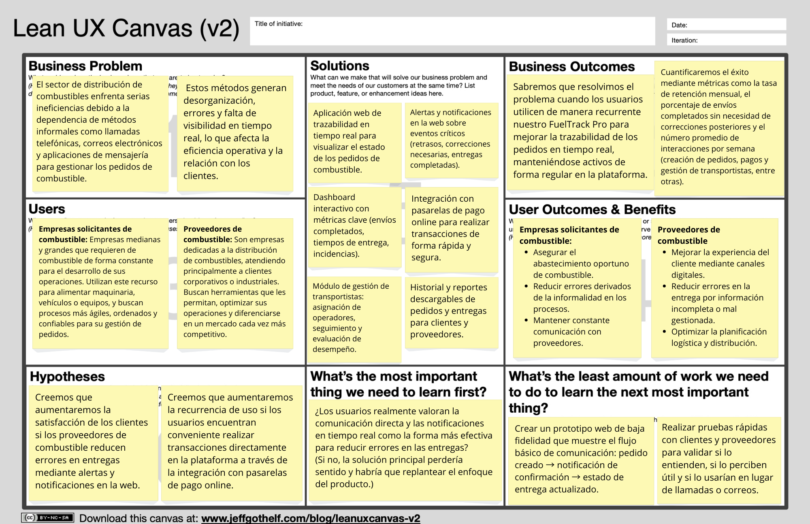

    
  <h2>Informe de Trabajo Final</h2>
  
<strong>Universidad:</strong> Universidad Peruana de Ciencias Aplicadas

  
<strong>Periodo:</strong> 202520

  
<strong>Curso:</strong> Desarrollo de Aplicaciones Open Source

  
<strong>Sección:</strong> 1ASI0729-2520-7394

  
<strong>Profesor:</strong> Hugo Allan Mori Paiva

<h2 align="center">Relación de Integrantes:</h2>

  <table>
    <tr>
      <th><strong>Código</strong></th>
      <th><strong>Apellidos y Nombres</strong></th>
    </tr>
    <tr>
      <td>u202324041</td>
      <td>Awad Vargas, Giorgio Marzouk</td>
    </tr>
    <tr>
      <td>u201817507</td>
      <td>Sanchez Arenas, Manuel Ángel</td>
    </tr>
    <tr>
      <td>u20211D760</td>
      <td>Paico Calderon, July Zelmira</td>
    </tr>
  </table>

<strong>Mes y Año:</strong> Septiembre 2025

## Registro de Versiones del Informe

<table border>
  <thead>
    <tr>
      <th><b>Versión</b></th>
      <th><b>Fecha</b></th>
      <th><b>Autores</b></th>
      <th><b>Descripción de modificación</b></th>
    </tr>
  </thead>
  <tbody>
    <tr>
      <td>TB1</td>
      <td>16/09/2025</td>
      <td>
        - Giorgio Marzouk Awad Vargas  
        - Manuel Ángel Sánchez Arenas  
        - Saul Ortega Muñoz  
        - Alberto Alejandro Ponce Perales
      </td>
      <td>
        Se incluyeron los siguientes capítulos:  
        • Estructura del informe  
        • Capítulo I: Introducción  
        • Capítulo II: Requirements Elicitation & Analysis  
        • Capítulo III: Requirements Specification  
        • Capítulo IV: Product Design  
        • Capítulo V: Product Implementation, Validation & Deployment  
        • Configuración inicial del repositorio y de la Landing Page  
        • Aplicación de GitFlow y conventional commits
      </td>
    </tr>
    <tr>
      <td>TP1</td>
      <td>09/10/2025</td>
      <td>
        - Giorgio Marzouk Awad Vargas  
        - Manuel Ángel Sánchez Arenas  
        - Alberto Alejandro Ponce Perales
      </td>
      <td>
        Se incluyeron los siguientes capítulos:  
        5.2.2. Sprint 2  
        5.2.2.1. Sprint Planning 2. 
        5.2.2.2. Aspect Leaders and Collaborators. 
        5.2.2.3. Sprint Backlog 2.  
        5.2.2.4. Development Evidence for Sprint Review. 
        5.2.2.5. Execution Evidence for Sprint Review. 
        5.2.2.6. Services Documentation Evidence for Sprint Review. 
        5.2.2.7. Software Deployment Evidence for Sprint Review. 
        5.2.2.8. Team Collaboration Insights during Sprint.
      </td>
    </tr>
    <tr>
      <td>TB2</td>
      <td>16/11/2025</td>
      <td>
        - Giorgio Marzouk Awad Vargas  
        - Manuel Ángel Sánchez Arenas  
        - Alberto Alejandro Ponce Perales
      </td>
      <td>
        Se incluyeron los siguientes capítulos:  
        5.2.3. Sprint 3  
        5.2.3.1. Sprint Planning 3. 
        5.2.3.2. Aspect Leaders and Collaborators. 
        5.2.3.3. Sprint Backlog 3.  
        5.2.3.4. Development Evidence for Sprint Review. 
        5.2.3.5. Execution Evidence for Sprint Review. 
        5.2.3.6. Services Documentation Evidence for Sprint Review. 
        5.2.3.7. Software Deployment Evidence for Sprint Review. 
        5.2.3.8. Team Collaboration Insights during Sprint.
      </td>
    </tr>
    <tr>
      <td>TF</td>
      <td>04/12/2025</td>
      <td>
        - Giorgio Marzouk Awad Vargas  
        - Manuel Ángel Sánchez Arenas  
        - July Zelmira Paico Calderon
      </td>
      <td>
        Se incluyeron los siguientes capítulos:  
        5.2.4. Sprint 4  
        5.2.4.1. Sprint Planning 4. 
        5.2.4.2. Aspect Leaders and Collaborators. 
        5.2.4.3. Sprint Backlog 4.  
        5.2.4.4. Development Evidence for Sprint Review. 
        5.2.4.5. Execution Evidence for Sprint Review. 
        5.2.4.6. Services Documentation Evidence for Sprint Review. 
        5.2.4.7. Software Deployment Evidence for Sprint Review. 
        5.2.4.8. Team Collaboration Insights during Sprint.  
        Se actualizó la sección de Conclusiones y Anexos.
      </td>
    </tr>
  </tbody>
</table>

## Project Report Collaboration Insights

**Link del repositorio del informe:**  
[https://github.com/1ASI0729-2520-7394-Grupo4/Report](https://github.com/1ASI0729-2520-7394-Grupo4/Report)

**Link del repositorio de la Landing Page:**  
[https://github.com/1ASI0729-2520-7394-Grupo4/landing-page](https://github.com/1ASI0729-2520-7394-Grupo4/landing-page)

**Link del repositorio del Fronted:**  
[https://github.com/1ASI0729-2520-7394-Grupo4/fueltrack-frontend](https://github.com/1ASI0729-2520-7394-Grupo4/fueltrack-frontend)

**Link del repositorio del Backend:**  
[https://github.com/1ASI0729-2520-7394-Grupo4/fueltrack-backend](https://github.com/1ASI0729-2520-7394-Grupo4/fueltrack-backend)

**Link de los repositorios de la organización:**  
[https://github.com/orgs/1ASI0729-2520-7394-Grupo4/repositories](https://github.com/orgs/1ASI0729-2520-7394-Grupo4/repositories)

Este informe ha sido desarrollado de forma colaborativa mediante GitHub, empleando GitFlow y Conventional Commits. Cada miembro del equipo ha contribuido con commits y ramas durante el desarrollo del proyecto.

**Participación por miembro**

A continuación, se muestra un gráfico de barras con la cantidad de commits realizados por cada integrante del equipo:

**Evolución temporal de commits**

El siguiente gráfico muestra un gráfico de barras con la evolución semanal de los commits realizados por todos los miembros:

## Contenido

- [Registro de Versiones del Informe](#registro-de-versiones-del-informe)
- [Project Report Collaboration Insights](#project-report-collaboration-insights)
- [Contenido](#contenido)
- [Student Outcome](#student-outcome)
- [Capítulo I: Introducción](#capítulo-i-introducción)
  - [1.1 Startup Profile](#11-startup-profile)
    - [1.1.1 Descripción de la Startup](#111-descripción-de-la-startup)
    - [1.1.2 Perfiles de integrantes del equipo](#112-perfiles-de-integrantes-del-equipo)
  - [1.2 Solution Profile](#12-solution-profile)
    - [1.2.1 Antecedentes y problemática](#121-antecedentes-y-problemática)
    - [1.2.2 Lean UX Process](#122-lean-ux-process)
      - [1.2.2.1 Lean UX Problem Statements](#1221-lean-ux-problem-statements)
      - [1.2.2.2 Lean UX Assumptions](#1222-lean-ux-assumptions)
      - [1.2.2.3 Lean UX Hypothesis Statements](#1223-lean-ux-hypothesis-statements)
      - [1.2.2.4 Lean UX Canvas](#1224-lean-ux-canvas)
  - [1.3 Segmentos objetivo](#13-segmentos-objetivo)
- [Capítulo II: Requirements Elicitation & Analysis](#capítulo-ii-requirements-elicitation--analysis)
  - [2.1 Competidores](#21-competidores)
    - [2.1.1 Análisis competitivo](#211-análisis-competitivo)
    - [2.1.2 Estrategias y tácticas frente a competidores](#212-estrategias-y-tácticas-frente-a-competidores)
  - [2.2 Entrevistas](#22-entrevistas)
    - [2.2.1 Diseño de entrevistas](#221-diseño-de-entrevistas)
    - [2.2.2 Registro de entrevistas](#222-registro-de-entrevistas)
    - [2.2.3 Análisis de entrevistas](#223-análisis-de-entrevistas)
  - [2.3 Needfinding](#23-needfinding)
    - [2.3.1 User Personas](#231-user-personas)
    - [2.3.2 User Task Matrix](#232-user-task-matrix)
    - [2.3.3 User Journey Mapping](#233-user-journey-mapping)
    - [2.3.4 Empathy Mapping](#234-empathy-mapping)
    - [2.3.5 As-is Scenario Mapping](#235-as-is-scenario-mapping)
  - [2.4 Ubiquitous Language](#24-ubiquitous-language)
- [Capítulo III: Requirements Specification](#capítulo-iii-requirements-specification)
  - [3.1 To-Be Scenario Mapping](#31-to-be-scenario-mapping)
  - [3.2 User Stories](#32-user-stories)
  - [3.3 Impact Mapping](#33-impact-mapping)
  - [3.4 Product Backlog](#34-product-backlog)
- [Capítulo IV: Product Design](#capítulo-iv-product-design)
  - [4.1 Style Guidelines](#41-style-guidelines)
    - [4.1.1 General Style Guidelines](#411-general-style-guidelines)
    - [4.1.2 Web Style Guidelines](#412-web-style-guidelines)
  - [4.2 Information Architecture](#43-information-architecture)
    - [4.2.1 Organization Systems](#421-organization-systems)
    - [4.2.2 Labeling System](#422-labeling-system)
    - [4.2.3 SEO Tags and Meta Tags](#423-seo-tags-and-meta-tags)
    - [4.2.4 Searching Systems](#424-searching-systems)
    - [4.2.5 Navigation System](#425-navigation-system)
  - [4.3 Landing Page UI Design](#43-landing-page-ui-design)
    - [4.3.1 Landing Page Wireframe](#431-landing-page-wireframe)
    - [4.3.2 Landing Page Mock-up](#432-landing-page-mock-up)
  - [4.4 Web Applications UX/UI Design](#44-web-applications-uxui-design)
    - [4.4.1 Web Applications Wireframes](#441-web-applications-wireframes)
    - [4.4.2 Web Applications Mock-ups](#442-web-applications-mock-ups)
    - [4.4.3 Web Applications User Flow Diagrams](#443-web-applications-user-flow-diagrams)
  - [4.5 Web Applications Prototyping](#45-web-applications-prototyping)
  - [4.6 Domain-Driven Software Architecture](#46-domain-driven-software-architecture)
    - [4.6.1 Software Architecture Context Diagram](#461-software-architecture-context-diagram)
    - [4.6.2 Software Architecture Container Diagrams](#462-software-architecture-container-diagrams)
    - [4.6.3 Software Architecture Components Diagrams](#463-software-architecture-components-diagrams)
  - [4.7 Software Object-Oriented Design](#47-software-object-oriented-design)
    - [4.7.1 Class Diagrams](#471-class-diagrams)
    - [4.7.2 Class Dictionary](#472-class-dictionary)
  - [4.8 Database Design](#48-database-design)
    - [4.8.1 Database Diagram](#481-database-diagram)
- [Capítulo V: Product Implementation, Validation & Deployment](#capítulo-v-product-implementation-validation--deployment)
  - [5.1 Software Configuration Management](#51-software-configuration-management)
    - [5.1.1 Software Development Environment Configuration](#511-software-development-environment-configuration)
    - [5.1.2 Source Code Management](#512-source-code-management)
    - [5.1.3 Source Code Style Guide & Conventions](#513-source-code-style-guide--conventions)
    - [5.1.4 Software Deployment Configuration](#514-software-deployment-configuration)
  - [5.2 Landing Page, Services & Applications Implementation](#52-landing-page-services--applications-implementation)
    - [5.2.1 Sprint 1](#521-sprint-1)
      - [5.2.1.1 Sprint Planning](#5211-sprint-planning-1)
      - [5.2.1.2 Aspect Leaders and Collaborators](#5212-aspect-leaders-and-collaborators)
      - [5.2.1.3 Sprint Backlog 1](#5213-sprint-backlog-1)
      - [5.2.1.4 Development Evidence for Sprint Review](#5214-development-evidence-for-sprint-review)
      - [5.2.1.5 Execution Evidence for Sprint Review](#5215-execution-evidence-for-sprint-review)
      - [5.2.1.6 Services Documentation Evidence for Sprint Review](#5216-services-documentation-evidence-for-sprint-review)
      - [5.2.1.7 Software Deployment Evidence for Sprint Review](#5217-software-deployment-evidence-for-sprint-review)
      - [5.2.1.8 Team Collaboration Insights during Sprint](#5218-team-collaboration-insights-during-sprint)
    - [5.2.2 Sprint 2](#522-sprint-2)
      - [5.2.2.1 Sprint Planning](#5221-sprint-planning-2)
      - [5.2.2.2 Aspect Leaders and Collaborators](#5222-aspect-leaders-and-collaborators)
      - [5.2.2.3 Sprint Backlog 2](#5223-sprint-backlog-2)
      - [5.2.2.4 Development Evidence for Sprint Review](#5224-development-evidence-for-sprint-review)
      - [5.2.2.5 Execution Evidence for Sprint Review](#5225-execution-evidence-for-sprint-review)
      - [5.2.2.6 Services Documentation Evidence for Sprint Review](#5226-services-documentation-evidence-for-sprint-review)
      - [5.2.2.7 Software Deployment Evidence for Sprint Review](#5227-software-deployment-evidence-for-sprint-review)
      - [5.2.2.8 Team Collaboration Insights during Sprint](#5228-team-collaboration-insights-during-sprint)
    - [5.2.3 Sprint 3](#523-sprint-3)
      - [5.2.3.1 Sprint Planning](#5231-sprint-planning-3)
      - [5.2.3.2 Aspect Leaders and Collaborators](#5232-aspect-leaders-and-collaborators)
      - [5.2.3.3 Sprint Backlog 3](#5233-sprint-backlog-3)
      - [5.2.3.4 Development Evidence for Sprint Review](#5234-development-evidence-for-sprint-review)
      - [5.2.3.5 Execution Evidence for Sprint Review](#5235-execution-evidence-for-sprint-review)
      - [5.2.3.6 Services Documentation Evidence for Sprint Review](#5236-services-documentation-evidence-for-sprint-review)
      - [5.2.3.7 Software Deployment Evidence for Sprint Review](#5237-software-deployment-evidence-for-sprint-review)
      - [5.2.3.8 Team Collaboration Insights during Sprint](#5238-team-collaboration-insights-during-sprint)
    - [5.2.4 Sprint 4](#524-sprint-4)
      - [5.2.4.1 Sprint Planning](#5241-sprint-planning-4)
      - [5.2.4.2 Aspect Leaders and Collaborators](#5242-aspect-leaders-and-collaborators)
      - [5.2.4.3 Sprint Backlog 4](#5243-sprint-backlog-4)
      - [5.2.4.4 Development Evidence for Sprint Review](#5244-development-evidence-for-sprint-review)
      - [5.2.4.5 Execution Evidence for Sprint Review](#5245-execution-evidence-for-sprint-review)
      - [5.2.4.6 Services Documentation Evidence for Sprint Review](#5246-services-documentation-evidence-for-sprint-review)
      - [5.2.4.7 Software Deployment Evidence for Sprint Review](#5247-software-deployment-evidence-for-sprint-review)
      - [5.2.4.8 Team Collaboration Insights during Sprint](#5248-team-collaboration-insights-during-sprint)
  - [5.3. Validation Interviews](#53-validation-interviews)
    - [5.3.1. Diseño de entrevistas](#531-diseño-de-entrevistas)
    - [5.3.2. Registro de entrevistas](#532-registro-de-entrevistas)
    - [5.3.3. Evaluaciones heuristicas](#533-evaluaciones-heuristicas)
  - [5.4. Video About-the-Product](#54-video-about-the-product)
- [Conclusiones](#conclusiones)
- [Bibliografía](#bibliografia)
- [Anexos](#anexos)

## Student Outcome

<table border>
  <thead>
    <tr>
      <th width="25%"><b>Criterio Específico</b></th>
      <th><b>Acciones Realizadas</b></th>
      <th><b>Conclusiones</b></th>
    </tr>
  </thead>
  <tbody>
    <tr>
      <td width="25%"><b>Comunica oralmente con efectividad a rangos de audiencia</b></td>
      <td>
        <b>Giorgio Awad</b> 
        TB1: Para esta entrega, me encargué de redactar las estrategias y tácticas frente a competidores, así como también elaborar el diseño de entrevistas y su respectivo registro. Asimismo, elaboré el User Task Matrix. 
        TP1: Explique con claridad la funcionalidad de los componentes Notifications y Providers, detallando su aporte técnico y su integración con el sistema. Utilice un lenguaje técnico comprensible, apoyándose en ejemplos visuales para evidenciar el funcionamiento. 
        TF: En esta entrega me encargué de finalizar ciertos endpoints del backend lo que llevó a tener que comunicar a mi equipo su funcionalidad.  
        <b>Manuel Sánchez</b> 
        TB1: Como el miembro con experiencia en el rubro de venta de combustibles, tuve que detallar la información a mis compañeros para poder compartir una misma visión al hacer nuestra propuesta. 
        TP1: Presente de manera estructurada el desarrollo del Order, Terminals y el Web App Layout, resaltando cómo estos módulos mejoran la navegación y experiencia del usuario. Comunique con fluidez los roles del equipo y la planificación del sprint. 
        TF: En esta entrega me encargué de adaptar el front para funcionar con los endpoints de autorización respectivos del  backend. Para ofrecer un trabajo de calidad, mantuve una comunicación constante con el equipo para asegurar la correcta integración.  
        <b>Saul Ortega</b> 
        TB1: Para esta entrega, me encargué de realizar entrevistas a usuarios dentro del Lean UX Process, así como también del análisis de la información obtenida. Posteriormente, expuse los hallazgos al equipo y a los stakeholders, adaptando mi comunicación oral al tipo de audiencia para asegurar una comprensión clara y efectiva de los resultados.  
        <b>Alberto Ponce</b> 
        TB1: En esta entrega participé en la recoleccion de las entrevistas, la construcción de las User Personas, definiendo perfiles claros a partir de las entrevistas. También colaboré en la User Task Matrix, priorizando las tareas según frecuencia e importancia. Asimismo, apoyé en el diseño de los User Journey Mapping, destacando puntos de dolor y motivaciones de los usuarios. 
        TP1: Expuse el proceso de creación de las vistas de Login y Register, además de explicar el despliegue del software en Vercel y las evidencias de colaboración del equipo. Utilice lenguaje formal y apoyos visuales claros para sustentar sus aportes.  
        <b>July Paico</b> 
        TF: En esta entrega me encargué principalmente de comunicar al equipo los endpoints relacionado a la seguridad y autenticación que desarrollé en el backend. Realicé presentaciones orales para explicar su funcionamiento y asegurar que los miembros responsables comprendieran cómo integrarlos correctamente en el frontend.
      </td>
      <td>
        Consideramos que la comunicación oral fue aplicada de manera clara y estratégica, logrando exponer hallazgos, transmitir insights y sostener discusiones con efectividad frente a diferentes audiencias. Gracias a ello, se alcanzó una comprensión común del problema y se sentaron bases sólidas para proponer soluciones innovadoras en el marco del Lean UX Process.
      </td>
    </tr>
    <tr>
      <td width="25%"><b>Comunica por escrito con efectividad a diferentes rangos de audiencia</b></td>
      <td>
        <b>Giorgio Awad</b> 
        TB1: Para esta entrega, me encargué de redactar las estrategias y tácticas frente a competidores, así como también elaborar el diseño de entrevistas y su respectivo registro. Asimismo, elaboré el User Task Matrix.  
        TP1: En esta entrega redacté la sección del Development Evidence, Execution Evidence y el Services Documentation, asegurando que la información técnica de los componentes Notifications y Providers fuera comprensible tanto para el equipo como para el lector del informe. Utilicé un lenguaje claro, estructurado y con soporte visual para facilitar la comprensión del desarrollo. 
        TF: Mi equipo y yo tuvimos la tarea de documentar apropiadamente en el informe acerca de los endpoints desarrollados en el backend para su correcta integración con el frontend. Para ello, describo brevemente los endpoints desarrollados y muestro evidencia de ello.  
        <b>Manuel Sanchez</b> 
        TB1: Para esta entrega le di prioridad a la explicación de nuestra propuesta, problemática, hipótesis, etc. 
        TP1: Elaboré las secciones del Sprint Planning, Aspect Leaders y Collaborators, además de documentar el desarrollo de los módulos Orders, Terminals y el Web App Layout. Cuidé la estructura del texto para mantener una secuencia lógica y una presentación clara de las responsabilidades y avances del equipo. 
        TF: En esta entrega me encargué de documentar en el informe aspectos relacionados al frontend, como la integración con los endpoints del backend, describiendo claramente los cambios principales que han sido implementados.  
        <b>Saul Ortega</b> 
        TB1: Para esta entrega, elaboré reportes y resúmenes de los hallazgos de entrevistas, adaptando el lenguaje y nivel de detalle según la audiencia para asegurar una comunicación escrita clara y efectiva.  
        <b>Alberto Ponce</b> 
        TB1: Para esta entrega me encargué de redactar y organizar la información de las User Personas. También participé en la documentación del User Task Matrix y del User Journey Mapping, resumiendo hallazgos de manera estructurada. Adapté mi redacción para mantener un lenguaje profesional, preciso y accesible. 
        TP1: Redacté las secciones de Software Deployment Evidence y Team Collaboration Insights, además de describir el funcionamiento de las vistas Login y Register.  
        <b>July Paico</b> 
        TF: Colaboré con las secciones del informe que evidencia el desarrollo del backend relacionado a la seguridad y autenticación. Me aseguré de que la documentación fuera clara y detallada, facilitando la comprensión de los endpoints desarrollados y su integración con el frontend.
      </td>
      <td>
        La comunicación escrita se utilizó de forma clara y estratégica, adaptando el nivel de detalle y el lenguaje según la audiencia. Esto permitió documentar hallazgos, explicar la problemática y presentar propuestas de manera efectiva, logrando que toda la información fuera comprendida y validada en el marco del Lean UX Process.
      </td>
    </tr>
  </tbody>
</table>

 

# Capítulo I: Introducción

## 1.1 Startup Profile

### 1.1.1 Descripción de la Startup

**FuelTrack**: Startup innovador dedicado a la gestión de la compraventa de combustible entre empresas solicitantes y proveedores. Fundada por estudiantes de la Universidad Peruana de Ciencias Aplicadas, nuestra propuesta se centra en la digitalización de un sector tradicionalmente dependiente de procesos manuales, brindando una solución tecnológica que garantiza eficiencia, transparencia y un control más riguroso de las operaciones. 

**Misión**: Nuestra misión es desarrollar soluciones tecnológicas avanzadas que transformen el mercado de combustible, eliminando los medios informales y reduciendo el margen de error, mediante una plataforma web intuitiva y accesible. 

**Visión**: Nuestra visión es posicionarnos como líderes en la digitalización del sector energético, ofreciendo a las empresas una herramienta que facilite una gestión más eficiente, segura y sostenible, contribuyendo al progreso tecnológico y a la mejora de la competitividad del sector. 

### 1.1.2 Perfiles de integrantes del equipo

<table border>
  <thead>
    <tr>
      <th>Foto</th>
      <th>Nombre completo</th>
      <th>Código</th>
      <th>Carrera</th>
      <th>Habilidades técnicas</th>
    </tr>
  </thead>
  <tbody>
    <tr>
      <td></td>
      <td>Giorgio Marzouk Awad Vargas</td>
      <td>u202324041</td>
      <td>Ingeniería de Software</td>
      <td>Considero ser alguien que aporta ideas nuevas al equipo, que a largo plazo contribuyen con la resolución de cualquier problema que se presente. Asimismo, soy capaz de adaptarme al momento de trabajar en equipo, convirtiéndome en un compañero polifuncional.</td>
    </tr>
    <tr>
      <td></td>
      <td>Manuel Ángel Sánchez Arenas</td>
      <td>u201817507</td>
      <td>Ingeniería de Software</td>
      <td>Desarrollo Fullstack: ASP.NetCORE MVC con Razor. Java básico. React.js</td>
    </tr>
    <tr>
      <td></td>
      <td>July Zelmira Paico Calderon</td>
      <td>u20231c019</td>
      <td>Ingeniería de Software</td>
      <td>Me considero una estudiante colaborativa, capaz de trabajar en equipo. Me gusta mucho la gestión de proyectos y organizar mi tiempo para alcanzar los objetivos planteados. En mis tiempos libres me gusta dibujar y aprender cosas nuevas en plataformas en línea. </td>
    </tr>
    
  </tbody>
</table>

---

## 1.2 Solution Profile

### 1.2.1 Antecedentes y problemática

- **What? (¿Qué?)**  
  La problemática principal es la falta de un sistema centralizado y digital para gestionar los pedidos de combustible, lo que genera errores humanos, duplicación de esfuerzos y retrasos en las entregas.

- **When? (¿Cuándo?)**  
  El problema se presenta constantemente en el proceso de gestión de pedidos, especialmente cuando hay un alto volumen de solicitudes o múltiples pedidos a coordinar.

- **Where? (¿Dónde?)**  
  El problema ocurre en empresas solicitantes de combustible y proveedores, tanto en áreas urbanas como rurales, donde la infraestructura digital aún no está optimizada.

- **Who? (¿Quién?)**  
  Los principales afectados son las empresas solicitantes (medianas y grandes), los proveedores de combustible y los encargados de la logística y gestión de pedidos.

- **Why? (¿Por qué?)**  
  El problema radica en la falta de integración entre los métodos actuales de gestión (como correos y aplicaciones de mensajería), que dificultan un control centralizado y preciso de los pedidos.

- **How? (¿Cómo?)**  
  Los procesos actuales son desorganizados, utilizando diversas plataformas desconectadas, lo que impide tener un flujo de trabajo eficiente y controlado.

- **How Much? (¿Cuánto?)**  
  La magnitud del problema es considerable, pues cada día se pierden horas valiosas debido a la ineficiencia y los errores, lo que incrementa los costos operativos y puede generar pérdidas económicas significativas.

### 1.2.2 Lean UX Process

Para el desarrollo de FuelTrack, utilizamos el enfoque Lean UX, que nos permite validar nuestras hipótesis, enfocarnos en la experiencia del usuario y reducir riesgos desde las etapas iniciales. A través de prototipos, pruebas con empresas, simulaciones y ciclos de retroalimentación continua, adaptamos nuestra plataforma a las necesidades reales del mercado de combustible.

#### 1.2.2.1 Lean UX Problem Statements
 
**Solicitantes de Combustible (Empresas Compradoras)**
- **Problema:** Empresas de sectores industriales, mineros y de construcción coordinan sus pedidos de combustible mediante canales informales (llamadas, correos, mensajería), lo que genera desorganización, errores y ausencia de trazabilidad. 
- **Impacto:** Incertidumbre sobre el estado de los despachos y posibles interrupciones en sus operaciones debido a errores por mala coordinación.  
- **Riesgo:** La facilidad a la adaptación puede verse afectada si la plataforma no es intuitiva o no se adapta a procesos actuales.  
- **How Might We...?:** ¿Cómo podemos diseñar una experiencia que permita registrar y gestionar pedidos en menos de 3 minutos, con tasa de error <5% y adopción del 80% en el primer mes?  

**Proveedores de Combustible (Empresas Distribuidoras)**
- **Problema:** Gestionan múltiples pedidos, conciliaciones y despachos con procesos manuales, lo que aumenta la carga administrativa (asumida por los operadores del área) y el riesgo de errores logísticos.  
- **Impacto:** Baja eficiencia operativa y menor satisfacción del cliente.  
- **Riesgo:** Posible resistencia a la implementación si los beneficios no son inmediatos.  
- **How Might We...?:** ¿Cómo podemos demostrar que nuestra plataforma reduce el tiempo de gestión en un 40%, disminuye errores logísticos en un 60% y mejora la satisfacción del cliente en +1 punto en encuestas durante los primeros 3 meses?  

#### 1.2.2.2 Lean UX Assumptions

**Business Assumptions (Suposiciones de Negocio)**

* Las empresas están buscando formas de reducir errores y retrasos logísticos para optimizar sus costos operativos.
* Los proveedores estan dispuestos a invertir para mejorar su nivel de servicio y aumentar su competitividad en el mercado.
* Las empresas usuarias apreciarán tener un mayor control sobre sus órdenes y ser capaces de seguirlas en una plataforma centralizada.
* La dificil trazabilidad de los pedidos y las fallas en la comunicación hace que dejar los métodos informales sea una necesidad crítica para todo el sector.

**User Assumptions (Suposiciones de Usuario)**

* *¿Quién es el usuario?*
  Los usuarios principales serían los encargados logísticos de los proveedores y las empresas solicitantes de combustible.
* *¿Dónde encaja nuestro producto en su trabajo o vida?*
  FuelTracks encajaría en el día a día de los usuarios como una plataforma de gestión centralizada, que ayudaría a coordinar, rastrear y organizar pedidos de combustible. Reemplazando así los sistemas no ligados que se utilizan hoy en día.
* *¿Qué problemas tiene nuestro producto que resolver?*
  FuelTracks debe resolver la desorganización causada por métodos informales de venta, reducir errores humanos y mejorar la experiencia del cliente.
* *¿Cuándo y cómo es nuestro producto usado?*
  Será utilizado diariamente por solicitantes y los proveedores por igual. Por el lado de los usuarios solicitantes, usarán la plataforma para registrar y monitorear pedidos de combustible, y por el lado de proveedores para gestionar la recepción, programación y entrega de dichos pedidos.
* *¿Qué características son importantes?*
  El seguimiento de pedidos en tiempo real, actualizaciones de estado mediante notificiaciones, historial de entregas, paneles de control y una interfaz clara y rápida.
* *¿Cómo debe verse nuestro producto y cómo debe comportarse?*
  El producto debe presentar una interfaz limpia y profesional. Adaptada al perfil corporativo de los clientes objetivos. Debe ser eficiente, permitiendo la creación, modificación y seguimiento de pedidos en pocos clics. También debe ser altamente confiable, debido al alto valor y magnitud de las órdenes que se realizarán en la plataforma

**Feature Assumptions**

* Creemos que al proporcionar una plataforma centralizada con trazabilidad en tiempo real, ayudaremos a las empresas a reducir errores y mejorar la eficiencia logística.
* Creemos que al ofrecer una interfaz clara y rápida con funciones de seguimiento, aumentaremos la adopción entre proveedores y solicitantes.
* Creemos que al automatizar la gestión de pedidos, los usuarios reducirán su dependencia de métodos informales y ganarán en control y visibilidad.
* Creemos que al integrar notificaciones en tiempo real sobre estados de pedido, mejoraremos la coordinación entre actores y reduciremos los retrasos.
*  Creemos que al incluir visualización de métricas, facilitaremos la toma de decisiones y la optimización operativa de los proveedores.

#### 1.2.2.3 Lean UX Hypothesis Statements

**Hypothesis Statement 01:**
* *Creemos* que la centralización de los pedidos en nuestra plataforma reducirá el margen de errores causados por problemas de coordinación entre las empresas solicitantes y los proveedores drásticamente.
* *Sabremos* que hemos tenido éxito
* *Cuando* luego de los primeros tres meses de uso se reporte que más de un 70% de los pedidos realizados fueron confirmados sin necesidad de correcciones posteriores.

**Hypothesis Statement 02:**
* *Creemos* que ofrecer más herramientas para el control y seguimiento de pedidos mejorará la satisfacción de los clientes solicitantes.
* *Sabremos* que hemos tenido éxito
* *Cuando* se observe una reducción del 30% en llamadas de seguimiento.

**Hypothesis Statement 03:**
* *Creemos* que la plataforma permitirá a los proveedores optimizar el proceso de gestión de los pedidos y reducir el tiempo que toma cumplir con cada uno.
* *Sabremos* que hemos tenido éxito
* *Cuando* los proveedores logren reducir en un 20% el tiempo promedio entre confirmación y entrega de pedidos.

**Hypothesis Statement 04:**
* *Creemos* que las notificaciones automáticas sobre el estado de los pedidos reducirán la necesidad de una gran cantidad de operadores comerciales de alta disponibilidad.
* *Sabremos* que hemos tenido éxito
* *Cuando* las solicitudes de información por parte de clientes disminuyan en un 40% y el tiempo promedio de atención se reduzca en un 60% tras el primer trimestre de uso.

#### 1.2.2.4 Lean UX Canvas

## 1.3 Segmentos objetivos

**A. Empresas solicitantes de combustible**

Empresas medianas y grandes que requieren de combustible de forma constante para el desarrollo de sus operaciones. Utilizan este recurso para alimentar maquinaria, vehículos o equipos, y buscan procesos más ágiles, ordenados y confiables para su gestión de pedidos. Además, mantienen un contrato de exclusividad con un proveedor de combustible, lo que les permite tener un flujo constante de pedidos y una relación comercial estable.

*Necesidades:*
* Asegurar el abastecimiento oportuno de combustible.
* Reducir errores derivados de la informalidad en los procesos.
* Mantener constante comunicación con proveedores.
  
**B. Proveedores de combustible**

Son empresas dedicadas a la distribución de combustibles, atendiendo principalmente a clientes corporativos o industriales. Buscan herramientas que les permitan, optimizar sus operaciones y diferenciarse en un mercado cada vez más competitivo.

*Motivaciones:*
* Mejorar la experiencia del cliente mediante canales digitales.
* Reducir errores en la entrega por información incompleta o mal gestionada.
* Optimizar la planificación logística y distribución.
