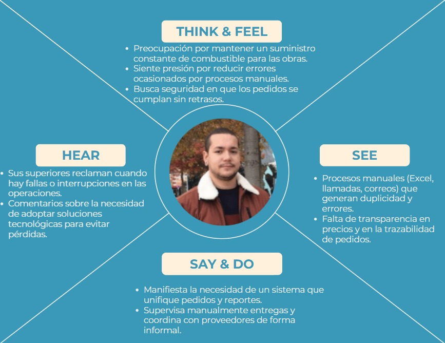

# Capítulo II: Requirements Elicitation & Analysis

## 2.1. Competidores.

En el mercado existen diversas soluciones digitales enfocadas en la gestión de combustible y flotas que compiten de manera directa o indirecta con FuelTrack. Entre ellas destaca **Zavgar**, una plataforma SaaS que ayuda a las empresas con flotas vehiculares a optimizar costos y controlar el consumo de combustible. Otro competidor importante es **FuelCloud**, que ofrece una solución integrada de hardware y software para garantizar seguridad y precisión en el despacho de combustible, principalmente en empresas con tanques propios. Finalmente, **Wialon** se presenta como una plataforma internacional de gestión de flotas que combina monitoreo GPS, análisis operativos y control de combustible, dirigida a compañías logísticas y de transporte.

### 2.1.1. Análisis competitivo.

<table border="2">
  <tr>
    <th colspan="6" style="text-align:left">Competitive Analysis Landscape</th>
  </tr>
  <tr>
    <td colspan="1"><strong>¿Por qué llevar a cabo este análisis?</strong></td>
    <td colspan="5">Este análisis se está llevando a cabo porque queremos conocer las ventajas y desventajas de nuestra aplicación frente a la competencia, y cómo nos diferenciamos de ellas.</td>
  </tr>
  <tr>
    <td colspan="2"><strong></strong></td>
    <td><strong>FuelTrack</strong> </td>
    <td><strong>Zavgar</strong> </td>
    <td><strong>FuelCloud</strong> </td>
    <td><strong>Wialon</strong> </td>
  </tr>

  <tr>
    <th rowspan="3">Perfil</th>
    <td><strong>Visión general</strong></td>
    <td>Plataforma web que digitaliza y estructura el proceso completo de pedido de combustible entre empresas y proveedores.</td>
    <td>SaaS para la gestión de consumo de combustible de flotas, con enfoque en eficiencia, monitoreo y costos.</td>
    <td>Solución con hardware/software para el control físico del despacho de combustible.</td>
    <td>Plataforma de gestión de flotas con control de combustible, GPS y reportes operativos.</td>
  </tr>
  <tr>
    <td><strong>Ventaja competitiva</strong></td>
    <td>Especialización en el flujo completo de pedido, despacho y análisis; integración de pagos y logística; UI intuitiva.</td>
    <td>No requiere hardware; ofrece métricas, control de gastos y reportes sobre consumo.</td>
    <td>Control físico preciso del combustible, monitoreo en tiempo real.</td>
    <td>Seguimiento en tiempo real, visualización de rutas, integración con sensores de combustible.</td>
  </tr>
  <tr>
    <td><strong>¿Qué valor ofrece al cliente?</strong></td>
    <td>Trazabilidad total, eficiencia operativa, reportes de consumo y validación segura de pedidos.</td>
    <td>Optimización de costos y control sobre el uso de combustible en flotas.</td>
    <td>Seguridad y precisión operativa en el control de combustible.</td>
    <td>Trazabilidad de flotas, alertas automáticas, análisis de rutas y consumo de combustible.</td>
  </tr>
  <tr>
    <th rowspan="2">Perfil de Marketing</th>
    <td><strong>Mercado objetivo</strong></td>
    <td>Empresas que solicitan combustible a proveedores.</td>
    <td>Empresas con flotas vehiculares que desean monitorear y reducir el consumo de combustible.</td>
    <td>Empresas con tanques de combustible propios.</td>
    <td>Empresas logísticas, distribuidoras y de transporte de combustible.</td>
  </tr>
  <tr>
    <td><strong>Estrategias de marketing</strong></td>
    <td>Alianzas con proveedores, demostraciones de ahorro, marketing de contenido enfocado en eficiencia.</td>
    <td>Enfoque digital, contenido técnico, integración con proveedores de tarjetas de combustible.</td>
    <td>Ferias industriales, distribuidores, venta consultiva entre empresas.</td>
    <td>Alianzas con distribuidores de GPS, marketing técnico, ferias de transporte.</td>
  </tr>
  <tr>
    <th rowspan="3">Perfil de Producto</th>
    <td><strong>Productos & Servicios</strong></td>
    <td>Plataforma para gestión completa de pedidos, seguimiento, reportes, validación y alertas.</td>
    <td>Plataforma web con módulo de abastecimiento, reportes de consumo, integración GPS y tarjetas.</td>
    <td>Hardware IoT y software para gestión, y control de combustible.</td>
    <td>Plataforma SaaS + app móvil con monitoreo, alertas, mapas y módulos personalizables.</td>
  </tr>
  <tr>
    <td><strong>Precios & Costos</strong></td>
    <td>Modelo SaaS con suscripción escalable según volumen y servicios.</td>
    <td>SaaS con modelos por flota activa o vehículos monitoreados.</td>
    <td>Venta e instalación de hardware + licencias de software.</td>
    <td>Modelo SaaS modular, basado en vehículos activos y funcionalidades activadas.</td>
  </tr>
  <tr>
    <td><strong>Canales de distribución</strong></td>
    <td>Web app responsive, potencial app móvil futura.</td>
    <td>Web app, marketing digital y comunidad de flotas.</td>
    <td>Plataforma web + hardware instalado en sitio.</td>
    <td>Red de partners global, distribuidores locales e integradores de sistemas GPS.</td>
  </tr>
  <tr>
    <th rowspan="4">Análisis SWOT</th>
    <td><strong>Fortalezas</strong></td>
    <td>Enfoque especializado, experiencia de usuario optimizada, integraciones clave, análisis avanzado de consumo.</td>
    <td>Implementación ágil, sin hardware, fácil adopción en empresas medianas.</td>
    <td>Control físico riguroso, solución probada en industrias exigentes.</td>
    <td>Plataforma robusta, cobertura internacional, integración con más de 2,400 dispositivos GPS.</td>
  </tr>
  <tr>
    <td><strong>Debilidades</strong></td>
    <td>Nueva en el mercado, menor reconocimiento de marca, necesita consolidar confianza.</td>
    <td>No gestiona el flujo completo del pedido, enfoque parcial en flotas.</td>
    <td>Alto costo, dependencia de hardware, menor adaptabilidad en mercados emergentes.</td>
    <td>No gestiona pedidos entre proveedor y solicitante, requiere configuración técnica inicial.</td>
  </tr>
  <tr>
    <td><strong>Oportunidades</strong></td>
    <td>Alta informalidad en el sector, digitalización creciente en logística, necesidad de trazabilidad y control.</td>
    <td>Mayor conciencia en eficiencia de flotas y digitalización de costos operativos.</td>
    <td>Nuevos mercados industriales con enfoque en seguridad y control.</td>
    <td>Creciente necesidad de control logístico y monitoreo de distribución en países en desarrollo.</td>
  </tr>
  <tr>
    <td><strong>Amenazas</strong></td>
    <td>Aparición de soluciones similares, resistencia al cambio en empresas tradicionales, competencia ERP.</td>
    <td>SaaS especializados con mayor cobertura funcional (ERP, proveedores, logística).</td>
    <td>SaaS ágiles y sin hardware físico, que ofrecen soluciones más accesibles.</td>
    <td>SaaS más específicos y ligeros, enfocados exclusivamente en la trazabilidad de entregas.</td>
  </tr>
</table>

### 2.1.2. Estrategias y tácticas frente a competidores.

**FuelTrack** aplicará diversas estrategias para afrontar la competencia y aprovechar las oportunidades que ofrece el sector.

#### a. Diferenciación a través de especialización
Una de las principales estrategias de **FuelTrack** es la **especialización en el flujo completo de pedido de combustible**. A diferencia de soluciones como **Zavgar**, que están orientadas principalmente al control y análisis del consumo de combustible en flotas, nuestra plataforma se enfoca en las **interacciones B2B** entre empresas solicitantes y proveedores. Esto nos permite ofrecer un control dedicado del pedido, gestión de la logística, y reportes detallados de consumo y entregas, lo cual no está presente en la mayoría de las plataformas competidoras.

- **Táctica**: Desarrollar funcionalidades para la validación automática de pagos, gestión de stock en tiempo real y la optimización del transporte logrando la automatización de procesos que solo eran logrados de forma manual. Esto crea una ventaja frente a competidores como **FuelCloud**, que se centran más en el control físico del combustible y menos en la administración a nivel operativo.

#### b. Innovación en la interfaz de usuario y experiencia

El sistema de **FuelTrack** está diseñado para ofrecer una **experiencia de usuario optimizada**, algo que **Wialon**, **FuelCloud** y la propia **OSINERGMIN** no abordan en sus plataformas. Al ser una solución especializada y dirigida a una tarea específica, podemos dedicar más recursos en crear una interfaz intuitiva y procesos bien definidos brindando comodidad y seguridad a nuestros usuarios.

- **Táctica**: Diseñar una **interfaz intuitiva y consistente** que permita a los usuarios acceder a reportes de consumo, validar pedidos y coordinar logística con facilidad. Además, ofrecer **soporte y formación continua** para asegurar que los usuarios aprovechen al máximo todas las funcionalidades del sistema.

#### c. Flexibilidad en precios y modelo SaaS escalable
El modelo de precios de **FuelTrack** ofrece **planes escalables basados en suscripción**, lo que hace que sea más accesible para medianas y grandes empresas. Esto es más competitivo frente a **Wialon**, que puede no ser una opción viable para empresas que solo requieren una solución de pedidos de combustible. También es más asequible que **FuelCloud**, que requiere una inversión considerable en hardware, instalación y mantenimiento.

- **Táctica**: Ofrecer un modelo de suscripción flexible y **precios competitivos**, con **múltiples niveles de suscripción** adaptados a las necesidades de diferentes empresas. Esto permitirá que empresas de menor tamaño puedan acceder a la plataforma sin comprometer su presupuesto, a la vez que se asegura el crecimiento a largo plazo a medida que la empresa crece.

#### d. Aprovechamiento de la digitalización en la logística
El sector de la logística está experimentando una transformación digital acelerada. **FuelTrack** se aprovechará de esta tendencia buscando la integración de la plataforma con otras soluciones logísticas (como los sistemas de gestión de vehículos o flotas). De esta forma podemos ofrecer una solución más completa y eficiente.

- **Táctica**: Colaborar con empresas de **gestión de flotas** para optimizar el proceso de asignación de vehículos, cisternas y choferes. También se considerará la posibilidad de integrar **sensores IoT** en los camiones de reparto para un control más preciso sobre el combustible transportado y la entrega.

#### e. Expansión hacia mercados internacionales
Si bien **FuelTrack** está inicialmente orientada a empresas locales, el modelo de negocio y la flexibilidad de la plataforma la hacen ideal para expandirse a **mercados internacionales**. Competidores como **Wialon** ya tienen presencia en mercados globales, pero su enfoque en empresas grandes y sus altos costos de implementación pueden ser una barrera para empresas de menor tamaño, limitando su alcance.

- **Táctica**: Iniciar la expansión en mercados emergentes donde la digitalización en la logística es una necesidad creciente. Esto incluirá la **localización de la plataforma** (idioma, moneda, regulaciones locales) para facilitar la adaptabilidad de los nuevos mercados.

## 2.2. Entrevistas.

### 2.2.1. Diseño de entrevistas.

**A. Proveedores de Combustible**

**Preguntas:**

1. ¿Cuál es su cargo dentro de la empresa proveedora?
2. ¿Qué tipos de clientes atienden principalmente (logística, construcción, minería, agroindustria)?
3. ¿Qué volumen de operaciones realizan mensualmente?
4. ¿Cómo gestionan actualmente los pedidos y contratos de sus clientes?
5. ¿Qué problemas han experimentado con los métodos tradicionales (llamadas, correos, planillas)?
6. ¿Utilizan algún software especializado para ventas o logística? 
7. ¿Qué características valoraría más en una plataforma digital para gestionar pedidos?
8. ¿Considera que una solución que centralice cotizaciones, contratos y entregas sería útil para su empresa?
9. ¿Qué tan importante es para ustedes tener reportes históricos y comparativos de ventas?
10. ¿Qué estrategias usan actualmente para fidelizar clientes, y cómo cree que una plataforma como FuelTrack podría apoyarlos?

---

**B. Empresas Solicitantes**

**Preguntas:**

1. ¿Cuál es su cargo en la empresa? 
2. ¿Hace cuánto tiempo trabaja en el sector energético/logístico? 
3. ¿Qué volumen de combustible gestionan aproximadamente al mes? 
4. ¿Cómo gestionan actualmente la compra y control de combustible? 
5. ¿Qué herramientas usan (Excel, llamadas, correos, sistemas propios)? 
6. ¿Cuáles son los principales problemas que enfrentan con su sistema actual?
7. ¿Qué tan importante es para usted contar con trazabilidad en tiempo real? 
8. ¿Qué dispositivos utilizan para gestionar pedidos (PC, móvil, tablet)? 
9. ¿Qué información considera más valiosa al momento de comprar combustible (precio, tiempo de entrega, historial de proveedor, etc.)? 
10. ¿Cómo afecta la falta de transparencia en los precios a sus decisiones de compra? 
11. ¿Le interesaría recibir notificaciones en tiempo real sobre cambios de precio o estado de sus pedidos? 
12. ¿Qué barreras considera que dificultarían implementar una solución digital como FuelTrack en su empresa?

### 2.2.2. Registro de entrevistas

#### **A. Proveedores de Combustible**  

**Entrevista 1**  
- **Nombres:** Wilber Franz
- **Apellidos:** Toledo Mamani
- **Edad:** 26 
- **Distrito:** San Miguel
- **Captura de la entrevista:** 

  

  

- **Duración:** 4 min 30 seg
- **URL de Entrevista:** [Ver video](https://upcedupe-my.sharepoint.com/:v:/g/personal/u202324041_upc_edu_pe/ESQiYkHNmUFCrcIMB9GPSYYBBzVdFlgerQtqhPSVk3u5dg?e=7wfR8G&nav=eyJyZWZlcnJhbEluZm8iOnsicmVmZXJyYWxBcHAiOiJTdHJlYW1XZWJBcHAiLCJyZWZlcnJhbFZpZXciOiJTaGFyZURpYWxvZy1MaW5rIiwicmVmZXJyYWxBcHBQbGF0Zm9ybSI6IldlYiIsInJlZmVycmFsTW9kZSI6InZpZXcifX0%3D)  

**Entrevista 2**  
- **Nombres:** Renato
- **Apellidos:** Calvo
- **Edad:** 25
- **Distrito:** Cercado de Lima
- **Captura de la entrevista:** 

  

  

- **Duración:** 4 min 48 seg
- **URL de Entrevista:** [Ver video](https://upcedupe-my.sharepoint.com/:v:/g/personal/u202324041_upc_edu_pe/Ec1x5o0yCKJHto72auvJEgsBFIOcS5AiCYAoO2uHmkneWA?e=2IR0y1&nav=eyJyZWZlcnJhbEluZm8iOnsicmVmZXJyYWxBcHAiOiJTdHJlYW1XZWJBcHAiLCJyZWZlcnJhbFZpZXciOiJTaGFyZURpYWxvZy1MaW5rIiwicmVmZXJyYWxBcHBQbGF0Zm9ybSI6IldlYiIsInJlZmVycmFsTW9kZSI6InZpZXcifX0%3D)  

---

#### **B. Empresas Solicitantes**  

**Entrevista 1**  
- **Nombres:** Carlos Alonso
- **Apellidos:** Sampen Navarrete
- **Edad:** 22
- **Distrito:** Magdalena
- **Captura de la entrevista:**

  

  

- **Duración:** 4 min 51 seg
- **URL de Entrevista:** [Ver video](https://upcedupe-my.sharepoint.com/:v:/g/personal/u20231c019_upc_edu_pe/EZ_nhGYmv_tMu4-N8jyqtqkBm_HUypEjcf-g4nklT0b2Rg?nav=eyJyZWZlcnJhbEluZm8iOnsicmVmZXJyYWxBcHAiOiJTdHJlYW1XZWJBcHAiLCJyZWZlcnJhbFZpZXciOiJTaGFyZURpYWxvZy1MaW5rIiwicmVmZXJyYWxBcHBQbGF0Zm9ybSI6IldlYiIsInJlZmVycmFsTW9kZSI6InZpZXcifX0%3D&e=rVonNr)  

**Entrevista 2**  
- **Nombres:** Franccesco
- **Apellidos:** Cruzate
- **Edad:** 22
- **Distrito:** Magdalena
- **Captura de la entrevista:**

  

- **Duración:** 3 min 22 seg
- **URL de Entrevista:** [Ver video](https://upcedupe-my.sharepoint.com/:v:/g/personal/u20231c019_upc_edu_pe/EZ-HXJ3KuiNFoXwUPpJYd70BIurcLECXami-EhvDLMZs0Q?nav=eyJyZWZlcnJhbEluZm8iOnsicmVmZXJyYWxBcHAiOiJTdHJlYW1XZWJBcHAiLCJyZWZlcnJhbFZpZXciOiJTaGFyZURpYWxvZy1MaW5rIiwicmVmZXJyYWxBcHBQbGF0Zm9ybSI6IldlYiIsInJlZmVycmFsTW9kZSI6InZpZXcifX0%3D&e=FScLB9) 

**Entrevista 3**
- **Nombres:**
- **Apellidos:**
- **Edad:**
- **Distrito:**
- **Captura de la entrevista:**

  

- **Duración:**
- **URL de Entrevista:** [Ver video](colocar_link_aqui)

### 2.2.3. Análisis de entrevistas

#### **A. Proveedores de Combustible**

#### Características Objetivas
| Característica         | Entrevista 1                                                                                   | Entrevista 2                                                                 | Entrevista 3 |
|-------------------------|------------------------------------------------------------------------------------------------|------------------------------------------------------------------------------|--------------|
| Gestión de pedidos      | Correos electrónicos y llamadas; pedidos registrados en base de datos interna; contratos en PDF | Llamadas telefónicas y correos electrónicos; contratos en PDF y Excel.       |              |
| Herramientas usadas     | Software básico para facturación e inventario; no unificado para pedidos.                      | ERP básico para facturación; no adaptado a pedidos/logística.               |              |
| Pasos del proceso       | Cliente solicita → registro en base interna → contratos en PDF → coordinación manual → entrega | Cliente solicita → registro en Excel/PDF → coordinación telefónica → entrega |              |
| Validación de stock     | Inventario controlado en software básico, pero no integrado al pedido.                         | No en tiempo real; se hace manualmente con reportes internos.               |              |
| Seguimiento de pedidos  | Seguimiento manual fuera del sistema; visibilidad limitada.                                    | No hay trazabilidad en tiempo real; depende de llamadas y correos.          |              |
| Conciliación de pagos   | Hecha con software de facturación, pero requiere cruce manual.                                 | Hecha con ERP y conciliación manual entre facturas y entregas.              |              |

#### Características Subjetivas
| Aspecto                       | Entrevista 1                                                                                   | Entrevista 2                                                                 | Entrevista 3 |
|--------------------------------|------------------------------------------------------------------------------------------------|------------------------------------------------------------------------------|--------------|
| Frustraciones principales      | Ineficiencia, pérdida de información, dificultad para rastrear pedidos.                        | Pérdida de correos, duplicidad de pedidos, falta de control en tiempo real.  |              |
| Percepción del proceso actual  | Demasiado manual; consume tiempo que podría dedicarse al cliente.                              | Manual, lento y propenso a errores.                                          |              |
| Deseo de mejoras               | Visibilidad en tiempo real, unificación de contratos, cotizaciones y entregas.                 | Historial centralizado, pedidos directos en plataforma, seguimiento entregas |              |
| Disposición a integrar plataforma | Muy alta; lo ven como invaluable para eficiencia y fidelización.                               | Alta; consideran que ahorraría tiempo y reduciría errores.                   |              |

#### **B. Empresas Solicitantes**

#### Características Objetivas
<table border>
  <thead>
    <tr>
      <th>Característica</th>
      <th>Entrevista 1</th>
      <th>Entrevista 2</th>
      <th>Entrevista 3</th>
    </tr>
  </thead>
  <tbody>
    <tr>
      <td>Cargo/Rol</td>
      <td>Asistente de operaciones</td>
      <td>Jefe de operaciones de flota</td>
      <td></td>
    </tr>
    <tr>
      <td>Nivel educativo</td>
      <td>Educacion superior</td>
      <td>Educación superior</td>
      <td></td>
    </tr>
    <tr>
      <td>Herramientas principales</td>
      <td>Excel, llamadas y correos electronicos</td>
      <td>Excel, correos, llamadas, WhatsApp</td>
      <td></td>
    </tr>
    <tr>
      <td>Medio actual de solicitud</td>
      <td>Pedidos a proveedores por llamadas/correos</td>
      <td>Pedidos coordinados por correo/llamadas, incidencias por WhatsApp</td>
      <td></td>
    </tr>
    <tr>
      <td>Validación de pedidos</td>
      <td>Se revisa manualmente en Excel (vales, facturas, consumo por vehículo)</td>
      <td>Control de consumos, rendimientos y asignaciones en Excel</td>
      <td></td>
    </tr>
    <tr>
      <td>Autorización de pagos</td>
      <td>Implícito, depende de la revisión manual (no hay un sistema claro)</td>
      <td>No especificado, ligado a reportes consolidados</td>
      <td></td>
    </tr>
    <tr>
      <td>Reportes de consumo</td>
      <td>Consolidados en Excel (proceso lento, con riesgo de errores)</td>
      <td>Reportes semanales en Excel, con retrasos y errores manuales</td>
      <td></td>
    </tr>
  </tbody>
</table>

#### Características Subjetivas
<table border>
  <thead>
    <tr>
      <th>Aspecto</th>
      <th>Entrevista 1</th>
      <th>Entrevista 2</th>
      <th>Entrevista 3</th>
    </tr>
  </thead>
  <tbody>
    <tr>
      <td>Frustración con métodos manuales</td>
      <td>Alta: errores de transcripción y tiempo perdido al consolidar datos</td>
      <td>Alta: errores manuales, reportes retrasados, difícil seguimiento</td>
      <td></td>
    </tr>
    <tr>
      <td>Problemas con retrasos/entregas incompletas</td>
      <td>Sí: falta de trazabilidad genera confusión</td>
      <td>Sí: poca velocidad de información en tiempo real</td>
      <td></td>
    </tr>
    <tr>
      <td>Importancia de trazabilidad</td>
      <td>Muy alta: permite actuar de inmediato ante problemas o retrasos</td>
      <td>Muy alta: clave para prevenir pérdidas y planificar mejor</td>
      <td></td>
    </tr>
    <tr>
      <td>Deseo de mejoras (automatización/plataforma centralizada)</td>
      <td>Sí: interés en trazabilidad en tiempo real y notificaciones automáticas</td>
      <td>Sí: alertas en tiempo real y sistema centralizado</td>
      <td></td>
    </tr>
    <tr>
      <td>Percepción de informalidad en proceso actual</td>
      <td>Dependencia de métodos manuales y poca transparencia en precios</td>
      <td>Uso de WhatsApp, falta de integración y sistema central</td>
      <td></td>
    </tr>
  </tbody>
</table>

## 2.3. Needfinding.

### 2.3.1. User Personas.

#### A. Proveedores de Combustible

  

#### B. Empresas Solicitantes

  

 

### 2.3.2. User Task Matrix.

<table border>
  <thead>
    <tr>
      <th>Tarea</th>
      <th>User Persona 1 – Frecuencia</th>
      <th>User Persona 1 – Importancia</th>
      <th>User Persona 2 – Frecuencia</th>
      <th>User Persona 2 – Importancia</th>
    </tr>
  </thead>
  <tbody>
    <tr>
      <td>Revisar nivel de stock de combustible</td>
      <td>-</td>
      <td>-</td>
      <td>-</td>
      <td>-</td>
    </tr>
    <tr>
      <td>Realizar pedido de combustible</td>
      <td>-</td>
      <td>-</td>
      <td>-</td>
      <td>-</td>
    </tr>
    <tr>
      <td>Validar confirmación de pedido</td>
      <td>-</td>
      <td>-</td>
      <td>-</td>
      <td>-</td>
    </tr>
    <tr>
      <td>Hacer seguimiento a la entrega</td>
      <td>-</td>
      <td>-</td>
      <td>-</td>
      <td>-</td>
    </tr>
    <tr>
      <td>Supervisar descarga y recepción</td>
      <td>-</td>
      <td>-</td>
      <td>-</td>
      <td>-</td>
    </tr>
    <tr>
      <td>Evaluar proceso post-servicio</td>
      <td>-</td>
      <td>-</td>
      <td>-</td>
      <td>-</td>
    </tr>
    <tr>
      <td>Gestionar atención al cliente</td>
      <td>-</td>
      <td>-</td>
      <td>-</td>
      <td>-</td>
    </tr>
    <tr>
      <td>Revisar encuestas o feedback</td>
      <td>-</td>
      <td>-</td>
      <td>-</td>
      <td>-</td>
    </tr>
  </tbody>
</table>

### 2.3.3. User Journey Mapping.

### 2.3.4. Empathy Mapping.
**User Persona 1: Carlos Herrera**

**User Persona 2: David Torres**

### 2.4. Big Picture Event Storming

## 2.5. Ubiquitous Language.

<table border="1">
  <thead>
    <tr>
      <th>Término</th>
      <th>Definición</th>
      <th>Segmentos relacionados</th>
    </tr>
  </thead>
  <tbody>
    <tr>
      <td><strong>Requester (Solicitante)</strong></td>
      <td>Usuario representante de una empresa que requiere abastecimiento de combustible</td>
      <td>Solicitante</td>
    </tr>
    <tr>
      <td><strong>Supplier (Proveedor)</strong></td>
      <td>Empresa que ofrece combustibles al por mayor y compite mediante precios, descuentos y promociones.</td>
      <td>Proveedor</td>
    </tr>
    <tr>
      <td><strong>Fuel (Combustible)</strong></td>
      <td>Recurso energético que es ofertado por los proveedores. Ejemplos: gasohol, diésel, GNV.</td>
      <td>Solicitante, Proveedor</td>
    </tr>
    <tr>
      <td><strong>Plant (Planta)</strong></td>
      <td>Punto de distribución del combustible perteneciente a al proveedor.</td>
      <td>Solicitante, Proveedor</td>
    </tr>
    <tr>
      <td><strong>Price per gallon (Precio por galón)</strong></td>
      <td>Valor económico que el proveedor establece por cada galón de combustible. Puede variar según planta, tipo de combustible, etc.</td>
      <td>Solicitante, Proveedor</td>
    </tr>
    <tr>
      <td><strong>Discount (Descuento)</strong></td>
      <td>Reducción aplicada sobre el precio ofrecido, ya sea por volumen, fidelización u otras condiciones.</td>
      <td>Solicitante, Proveedor</td>
    </tr>
    <tr>
      <td><strong>Quotation (Cotización)</strong></td>
      <td>Propuesta formal que un proveedor genera detallando precios, productos, entre otras condiciones</td>
      <td>Solicitante, Proveedor</td>
    </tr>
    <tr>
      <td><strong>Price Table (Tabla de precios)</strong></td>
      <td>Grilla o tabla que muestra los precios ofrecidos por planta, proveedor y tipo de combustible.</td>
      <td>Solicitante</td>
    </tr>
    <tr>
      <td><strong>Negotiation (Negociación)</strong></td>
      <td>Intercambio de condiciones entre solicitante y proveedor para alcanzar un acuerdo favorable para ambas partes.</td>
      <td>Solicitante, Proveedor</td>
    </tr>
    <tr>
      <td><strong>Consumption Volume (Volumen de consumo)</strong></td>
      <td>Cantidad de combustible estimada que una empresa solicita regularmente en un periodo determinado.</td>
      <td>Solicitante</td>
    </tr>
    <tr>
      <td><strong>Purchase History (Historial de compras)</strong></td>
      <td>Registro de cotizaciones y compras o pedidos previos hechos por el solicitante dentro del sistema.</td>
      <td>Solicitante</td>
    </tr>
  </tbody>
</table>
