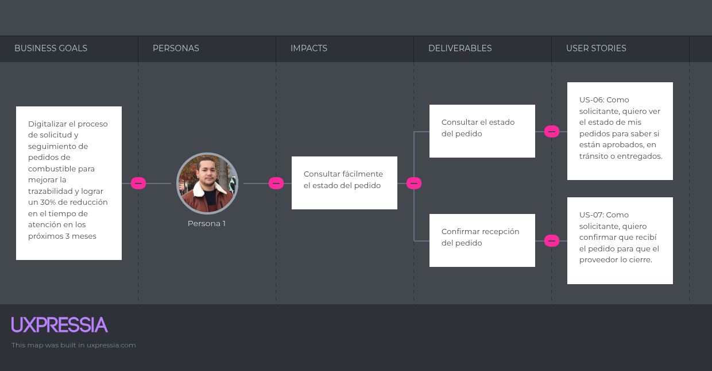

# Capítulo III: Requirements Specifications

## 3.1 User Stories

<table border>
  <thead>
    <tr>
      <th>User Story ID</th>
      <th>Título</th>
      <th>Descripción</th>
      <th>Criterios de Aceptación</th>
      <th>Epic ID</th>
    </tr>
  </thead>
  <tbody>
    <tr>
      <td>US01</td>
      <td>Ver sección Home</td>
      <td>Como visitante (proveedor), quiero ver una sección de inicio que resuma el valor de FuelTrack para comprender rápidamente el objetivo del sistema.</td>
      <td><b>Escenario 1: Visualización de resumen del sistema</b>   Dado que el visitante (proveedor) accede al sitio web, Cuando se encuentra en la sección Home, Entonces puede ver un resumen claro del sistema.  <b>Escenario 2: Acceso a call to action desde Home</b>   Dado que el visitante (proveedor) revisa la sección Home, Cuando desliza hacia abajo, Entonces encuentra un botón que lo invita a conocer más sobre FuelTrack.</td>
      <td>EP01</td>
    </tr>
    <tr>
      <td>US02</td>
      <td>Ver sección About Us</td>
      <td>Como visitante de ambos segmentos, quiero conocer quiénes están detrás de FuelTrack para confiar en el sistema.</td>
      <td><b>Escenario 1: Información visible del equipo</b>   Dado que el visitante de ambos segmentos accede a About Us, Cuando se carga la sección, Entonces puede leer una descripción del equipo detrás del sistema.  <b>Escenario 2: Ver valores o misión</b>   Dado que el visitante de ambos segmentos revisa la sección completa, Cuando llega al final del contenido, Entonces puede conocer los valores o misión de la empresa.</td>
      <td>EP01</td>
    </tr>
    <tr>
      <td>US03</td>
      <td>Ver sección How it works?</td>
      <td>Como visitante de ambos segmentos, quiero entender cómo funciona FuelTrack paso a paso para evaluar si se ajusta a mis necesidades.</td>
      <td><b>Escenario 1: Comprensión del flujo de pedidos</b>   Dado que el visitante de ambos segmentos accede a How it works?, Cuando lee la sección, Entonces entiende el flujo de pedido desde solicitud hasta entrega.  <b>Escenario 2: Interacción clara entre usuarios</b>   Dado que el visitante de ambos segmentos busca claridad, Cuando revisa la sección, Entonces puede comprender cómo interactúan solicitante y proveedor.</td>
      <td>EP01</td>
    </tr>
    <tr>
      <td>US04</td>
      <td>Enviar mensaje de contacto</td>
      <td>Como visitante de ambos segmentos, quiero enviar un mensaje desde Contact Us para solicitar más información.</td>
      <td><b>Escenario 1: Envío exitoso de mensaje</b>   Dado que el visitante de ambos segmentos completa el formulario correctamente, Cuando presiona “Enviar”, Entonces el mensaje es registrado para revisión.  <b>Escenario 2: Validación de campos obligatorios</b>   Dado que el visitante de ambos segmentos deja campos vacíos, Cuando intenta enviar el formulario, Entonces el sistema muestra una advertencia.  <b>Escenario 3: Confirmación visual del envío</b>   Dado que el visitante de ambos segmentos envía el formulario exitosamente, Cuando el mensaje es registrado, Entonces recibe una confirmación visual o notificación.</td>
      <td>EP01</td>
    </tr>
    <tr>
      <td>US05</td>
      <td>Registrar nuevo pedido</td>
      <td>Como solicitante, quiero registrar un pedido con tipo y cantidad de combustible para que el proveedor lo procese.</td>
      <td><b>Escenario 1: Registro exitoso del pedido</b>   Dado que el solicitante accede al formulario de pedidos, Cuando completa los campos requeridos, Entonces puede enviar un nuevo pedido.  <b>Escenario 2: Validación de campos</b>   Dado que el solicitante deja un campo obligatorio vacío, Cuando intenta enviar el pedido, Entonces el sistema muestra un mensaje de error.  <b>Escenario 3: Confirmación del cambio de estado</b>   Dado que el solicitante envió el pedido, Cuando el proveedor lo aprueba, Entonces su estado se actualiza automáticamente.</td>
      <td>EP02</td>
    </tr>
    <tr>
      <td>US06</td>
      <td>Consultar estado del pedido</td>
      <td>Como solicitante, quiero ver el estado de mis pedidos para saber si están aprobados, en tránsito o entregados.</td>
      <td><b>Escenario 1: Consulta de estado en el panel</b>   Dado que el solicitante accede a su panel, Cuando revisa la lista de pedidos, Entonces ve el estado actualizado.  <b>Escenario 2: Actualización dinámica de estado</b>   Dado que el solicitante está visualizando el panel de pedidos, Cuando el pedido cambia de estado, Entonces el cambio se refleja correctamente al recargar el panel.</td>
      <td>EP02</td>
    </tr>
    <tr>
      <td>US07</td>
      <td>Confirmar recepción de pedido</td>
      <td>Como solicitante, quiero confirmar que recibí el pedido para que el proveedor lo cierre.</td>
      <td><b>Escenario 1: Confirmación exitosa de recepción</b>   Dado que el solicitante recibió el pedido, Cuando lo confirma en el sistema, Entonces su estado cambia a “Despachado”.  <b>Escenario 2: Prevención de doble confirmación</b>   Dado que el solicitante ya confirmó la entrega, Cuando intenta volver a confirmar, Entonces el sistema bloquea la acción y notifica al usuario.</td>
      <td>EP02</td>
    </tr>
    <tr>
      <td>US08</td>
      <td>Registrar información de pago</td>
      <td>Como solicitante, quiero ingresar la información de los pagos correspondientes para validar el pedido ante el proveedor.</td>
      <td><b>Escenario 1: Registro exitoso de depósitos</b>   Dado que el solicitante ingresa la información de depósitos, Cuando registra el pedido, Estos quedan vinculados a él.  <b>Escenario 2: Validación del formulario de ingreso de depósitos</b>   Dado que el solicitante intenta ingresar los datos del depósito, Cuando excede el límite de caracteres, Entonces el sistema muestra un mensaje de error.  <b>Escenario 3: Validación de depósitos ya registrados</b>   Dado que el solicitante ingresa un depósito con un número de operación repetido, Cuando intenta seguir con el registro, Entonces el sistema notifica el error.</td>
      <td>EP02</td>
    </tr>
    <tr>
      <td>US09</td>
      <td>Ver historial de pedidos</td>
      <td>Como solicitante, quiero ver mis pedidos anteriores para tener control sobre mi consumo.</td>
      <td><b>Escenario 1: Visualización del historial</b>   Dado que el solicitante accede al historial, Cuando se listan los pedidos, Entonces puede ver fecha, tipo y estado de cada uno.  <b>Escenario 2: Historial vacío</b>   Dado que el solicitante aún no ha realizado pedidos, Cuando accede al historial, Entonces se muestra un mensaje informativo.  <b>Escenario 3: Acceso a detalles desde historial</b>   Dado que el solicitante ve la lista de pedidos anteriores, Cuando selecciona uno, Entonces puede revisar sus detalles.</td>
      <td>EP02</td>
    </tr>
    <tr>
      <td>US10</td>
      <td>Ver pedidos pendientes</td>
      <td>Como proveedor, quiero ver todos los pedidos pendientes para analizarlos y tomar acción.</td>
      <td><b>Escenario 1: Listado de pedidos pendientes</b>   Dado que el proveedor accede al panel, Cuando ve los pedidos pendientes, Entonces puede revisar sus detalles básicos.  <b>Escenario 2: Filtro por fechas o cliente</b>   Dado que el proveedor tiene muchos pedidos, Cuando aplica filtros por fecha o empresa, Entonces puede localizar los pedidos relevantes.</td>
      <td>EP03</td>
    </tr>
    <tr>
      <td>US11</td>
      <td>Aprobar pedido</td>
      <td>Como proveedor, quiero aprobar pedidos según los depósitos hechos a mis cuentas bancarias.</td>
      <td>
        <b>Escenario 1: Aprobación de pedido con depósitos válidos</b> 
        Dado que el proveedor tiene el pago completo del pedido, 
        Cuando intenta aprobarlo, 
        Entonces el estado cambia a “Aprobado”.  
        <b>Escenario 2: No aprobar el pedido por pago incompleto</b> 
        Dado que el proveedor no cuenta con los depósitos suficientes para completar el pago del pedido, 
        Cuando intenta aprobarlo, 
        Entonces se muestra un mensaje indicando que el pedido no fue pagado por completo.  
      </td>
      <td>EP03</td>
    </tr>
    <tr>
      <td>US12</td>
      <td>Marcar pedido como despachado</td>
      <td>Como proveedor, quiero marcar cuándo un pedido sale a entrega para notificar al cliente.</td>
      <td>
        <b>Escenario 1: Despacho exitoso de un pedido</b> 
        Dado que el proveedor tiene un pedido aprobado, 
        Cuando marca el pedido como despachado, 
        Entonces el estado cambia a “Despachado”.  
        <b>Escenario 2: Restricción de despacho sin aprobación previa</b> 
        Dado que el proveedor intenta despachar un pedido sin pasar por la liberación correspondiente, 
        Cuando ejecuta la acción, 
        Entonces el sistema impide el cambio de estado y muestra un mensaje.  
      </td>
      <td>EP03</td>
    </tr>
    <tr>
      <td>US13</td>
      <td>Cerrar pedido</td>
      <td>Como proveedor, quiero cerrar el pedido cuando el cliente confirme la entrega para finalizar el proceso.</td>
      <td>
        <b>Escenario 1: Cierre correcto del pedido tras confirmación</b> 
        Dado que el solicitante ya confirmó la entrega, 
        Cuando el proveedor cierra el pedido, 
        Entonces este no puede modificarse más.  
        <b>Escenario 2: Intento de cierre sin confirmación previa</b> 
        Dado que el proveedor intenta cerrar el pedido, 
        Cuando el solicitante aún no ha confirmado la entrega, 
        Entonces el sistema impide esta acción.  
      </td>
      <td>EP03</td>
    </tr>
    <tr>
      <td>US14</td>
      <td>Generar reporte de ventas</td>
      <td>Como proveedor, quiero generar reportes de ventas para tener registro de operaciones realizadas.</td>
      <td>
        <b>Escenario 1: Generación de reporte con datos disponibles</b> 
        Dado que el proveedor selecciona un rango de fechas válido, 
        Cuando solicita el reporte, 
        Entonces se genera un archivo con los datos de ventas.  
        <b>Escenario 2: Generación sin datos en el rango</b> 
        Dado que el proveedor selecciona un rango sin ventas, 
        Cuando solicita el reporte, 
        Entonces el sistema informa que no hay resultados.  
        <b>Escenario 3: Descarga del archivo generado</b> 
        Dado que el reporte se genera correctamente, 
        Cuando finaliza el proceso, 
        Entonces el proveedor puede descargar el archivo.  
      </td>
      <td>EP03</td>
    </tr>
    <tr>
      <td>US15</td>
      <td>Iniciar sesión</td>
      <td>Como usuario registrado, quiero iniciar sesión con correo y contraseña para acceder a mi cuenta.</td>
      <td>
        <b>Escenario 1: Inicio de sesión exitoso</b> 
        Dado que el usuario registrado ingresa credenciales válidas, 
        Cuando presiona iniciar sesión, 
        Entonces accede a su dashboard.  
        <b>Escenario 2: Error por credenciales incorrectas</b> 
        Dado que el usuario registrado ingresa datos incorrectos, 
        Cuando intenta iniciar sesión, 
        Entonces el sistema muestra un mensaje de error.  
        <b>Escenario 3: Validación de campos vacíos</b> 
        Dado que el usuario deja campos vacíos, 
        Cuando intenta iniciar sesión, 
        Entonces el sistema solicita completar los campos.  
      </td>
      <td>EP04</td>
    </tr>
    <tr>
      <td>US16</td>
      <td>Recuperar contraseña</td>
      <td>Como usuario registrado, quiero recuperar mi contraseña para volver a acceder si la olvidé.</td>
      <td>
        <b>Escenario 1: Envío de enlace de recuperación</b> 
        Dado que el usuario registrado ingresa su correo válido, 
        Cuando solicita recuperación, 
        Entonces recibe un enlace al correo.  
        <b>Escenario 2: Error por correo no registrado</b> 
        Dado que el usuario ingresa un correo inexistente, 
        Cuando solicita recuperación, 
        Entonces se le informa que el correo no está registrado.  
        <b>Escenario 3: Validación de campo vacío</b> 
        Dado que el usuario no completa el campo de correo, 
        Cuando intenta enviar la solicitud, 
        Entonces el sistema solicita completarlo.  
      </td>
      <td>EP04</td>
    </tr>
    <tr>
      <td>US17</td>
      <td>Cerrar sesión</td>
      <td>Como usuario registrado, quiero poder cerrar sesión para mantener segura mi cuenta.</td>
      <td>
        <b>Escenario 1: Cierre exitoso de sesión</b> 
        Dado que el usuario está autenticado, 
        Cuando selecciona “Cerrar sesión”, 
        Entonces la sesión se finaliza y es redirigido al login.  
        <b>Escenario 2: Confirmación de cierre de sesión</b> 
        Dado que el usuario cierra sesión, 
        Cuando termina la acción, 
        Entonces el sistema muestra un mensaje de despedida o confirmación.  
      </td>
      <td>EP04</td>
    </tr>
    <tr>
      <td>US18</td>
      <td>Ver resumen de pedidos (Solicitante)</td>
      <td>Como solicitante, quiero ver un resumen de mis pedidos para identificar cuántos están en proceso o completados.</td>
      <td>
        <b>Escenario 1: Visualización de resumen con datos disponibles</b> 
        Dado que el solicitante tiene pedidos registrados, 
        Cuando accede a su dashboard, 
        Entonces visualiza los KPIs por estado: pendientes, aprobados, despachados, finalizados y rechazados.  
        <b>Escenario 2: Sin pedidos registrados</b> 
        Dado que el solicitante no tiene pedidos, 
        Cuando accede al dashboard, 
        Entonces ve un mensaje informando “No hay pedidos registrados”.  
        <b>Escenario 3: Error al cargar datos del resumen</b> 
        Dado que el solicitante accede al dashboard, 
        Cuando ocurre un error de carga, 
        Entonces el sistema muestra un mensaje e intenta recargar los datos automáticamente.  
      </td>
      <td>EP05</td>
    </tr>
    <tr>
      <td>US19</td>
      <td>Ver resumen de pedidos (Proveedor)</td>
      <td>Como proveedor, quiero ver un resumen de pedidos gestionados y pendientes para organizar a los clientes.</td>
      <td>
        <b>Escenario 1: Visualización de KPIs con datos</b> 
        Dado que el proveedor tiene pedidos registrados, 
        Cuando accede a su dashboard, 
        Entonces ve KPIs de pedidos: pendientes, aprobados, rechazados, despachados y finalizados.  
        <b>Escenario 2: Sin datos registrados</b> 
        Dado que no hay pedidos registrados, 
        Cuando se carga el dashboard, 
        Entonces los KPIs se muestran con valor cero y un mensaje informativo.  
        <b>Escenario 3: Fallo en la carga del resumen</b> 
        Dado que el proveedor accede al dashboard, 
        Cuando hay un error de conexión, 
        Entonces se muestra una alerta con opción para reintentar.  
      </td>
      <td>EP05</td>
    </tr>
    <tr>
      <td>US20</td>
      <td>Endpoint: Login</td>
      <td>Como developer, quiero un endpoint para autenticar usuarios.</td>
      <td>
        <b>Escenario 1: Autenticación exitosa</b> 
        Dado que el developer incluye credenciales válidas en el request, 
        Cuando lo envía al endpoint de autenticación, 
        Entonces recibe un token JWT y un status 200 como respuesta.  
        <b>Escenario 2: Credenciales inválidas</b> 
        Dado que el developer incluye credenciales incorrectas en el request, 
        Cuando se procesa la solicitud, 
        Entonces se retorna status 401 con un mensaje de error.  
        <b>Escenario 3: Error interno del servidor</b> 
        Dado que el developer realiza un request y ocurre un problema en el backend, 
        Cuando se procesa la autenticación, 
        Entonces se retorna status 500 con un mensaje genérico de error.  
      </td>
      <td>EP06</td>
    </tr>
    <tr>
      <td>US21</td>
      <td>Endpoint: Recuperar contraseña</td>
      <td>Como developer, quiero un endpoint para que permita enviar correo de recuperación.</td>
      <td>
        <b>Escenario 1: Solicitud válida</b> 
        Dado que el developer envía un request con un correo que existe en la base de datos, 
        Cuando el request llega al endpoint de recuperación, 
        Entonces el sistema genera un token y envía el correo de recuperación.  
        <b>Escenario 2: Correo inexistente</b> 
        Dado que el developer envía un request con un correo no registrado, 
        Cuando se procesa la solicitud, 
        Entonces se retorna status 404 y no se envía ningún correo.  
        <b>Escenario 3: Error en el envío del correo</b> 
        Dado que el developer ejecuta la acción y ocurre un fallo en el servicio de correo, 
        Cuando se intenta enviar el mensaje, 
        Entonces se retorna status 500 y se registra el error en los logs del servidor.  
      </td>
      <td>EP06</td>
    </tr>
    <tr>
      <td>US22</td>
      <td>Endpoint: Logout</td>
      <td>Como developer, quiero un endpoint para cerrar sesión.</td>
      <td>
        <b>Escenario 1: Logout exitoso</b> 
        Dado que el developer envía un token de sesión válido, 
        Cuando llama al endpoint de logout, 
        Entonces la sesión se invalida y se retorna status 200.  
        <b>Escenario 2: Token inválido o expirado</b> 
        Dado que el developer incluye un token no válido o expirado, 
        Cuando se llama al endpoint de logout, 
        Entonces se retorna status 401 y no se realiza ninguna acción.  
        <b>Escenario 3: Falla del servidor</b> 
        Dado que el developer realiza un request y ocurre un error interno en el servidor, 
        Cuando se procesa el logout, 
        Entonces se retorna status 500 con un mensaje genérico.  
      </td>
      <td>EP06</td>
    </tr>
    <tr>
      <td>US23</td>
      <td>Endpoint: Crear pedido</td>
      <td>Como developer, quiero un endpoint para registrar un nuevo pedido de combustible.</td>
      <td>
        <b>Escenario 1: Petición con datos completos</b> 
        Dado que el developer envía una petición con todos los campos requeridos, 
        Cuando se procesa el POST, 
        Entonces se retorna status 201 con el ID del nuevo pedido.  
        <b>Escenario 2: Petición incompleta</b> 
        Dado que el developer envía una petición con campos obligatorios faltantes, 
        Cuando se procesa la solicitud, 
        Entonces se retorna status 400 con un mensaje de validación.  
      </td>
      <td>EP07</td>
    </tr>
    <tr>
      <td>US24</td>
      <td>Endpoint: Consultar pedidos por usuario</td>
      <td>Como developer, quiero un endpoint para obtener todos los pedidos de un usuario.</td>
      <td>
        <b>Escenario 1: Usuario con pedidos registrados</b> 
        Dado que el usuario tiene pedidos en el sistema, 
        Cuando se llama al endpoint, 
        Entonces retorna un array con sus pedidos y status 200.  
        <b>Escenario 2: Usuario sin pedidos</b> 
        Dado que el usuario no ha realizado pedidos, 
        Cuando se ejecuta la solicitud, 
        Entonces retorna un array vacío con status 200.  
      </td>
      <td>EP07</td>
    </tr>
    <tr>
      <td>US25</td>
      <td>Asignar vehículo a pedido</td>
      <td>Como proveedor, quiero asignar un vehículo a un pedido aprobado para organizar la logística.</td>
      <td>
        <b>Escenario 1: Asignación válida</b> 
        Dado que el proveedor tiene un pedido aprobado y un vehículo libre disponible, 
        Cuando selecciona el vehículo para asignarlo, 
        Entonces queda asignado correctamente al pedido.  
        <b>Escenario 2: Vehículo ocupado</b> 
        Dado que el proveedor intenta asignar un vehículo que ya está ocupado, 
        Cuando realiza la acción, 
        Entonces el sistema muestra un mensaje indicando que el vehículo no está disponible.  
        <b>Escenario 3: Falla durante la asignación</b> 
        Dado que el proveedor intenta asignar un vehículo y ocurre un error en el backend, 
        Cuando se ejecuta la asignación, 
        Entonces se muestra un mensaje de error y no se vincula ningún vehículo.  
      </td>
      <td>EP08</td>
    </tr>
    <tr>
      <td>US26</td>
      <td>Asignar conductor a pedido</td>
      <td>Como proveedor, quiero asignar un conductor para completar la información de despacho.</td>
      <td>
        <b>Escenario 1: Conductor disponible</b> 
        Dado que el proveedor tiene un pedido con vehículo asignado y el conductor está libre, 
        Cuando selecciona al conductor, 
        Entonces este se vincula correctamente al pedido.  
        <b>Escenario 2: Conductor ya asignado en misma franja horaria</b> 
        Dado que el conductor está asignado a otro pedido en el mismo horario, 
        Cuando se intenta asignarlo, 
        Entonces el sistema bloquea la acción y muestra un mensaje de conflicto.  
        <b>Escenario 3: Error al guardar</b> 
        Dado que el proveedor intenta guardar la asignación y ocurre una falla técnica, 
        Cuando realiza la acción, 
        Entonces se muestra un mensaje de error y no se realiza el vínculo.  
      </td>
      <td>EP08</td>
    </tr>
    <tr>
      <td>US27</td>
      <td>Validar disponibilidad de transporte</td>
      <td>Como proveedor, quiero saber qué vehículos están disponibles antes de asignarlos para vincularlos correctamente.</td>
      <td>
        <b>Escenario 1: Vehículo no disponible por superposición</b> 
        Dado que el proveedor visualiza el listado de vehículos, 
        Cuando un vehículo está asignado a otro pedido para la misma fecha y hora estimada, 
        Entonces el sistema lo muestra como no disponible.  
        <b>Escenario 2: Vehículo disponible</b> 
        Dado que el proveedor visualiza un vehículo sin conflictos de agenda, 
        Cuando se carga el listado de vehículos, 
        Entonces dicho vehículo se muestra como seleccionable.  
        <b>Escenario 3: Conflicto en tiempo real</b> 
        Dado que el proveedor intenta seleccionar un vehículo que fue asignado recientemente por otro usuario, 
        Cuando realiza la acción, 
        Entonces el sistema bloquea la selección y muestra un mensaje de actualización.  
      </td>
      <td>EP08</td>
    </tr>
    <tr>
      <td>US28</td>
      <td>Ver perfil de usuario</td>
      <td>Como usuario registrado, quiero ver mis datos de perfil para revisar mi información registrada.</td>
      <td>
        <b>Escenario 1: Visualización exitosa del perfil</b> 
        Dado que el usuario tiene sesión activa, 
        Cuando accede a su perfil, 
        Entonces ve su nombre, correo y rol.  
        <b>Escenario 2: Error en la carga de datos</b> 
        Dado que el usuario accede a su perfil y ocurre un error al obtener los datos, 
        Cuando se carga la vista, 
        Entonces se muestra un mensaje de error y se sugiere reintentar.  
        <b>Escenario 3: Restricción de datos de otros usuarios</b> 
        Dado que el usuario tiene sesión activa, 
        Cuando intenta ver otro perfil, 
        Entonces el sistema restringe el acceso y muestra su propia información.  
      </td>
      <td>EP09</td>
    </tr>
    <tr>
      <td>US29</td>
      <td>Editar datos de perfil</td>
      <td>Como usuario registrado, quiero editar mis datos para mantener mi información actualizada.</td>
      <td>
        <b>Escenario 1: Edición y guardado exitoso</b> 
        Dado que el usuario modifica uno o más campos del formulario, 
        Cuando la información ingresada es válida, 
        Entonces el sistema guarda los cambios correctamente.  
        <b>Escenario 2: Campo obligatorio vacío</b> 
        Dado que el usuario deja un campo obligatorio vacío, 
        Cuando intenta guardar, 
        Entonces el sistema muestra un mensaje de validación indicando el campo requerido.  
        <b>Escenario 3: Error del servidor al guardar</b> 
        Dado que el usuario intenta guardar y ocurre un fallo en el servidor, 
        Cuando se realiza la acción, 
        Entonces se muestra un mensaje de error y los datos ingresados permanecen visibles.  
      </td>
      <td>EP09</td>
    </tr>
    <tr>
      <td>US30</td>
      <td>Ver sección de preguntas frecuentes</td>
      <td>Como visitante de ambos segmentos, quiero acceder a una sección de preguntas frecuentes para resolver dudas rápidamente.</td>
      <td>
        <b>Escenario 1: Visualización de preguntas comunes</b> 
        Dado que el visitante accede a la sección, 
        Cuando se carga el contenido, 
        Entonces puede leer las preguntas y respuestas más frecuentes.  
        <b>Escenario 2: Organización por categorías</b> 
        Dado que el visitante accede a la sección de preguntas frecuentes con muchas entradas, 
        Cuando navega por la sección, 
        Entonces puede visualizarlas clasificadas en categorías.  
        <b>Escenario 3: Error al cargar FAQs</b> 
        Dado que el visitante accede a la sección y ocurre un fallo en la carga, 
        Cuando intenta visualizar las preguntas frecuentes, 
        Entonces se muestra un mensaje de error o un contenido informativo alternativo.  
      </td>
      <td>EP10</td>
    </tr>
    <tr>
      <td>US31</td>
      <td>Acceder a información de contacto rápido</td>
      <td>Como usuario de ambos segmentos, quiero ver datos de contacto directo (teléfono o correo) para hacer consultas urgentes.</td>
      <td>
        <strong>Escenario 1: Visualización de datos de contacto</strong> 
        Dado que el usuario accede a la sección de soporte, 
        Cuando se carga la página, 
        Entonces puede visualizar claramente el correo de soporte y número telefónico.  
        <strong>Escenario 2: Acceso al correo de cliente</strong> 
        Dado que el usuario hace clic en la dirección de correo, 
        Cuando tiene una app de correo configurada, 
        Entonces se abre automáticamente su aplicación de correo predeterminada.  
        <strong>Escenario 3: Falla en la configuración de contacto</strong> 
        Dado que el usuario accede a la página y los datos de contacto no están bien configurados, 
        Cuando se carga la sección de contacto, 
        Entonces el sistema muestra un mensaje genérico invitando a intentar más tarde.  
      </td>
      <td>EP10</td>
    </tr>
    <tr>
      <td>US32</td>
      <td>Buscar pedido por código</td>
      <td>Como usuario de ambos segmentos, quiero buscar un pedido específico por su código para encontrarlo rápidamente.</td>
      <td>
        <strong>Escenario 1: Pedido encontrado</strong> 
        Dado que el usuario escribe un código válido, 
        Cuando existe un pedido con ese código, 
        Entonces se muestra el resultado correspondiente.  
        <strong>Escenario 2: Pedido no encontrado</strong> 
        Dado que el usuario digita un código no correspondiente a ningún pedido, 
        Cuando finaliza la búsqueda, 
        Entonces el sistema muestra un mensaje de que no hay coincidencias.  
      </td>
      <td>EP11</td>
    </tr>
    <tr>
      <td>US33</td>
      <td>Filtrar pedidos por estado</td>
      <td>Como usuario de ambos segmentos, quiero filtrar mis pedidos por estado (pendiente, aprobado, entregado) para facilitar la revisión.</td>
      <td>
        <strong>Escenario 1: Aplicar filtro correctamente</strong> 
        Dado que el usuario selecciona un estado, 
        Cuando se aplica el filtro, 
        Entonces solo se muestran los pedidos con ese estado.  
        <strong>Escenario 2: No hay pedidos en ese estado</strong> 
        Dado que el usuario selecciona un estado que no tiene coincidencias, 
        Cuando ejecuta el filtro, 
        Entonces se muestra un mensaje indicando que no hay pedidos para ese estado.  
      </td>
      <td>EP11</td>
    </tr>
    <tr>
      <td>US34</td>
      <td>Recibir notificación de aprobación</td>
      <td>Como solicitante, quiero recibir una notificación cuando un pedido sea aprobado o rechazado para estar informado.</td>
      <td>
        <strong>Escenario 1: Visualización de notificación</strong> 
        Dado que el proveedor cambia el estado del pedido, 
        Cuando el solicitante inicia sesión, 
        Entonces ve una notificación del evento.  
        <strong>Escenario 2: Pedido actualizado desde otra sesión</strong> 
        Dado que el solicitante aún no ha leído la notificación, 
        Cuando actualiza la interfaz, 
        Entonces la notificación se mantiene visible hasta que sea marcada como leída.  
      </td>
      <td>EP12</td>
    </tr>
    <tr>
      <td>US35</td>
      <td>Notificación de pedido despachado</td>
      <td>Como solicitante, quiero recibir una notificación cuando un pedido haya sido despachado para estar informado.</td>
      <td>
        <strong>Escenario 1: Pedido marcado como despachado</strong> 
        Dado que el proveedor marca el pedido como despachado, 
        Cuando el solicitante consulta su cuenta, 
        Entonces puede ver la notificación correspondiente.  
        <strong>Escenario 2: Visualización posterior del evento</strong> 
        Dado que el pedido fue despachado anteriormente, 
        Cuando el solicitante accede en otro momento, 
        Entonces la notificación sigue disponible hasta ser archivada o leída.  
      </td>
      <td>EP12</td>
    </tr>
    <tr>
      <td>US36</td>
      <td>Ver listado de empresas</td>
      <td>Como proveedor, quiero ver una lista de empresas solicitantes para identificar a mis clientes frecuentes.</td>
      <td>
        <strong>Escenario 1: Visualización del listado</strong> 
        Dado que el proveedor accede al módulo de empresas, 
        Cuando se carga el listado, 
        Entonces se muestran nombre, pedidos activos y total histórico por empresa.  
        <strong>Escenario 2: Lista vacía o sin datos</strong> 
        Dado que el proveedor accede al módulo y no hay empresas registradas, 
        Cuando se carga la vista, 
        Entonces se muestra un mensaje indicando que no hay empresas disponibles.  
      </td>
      <td>EP13</td>
    </tr>
    <tr>
      <td>US37</td>
      <td>Ver detalles de empresa</td>
      <td>Como proveedor, quiero ver información detallada de una empresa solicitante para analizar su historial de pedidos.</td>
      <td>
        <strong>Escenario 1: Acceso a detalle de empresa</strong> 
        Dado que el proveedor selecciona una empresa, 
        Cuando se carga el detalle, 
        Entonces visualiza pedidos realizados, cantidades solicitadas y fechas.  
        <strong>Escenario 2: Empresa sin historial de pedidos</strong> 
        Dado que el proveedor selecciona una empresa que aún no ha realizado pedidos, 
        Cuando se accede a su perfil, 
        Entonces se muestra un mensaje indicando que no hay historial disponible.  
      </td>
      <td>EP13</td>
    </tr>
    <tr>
      <th>User Story ID</th>
      <th>Título</th>
      <th>Descripción</th>
      <th>Criterios de Aceptación</th>
      <th>Epic ID</th>
    </tr>
  </thead>
  <tbody>
    <tr>
      <td>US38</td>
      <td>Ver gráfico de consumo (Solicitante)</td>
      <td>Como solicitante, quiero ver un gráfico de mi consumo mensual para tener control sobre el uso del combustible.</td>
      <td>
        <strong>Escenario 1: Gráfico con datos disponibles</strong> 
        Dado que el solicitante ha realizado pedidos, 
        Cuando accede al módulo de reportes, 
        Entonces se visualiza un gráfico con galones consumidos por mes.  
        <strong>Escenario 2: Sin datos de consumo</strong> 
        Dado que el solicitante no ha hecho pedidos aún, 
        Cuando accede al gráfico, 
        Entonces se muestra un mensaje de que no hay datos suficientes.  
      </td>
      <td>EP14</td>
    </tr>
    <tr>
      <td>US39</td>
      <td>Ver gráfico de ventas (Proveedor)</td>
      <td>Como proveedor, quiero ver un gráfico de ventas por mes para monitorear el rendimiento del negocio.</td>
      <td>
        <strong>Escenario 1: Datos disponibles para graficar</strong> 
        Dado que el proveedor ha despachado pedidos, 
        Cuando accede al módulo de reportes, 
        Entonces se visualiza un gráfico con las ventas mensuales totales.  
        <strong>Escenario 2: Sin pedidos registrados</strong> 
        Dado que el proveedor no ha realizado ventas aún, 
        Cuando accede al gráfico, 
        Entonces se muestra un mensaje de que no hay datos suficientes.  
      </td>
      <td>EP14</td>
    </tr>
    <tr>
      <td>US40</td>
      <td>Descargar reporte PDF</td>
      <td>Como usuario de ambos segmentos, quiero descargar un resumen de pedidos o ventas en formato PDF para archivarlo o compartirlo.</td>
      <td>
        <strong>Escenario 1: Generación de PDF con datos</strong> 
        Dado que el usuario hace clic en "Descargar", 
        Cuando hay datos en el periodo seleccionado, 
        Entonces se genera un archivo PDF descargable.  
        <strong>Escenario 2: No hay datos en el periodo seleccionado</strong> 
        Dado que el usuario no tiene registros en el periodo seleccionado, 
        Cuando se solicita la descarga, 
        Entonces el sistema notifica que no hay contenido para exportar.  
        <strong>Escenario 3: Falla en la generación del PDF</strong> 
        Dado que el usuario intenta descargar el archivo y ocurre un error en el backend al generar el PDF, 
        Cuando hace clic en el botón de descargar, 
        Entonces se muestra un mensaje de error sin afectar la sesión.  
      </td>
      <td>EP14</td>
    </tr>
    <tr>
      <td>US41</td>
      <td>Ver sección Benefits</td>
      <td>Como visitante de ambos segmentos, quiero conocer las principales ventajas con las que puedo contar para evaluar la implementación de la plataforma.</td>
      <td>
        <strong>Escenario 1: Visualizar beneficios</strong> 
        Dado que el visitante de ambos segmentos accede a la sección "¿Por qué elegir Fueltrack?", 
        Cuando visualiza los múltiples beneficios, 
        Entonces puede identificar nuestra ventajas frente a nuestros competidores  
        <strong>Escenario 2: Visualizar beneficios </strong> 
        Dado que el visitante de ambos segmentos accede a la sección "¿Por qué elegir Fueltrack?", 
        Cuando observa la lista de beneficios, 
        Entonces ve como le podría beneficiar usar Fueltrack  
      </td>
      <td>EP01</td>
    </tr>
    <tr>
      <td>US42</td>
      <td>Ver sección Lo que Dicen Nuestros Clientes</td>
      <td>Como visitante de ambos segmentos, quiero conocer los testimonios de los usuarios de FuelTrack para tener confianza en la plataforma y saber que otras empresas ya la están usando.</td>
      <td>
        <strong>Escenario 1: Ver testimonios de clientes</strong> 
        Dado que el visitante de ambos segmentos está interesado en los comentarios de los clientes, 
        Cuando accede a la sección, 
        Entonces puede leer un breve testimonio sobre experiencias usando FuelTrack.  
        <strong>Escenario 2: Visualizar testimonios recientes</strong> 
        Dado que el visitante de ambos segmentos accede a la sección y esta se actualiza regularmente, 
        Cuando se carga la información, 
        Entonces visualiza las últimos testimonios que se han unido a FuelTrack.  
      </td>
      <td>EP01</td>
    </tr>
    <tr>
      <td>US43</td>
      <td>Ver sección Planes y Precios</td>
      <td>Como visitante (ambos segmentos), quiero saber que planes se adecuan a mis necesidades para poder iniciar un proceso de registro o solicitud.</td>
      <td>
        <strong>Escenario 1: Ver información sobre ser solicitante de combustible</strong> 
        Dado que el visitante entra a la sección Precios y Planes, 
        Cuando visualiza los diferentes precios y las features incluidas, 
        Entonces entiende que existe flexibilidad para adaptar Fueltrack a su empresa.  
        <strong>Escenario 2: Seleccionar un plan</strong> 
        Dado que el visitante está interesado en obtener un plan específico, 
        Cuando hace clic en el call to action, 
        Entonces es redirigido a la página de registro.  
      </td>
      <td>EP01</td>
    </tr>
    <tr>
      <td>US44</td>
      <td>Cambiar idioma</td>
      <td>Como visitante de ambos segmentos, quiero poder cambiar entre inglés y español para entender la plataforma en mi idioma preferido.</td>
      <td>
        <strong>Escenario 1: Cambiar idioma a español</strong> 
        Dado que el visitante de ambos segmentos está viendo la página en inglés, 
        Cuando selecciona la opción de español, 
        Entonces toda la interfaz de la página se muestra en español.  
        <strong>Escenario 2: Cambiar idioma a inglés</strong> 
        Dado que el visitante está viendo la página en español, 
        Cuando selecciona la opción de inglés, 
        Entonces toda la interfaz de la página se muestra en inglés.  
      </td>
      <td>EP01</td>
    </tr>
  </tbody>
</table>

## 3.2 Impact Mapping

Solicitantes:

Proveedores:

## 3.3 Product Backlog

<table border="1" cellspacing="0" cellpadding="6">
  <thead>
    <tr>
      <th>#Orden</th>
      <th>ID</th>
      <th>Título</th>
      <th>Descripción</th>
      <th>Story Points</th>
    </tr>
  </thead>
  <tbody>
    <tr>
      <td>01</td>
      <td>US-01</td>
      <td>Ver sección Home</td>
      <td>Como visitante (proveedor), quiero ver una sección de inicio que resuma el valor de FuelTrack para comprender rápidamente el objetivo del sistema</td>
      <td>3</td>
    </tr>
    <tr>
      <td>02</td>
      <td>US-02</td>
      <td>Ver sección About Us</td>
      <td>Como visitante de ambos segmentos, quiero conocer quiénes están detrás de FuelTrack para confiar en el sistema</td>
      <td>2</td>
    </tr>
    <tr>
      <td>03</td>
      <td>US-03</td>
      <td>Ver sección How it works?</td>
      <td>Como visitante de ambos segmentos, quiero entender cómo funciona FuelTrack paso a paso para evaluar si se ajusta a mis necesidades</td>
      <td>3</td>
    </tr>
    <tr>
      <td>04</td>
      <td>US-41</td>
      <td>Ver sección Main Suppliers</td>
      <td>Como visitante de ambos segmentos, quiero conocer los principales proveedores de combustible que trabajan con FuelTrack para confiar en la plataforma</td>
      <td>1</td>
    </tr>
    <tr>
      <td>05</td>
      <td>US-42</td>
      <td>Ver sección Our Clients</td>
      <td>Como visitante de ambos segmentos, quiero conocer a las empresas que utilizan FuelTrack para tener confianza en la plataforma y saber que otras empresas ya la están usando</td>
      <td>3</td>
    </tr>
    <tr>
      <td>06</td>
      <td>US-43</td>
      <td>Ver sección Are You A Fuel Requester?</td>
      <td>Como visitante (solicitante), quiero saber si cumplo con los requisitos de solicitante de combustible para poder iniciar un proceso de registro o solicitud</td>
      <td>5</td>
    </tr>
    <tr>
      <td>07</td>
      <td>US-44</td>
      <td>Cambiar idioma</td>
      <td>Como visitante de ambos segmentos, quiero poder cambiar entre inglés y español para entender la plataforma en mi idioma preferido</td>
      <td>8</td>
    </tr>
    <tr>
      <td>08</td>
      <td>US-04</td>
      <td>Enviar mensaje de contacto</td>
      <td>Como visitante de ambos segmentos, quiero enviar un mensaje desde Contact Us para solicitar más información</td>
      <td>5</td>
    </tr>
    <tr>
      <td>09</td>
      <td>US-30</td>
      <td>Ver sección de preguntas frecuentes</td>
      <td>Como visitante de ambos segmentos, quiero acceder a una sección de preguntas frecuentes para resolver dudas rápidamente</td>
      <td>3</td>
    </tr>
    <tr>
      <td>10</td>
      <td>US-31</td>
      <td>Acceder a información de contacto rápido</td>
      <td>Como usuario de ambos segmentos, quiero ver datos de contacto directo (teléfono o correo) para hacer consultas urgentes</td>
      <td>2</td>
    </tr>
    <tr>
      <td>11</td>
      <td>US-05</td>
      <td>Registrar nuevo pedido</td>
      <td>Como solicitante, quiero registrar un pedido con tipo y cantidad de combustible para que el proveedor lo procese</td>
      <td>5</td>
    </tr>
    <tr>
      <td>12</td>
      <td>US-06</td>
      <td>Consultar estado del pedido</td>
      <td>Como solicitante, quiero ver el estado de mis pedidos para saber si están aprobados, en tránsito o entregados</td>
      <td>3</td>
    </tr>
    <tr>
      <td>13</td>
      <td>US-09</td>
      <td>Ver historial de pedidos</td>
      <td>Como solicitante, quiero ver mis pedidos anteriores para tener control sobre mi consumo</td>
      <td>3</td>
    </tr>
    <tr>
      <td>14</td>
      <td>US-18</td>
      <td>Ver resumen de pedidos (Solicitante)</td>
      <td>Como solicitante, quiero ver un resumen de mis pedidos para identificar cuántos están en proceso o completados</td>
      <td>5</td>
    </tr>
    <tr>
      <td>15</td>
      <td>US-34</td>
      <td>Recibir notificación de aprobación</td>
      <td>Como solicitante, quiero recibir una notificación cuando un pedido sea aprobado o rechazado para  estar informado</td>
      <td>2</td>
    </tr>
    <tr>
      <td>16</td>
      <td>US-35</td>
      <td>Notificación de pedido despachado</td>
      <td>Como solicitante, quiero recibir una notificación cuando un pedido haya sido despachado para estar informado</td>
      <td>2</td>
    </tr>
    <tr>
      <td>17</td>
      <td>US-08</td>
      <td>Subir comprobante de pago</td>
      <td>Como solicitante, quiero subir el comprobante para validar el pedido ante el proveedor</td>
      <td>3</td>
    </tr>
    <tr>
      <td>18</td>
      <td>US-07</td>
      <td>Confirmar recepción de pedido</td>
      <td>Como solicitante, quiero confirmar que recibí el pedido para que el proveedor lo cierre</td>
      <td>2</td>
    </tr>
    <tr>
      <td>19</td>
      <td>US-10</td>
      <td>Ver pedidos pendientes</td>
      <td>Como proveedor, quiero ver todos los pedidos pendientes para analizarlos y tomar acción</td>
      <td>2</td>
    </tr>
    <tr>
      <td>20</td>
      <td>US-11</td>
      <td>Aprobar o rechazar pedido</td>
      <td>Como proveedor, quiero aceptar o rechazar pedidos según el stock disponible para evitar conflictos de distribución</td>
      <td>5</td>
    </tr>
    <tr>
      <td>21</td>
      <td>US-12</td>
      <td>Marcar pedido como despachado</td>
      <td>Como proveedor, quiero marcar cuándo un pedido sale a entrega para notificar al cliente</td>
      <td>2</td>
    </tr>
    <tr>
      <td>22</td>
      <td>US-13</td>
      <td>Cerrar pedido</td>
      <td>Como proveedor, quiero cerrar el pedido cuando el cliente confirme la entrega para finalizar el proceso</td>
      <td>3</td>
    </tr>
    <tr>
      <td>23</td>
      <td>US-25</td>
      <td>Asignar vehículo a pedido</td>
      <td>Como proveedor, quiero asignar un vehículo a un pedido aprobado para organizar la logística</td>
      <td>5</td>
    </tr>
    <tr>
      <td>24</td>
      <td>US-26</td>
      <td>Asignar conductor a pedido</td>
      <td>Como proveedor, quiero asignar un conductor para completar la información de despacho</td>
      <td>5</td>
    </tr>
    <tr>
      <td>25</td>
      <td>US-27</td>
      <td>Validar disponibilidad de transporte</td>
      <td>Como proveedor, quiero saber qué vehículos están disponibles antes de asignarlos para vincularlos correctamente</td>
      <td>8</td>
    </tr>
    <tr>
      <td>26</td>
      <td>US-19</td>
      <td>Ver resumen de pedidos (Proveedor)</td>
      <td>Como proveedor, quiero ver un resumen de pedidos gestionados y pendientes para organizar a los clientes</td>
      <td>5</td>
    </tr>
    <tr>
      <td>27</td>
      <td>US-14</td>
      <td>Generar reporte de ventas</td>
      <td>Como proveedor, quiero generar reportes de ventas para tener registro de operaciones realizadas</td>
      <td>3</td>
    </tr>
    <tr>
      <td>28</td>
      <td>US-36</td>
      <td>Ver listado de empresas</td>
      <td>Como proveedor, quiero ver una lista de empresas solicitantes para identificar a mis clientes frecuentes</td>
      <td>3</td>
    </tr>
    <tr>
      <td>29</td>
      <td>US-37</td>
      <td>Ver detalles de empresa</td>
      <td>Como proveedor, quiero ver información detallada de una empresa solicitante para analizar su historial de pedidos</td>
      <td>3</td>
    </tr>
    <tr>
      <td>30</td>
      <td>US-38</td>
      <td>Ver gráfico de consumo (Solicitante)</td>
      <td>Como solicitante, quiero ver un gráfico de mi consumo mensual para tener control sobre el uso del combustible</td>
      <td>5</td>
    </tr>
    <tr>
      <td>31</td>
      <td>US-39</td>
      <td>Ver gráfico de ventas (Proveedor)</td>
      <td>Como proveedor, quiero ver un gráfico de ventas por mes para monitorear el rendimiento del negocio</td>
      <td>5</td>
    </tr>
    <tr>
      <td>32</td>
      <td>US-40</td>
      <td>Descargar reporte PDF</td>
      <td>Como usuario de ambos segmentos, quiero descargar un resumen de pedidos o ventas en formato PDF para archivarlo o compartirlo</td>
      <td>3</td>
    </tr>
    <tr>
      <td>33</td>
      <td>US-32</td>
      <td>Buscar pedido por código</td>
      <td>Como usuario de ambos segmentos, quiero buscar un pedido específico por su código para encontrarlo rápidamente</td>
      <td>2</td>
    </tr>
    <tr>
      <td>34</td>
      <td>US-33</td>
      <td>Filtrar pedidos por estado</td>
      <td>Como usuario de ambos segmentos, quiero filtrar mis pedidos por estado (pendiente, aprobado, entregado) para facilitar la revisión</td>
      <td>2</td>
    </tr>
    <tr>
      <td>35</td>
      <td>US-28</td>
      <td>Ver perfil de usuario</td>
      <td>Como usuario registrado, quiero ver mis datos de perfil para revisar mi información registrada</td>
      <td>2</td>
    </tr>
    <tr>
      <td>36</td>
      <td>US-29</td>
      <td>Editar datos de perfil</td>
      <td>Como usuario registrado, quiero editar mis datos para mantener mi información actualizada</td>
      <td>3</td>
    </tr>
    <tr>
      <td>37</td>
      <td>US-15</td>
      <td>Iniciar sesión</td>
      <td>Como usuario registrado, quiero iniciar sesión con correo y contraseña para acceder a mi cuenta</td>
      <td>3</td>
    </tr>
    <tr>
      <td>38</td>
      <td>US-16</td>
      <td>Recuperar contraseña</td>
      <td>Como usuario registrado, quiero recuperar mi contraseña para volver a acceder si la olvidé</td>
      <td>3</td>
    </tr>
    <tr>
      <td>39</td>
      <td>US-17</td>
      <td>Cerrar sesión</td>
      <td>Como usuario registrado, quiero poder cerrar sesión para mantener segura mi cuenta</td>
      <td>1</td>
    </tr>
    <tr>
      <td>40</td>
      <td>US-20</td>
      <td>Endpoint: Login</td>
      <td>Como developer, quiero un endpoint para autenticar usuarios</td>
      <td>3</td>
    </tr>
    <tr>
      <td>41</td>
      <td>US-21</td>
      <td>Endpoint: Recuperar contraseña</td>
      <td>Como developer, quiero un endpoint para que permita enviar correo de recuperación</td>
      <td>3</td>
    </tr>
    <tr>
      <td>42</td>
      <td>US-22</td>
      <td>Endpoint: Logout</td>
      <td>Como developer, quiero un endpoint para cerrar sesión</td>
      <td>2</td>
    </tr>
    <tr>
      <td>43</td>
      <td>US-23</td>
      <td>Endpoint: Crear pedido</td>
      <td>Como developer, quiero un endpoint para registrar un nuevo pedido de combustible</td>
      <td>3</td>
    </tr>
    <tr>
      <td>44</td>
      <td>US-24</td>
      <td>Endpoint: Consultar pedidos por usuario</td>
      <td>Como developer, quiero un endpoint para obtener todos los pedidos de un usuario</td>
      <td>3</td>
    </tr>
  </tbody>
</table>
