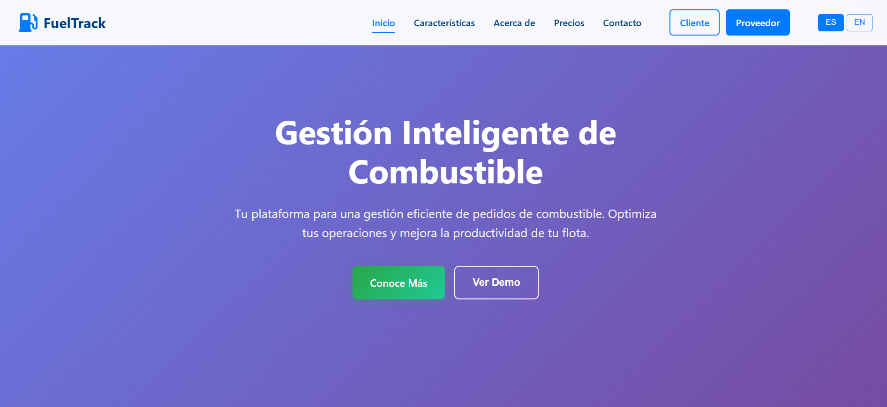
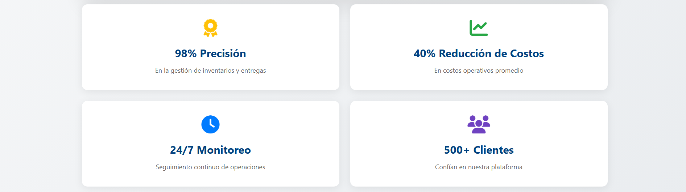

# Capítulo V: Product Implementation, Validation & Deployment

## 5.1. Software Configuration Management

### 5.1.1. Software Development Environment Configuration

### Project Management

- **WhatsApp**: Aplicación de mensajería instantánea que fue utilizada para coordinar tareas del equipo, interca,biar ideas y brindar soporte continuo durante el desarrollo del proyecto.
- **Google Meet**: Herramienta de videoconferencias de Google empleada para mantener una comunicación verbal y directa, permitiendo la planificación colaborativa de actividades y la toma de decisiones en tiempo real.
- **Microsoft 365**: Servicio en la nube que integra herramientas clásicas como Word y Excel, ofreciendo acceso desde cualquier lugar y permitiendo la colaboración en tiempo real. Permitió la supervisión continua de los avances de los miembros.

### Requirements Management

- **UXPressia**: Herramienta utilizada para la elaboración de User Personas, User Journey Maps e Impact Maps, lo que permite comprender mejor las necesidades de los usuarios y definir funcionalidades centradas en ellos.
- **Google Meet**: Aplicación de Google empleada para la toma de entrevistas a potenciales usuarios, facilitando la recopilación de información valiosa para la definición y validación de requisitos.

### Product UX/UI Design

- **Figma**: Plataforma colaborativa utilizada para el diseño de wireframes, wireflows, mockups y prototipos interactivos, garantizando una visión clara y alineada de la interfaz del producto.

### Software Development

- **Visual Studio Code**: Editor de código utilizado para la implementación de la Landing Page, gracias a sus extensiones y soporte para diversas tecnologías web.
- **Google Chrome**: Navegador utilizado para la ejecución de pruebas de visualización y funcionalidad de la landing page y el frontend, asegurando su correcto comportamiento en entornos reales.

### Software Deployment

- **Vercel**: Servicio de hosting utilizado para el despliegue de la landing page del proyecto.

### Software Documentation

- **Structurizr**: Plataforma empleada para la creación de diagramas C4, permitiendo representar visualmente la arquitectura del software en distintos niveles de abstracción.
- **GitHub**: Plataforma utilizada para la gestión de repositorios de código y documentación del proyecto, incluyendo la landing page, el frontend, el backend y los documentos técnicos, facilitando el trabajo colaborativo y el control de versiones.

### 5.1.2. Source Code Management

El proyecto utiliza GitHub como repositorio para administrar y estructurar los avances. Implementamos el flujo de trabajo **Gitflow**, siguiendo la metodología propuesta por Vincent Driessen, para mantener versiones estables y trabajo colaborativo ordenado.

**Main branch:** Rama principal donde se almacena el código de producción estable.

**Develop branch:** Rama de integración donde se fusionan las nuevas funcionalidades desarrolladas.

**Chapter branches:** Ramas creadas a partir de `develop` para seccionar los avances del proyecto por capítulo. Cada chapter se trabaja de forma aislada para evitar conflictos.

**Conventional Commits:** Estándar aplicado en los mensajes de commit para mantener un historial de cambios claro, comprensible y trazable, mejorando además la automatización de flujos de despliegue.

### 5.1.3. Source Code Style Guide & Conventions

**HTML:**

Seguimos las convenciones descritas en la guía oficial HTML Style Guide and Coding Conventions para fomentar una estructura limpia, semántica y predecible:

- Usar nombres de elementos en minúsculas.
- Cerrar todos los elementos HTML, incluso los que son opcionales.
- Usar nombres de atributos en minúsculas.
- Incluir siempre los atributos requeridos en elementos clave, especialmente en imágenes (alt) y formularios (name, id, etc.).
- Evitar líneas de código largas para mejorar la legibilidad.
- Utilizar sintaxis simplificada y estándar para hojas de estilo (link) y scripts externos (script).

**CSS:**

Aplicamos las siguientes convenciones para lograr un estilo consistente, ordenado y fácil de mantener:

- Usar minúsculas y guiones para los nombres de clases y selectores.
- Escribir un espacio después de los dos puntos y cerrar cada declaración con punto y coma.
- Agrupar reglas CSS relacionadas y separarlas con una línea en blanco para mejorar la claridad visual.
- Utilizar nombres de clases descriptivos, que reflejen la función o apariencia del elemento.
- Organizar el CSS por bloques lógicos o módulos.

**JavaScript:**

Definimos las siguientes convenciones para asegurar un código robusto, eficiente y comprensible:

- Declarar las variables al inicio del ámbito correspondiente, evitando la redeclaración innecesaria.
- Preferir el uso de const y let en lugar de var para controlar mejor el ámbito y la mutabilidad de las variables.
- Incluir comentarios descriptivos para explicar la funcionalidad de componentes, servicios, validaciones y lógica compleja.
- Mantener las funciones pequeñas y con una única responsabilidad.
- Aplicar principios de programación funcional y reactiva, así como patrones de diseño adecuados.

### 5.1.4. Software Deployment Configuration

#### Entorno de Desarrollo

Tecnologías utilizadas:
- HTML5
- CSS3
- Javascript

#### Estrategia de Deployment

- Vercel Cloud
- Repositorio principal en GitHub

Flujo Gitflow:

- main: rama principal de producción
- develop: rama de integración principal
- chapter-n*: desarrollo de los chapters sobre develop
- Pull Requests se realizan desde chapter-n hacia develop

## 5.2. Landing Page, Services & Applications Implementation.

### 5.2.1. Sprint 1

#### 5.2.1.1. Sprint Planning 1

<table border>
    <tr align="center">
        <td><strong>Sprint #</strong></td>
        <td><strong>Sprint 1</strong></td>
    </tr>
    <tr>
        <td colspan="2" align="center"><strong>Sprint Planning Background</strong></td>
    </tr>
    <tr align="center">
        <td>Date</td>
        <td>06/09/2025</td>
    </tr>
    <tr align="center">
        <td>Time</td>
        <td>11:00 AM</td>
    </tr>
    <tr align="center">
        <td>Location</td>
        <td>Meet</td>
    </tr>
    <tr align="center">
        <td>Prepared by</td>
        <td>Manuel Sanchez</td>
    </tr>
    <tr align="center">
        <td>Attendess (to planning meeting)</td>
        <td>
          Manuel Angel Sanchez Arenas - U201817507 
          Giorgio Marzouk Awad Vargas - u202324041 
          Saul Ortega Muñoz - u20231c019 
          Alberto Alejandro Ponce Perales - u202320684
        </td>
    </tr>
    <tr align="center">
        <td>Sprint 0 Review Summary</td>
        <td>No hubo sprint previo</td>
    </tr>
    <tr align="center">
        <td>Sprint 0 Retrospective Summary</td>
        <td>No hubo sprint previo</td>
    </tr>
    <tr>
        <td colspan="2" align="center"><strong>Sprint Goal & User Stories</strong></td>
    </tr>
    <tr>
        <td align="center">Sprint 1 Goal</td>
        <td>Desarrollar una landing page funcional y visualmente clara que comunique efectivamente la propuesta de valor de FuelTrack a nuestros dos segmentos clave de usuarios: proveedores de combustible y solicitantes de combustible. La página debe incluir secciones estratégicas como: 
        •	Home, con un call to action para captar proveedores interesados. 
        •	Are you a fuel requester?, con un call to action dirigido a potenciales solicitantes. 
        •	Secciones informativas como About Us y How it works?, para explicar el funcionamiento del sistema. 
        •	Secciones de validación social como Main Suppliers y Our Clients, para generar confianza mostrando empresas reales que ya usan el servicio. 
        •	Una sección de contacto directo (Contact Us) para atención inmediata. 
        •	Soporte de idioma bilingüe (español e inglés) para mayor accesibilidad.
        </td>
    </tr>
    <tr align="center">
        <td>Sprint 1 Velocity</td>
        <td>12</td>
    </tr>
    <tr align="center">
        <td>Sum of Story Point</td>
        <td>22</td>
    </tr>
</table>

#### 5.2.1.2. Aspect Leaders and Collaborators

<table border="1" cellspacing="0" cellpadding="6">
  <thead>
    <tr>
      <th>Team Member</th>
      <th>GitHub Username</th>
      <th>Landing Page</th>
      <th>Documentation</th>
    </tr>
  </thead>
  <tbody>
    <tr>
      <td>Manuel Angel Sanchez Arenas</td>
      <td>manuels7a</td>
      <td>L</td>
      <td>L</td>
    </tr>
    <tr>
      <td>Giorgio Marzouk Awad Vargas</td>
      <td>GiorgioAwad</td>
      <td>C</td>
      <td>C</td>
    </tr>
    <tr>
      <td>Saul Ortega Muñoz</td>
      <td>Ss1lent10</td>
      <td>C</td>
      <td>C</td>
    </tr>
    <tr>
      <td>Alberto Alejandro Ponce Perales</td>
      <td>aponceperales</td>
      <td>C</td>
      <td>C</td>
    </tr>
  </tbody>
</table>

#### 5.2.1.3. Sprint Backlog 1

<table border>
    <tr align="center">
        <td colspan="2"><strong>Sprint #</strong></td>
        <td colspan="6"><strong>Sprint 1</strong></td>
    </tr>
    <tr align="center">
        <td colspan="2"><strong>User Story</strong></td>
        <td colspan="6"><strong>Work-Item / Task</strong></td>
    </tr>
    <tr align="center">
        <td><strong>Id</strong></td>
        <td><strong>Title</strong></td>
        <td><strong>Id</strong></td>
        <td><strong>Title</strong></td>
        <td><strong>Description</strong></td>
        <td><strong>Estimation (Hours)</strong></td>
        <td><strong>Assigned to</strong></td>
        <td><strong>Status (To do / In process / To review / Done)</strong></td>
    </tr>
    <tr align="center">
        <td>US-01</td>
        <td>Ver sección Home</td>
        <td>W-01</td>
        <td>Sección Home</td>
        <td>Como visitante (proveedor), quiero ver una sección de inicio que resuma el valor de FuelTrack para comprender rápidamente el objetivo del sistema</td>
        <td>5 horas</td>
        <td>Manuel</td>
        <td>Done</td>
    </tr>
    <tr align="center">
        <td>US-02</td>
        <td>Ver sección About Us</td>
        <td>W-02</td>
        <td>Sección About Us</td>
        <td>Como visitante de ambos segmentos, quiero conocer quiénes están detrás de FuelTrack para confiar en el sistema</td>
        <td>4 horas</td>
        <td>Saul</td>
        <td>Done</td>
    </tr>
    <tr align="center">
        <td>US-03</td>
        <td>Ver sección How it Works?</td>
        <td>W-03</td>
        <td>Sección How it works?</td>
        <td>Como visitante de ambos segmentos, quiero entender cómo funciona FuelTrack paso a paso para evaluar si se ajusta a mis necesidades</td>
        <td>5 horas</td>
        <td>Saul</td>
        <td>Done</td>
    </tr>
    <tr align="center">
        <td>US-41</td>
        <td>Ver sección Benefits</td>
        <td>W-04</td>
        <td>Sección Beneficios</td>
        <td>Como visitante de ambos segmentos, quiero conocer las principales ventajas con las que puedo contar para evaluar la implementación de la plataforma</td>
        <td>4 horas</td>
        <td>Saul</td>
        <td>Done</td>
    </tr>
    <tr align="center">
        <td>US-42</td>
        <td>Ver sección Lo que Dicen Nuestros Clientes</td>
        <td>W-05</td>
        <td>Sección Testimonios</td>
        <td>Como visitante de ambos segmentos, quiero conocer los testimonios de los usuarios de FuelTrack para tener confianza en la plataforma y saber que otras empresas ya la están usando.</td>
        <td>6 horas</td>
        <td>Alejandro</td>
        <td>Done</td>
    </tr>
    <tr align="center">
        <td>US-04</td>
        <td>Enviar mensaje de contacto</td>
        <td>W-06</td>
        <td>Contacto</td>
        <td>Como visitante de ambos segmentos, quiero enviar un mensaje desde Contact Us para solicitar más información</td>
        <td>5 horas</td>
        <td>Alberto</td>
        <td>In Process</td>
    </tr>
    <tr align="center">
        <td>US-43</td>
        <td>Ver sección Planes y Precios</td>
        <td>W-07</td>
        <td>Sección Planes y Precios</td>
        <td>Como visitante (ambos segmentos), quiero saber que planes se adecuan a mis necesidades para poder iniciar un proceso de registro o solicitud.</td>
        <td>6 horas</td>
        <td>Manuel</td>
        <td>Done</td>
    </tr>
    <tr align="center">
        <td>US-44</td>
        <td>Cambiar idioma</td>
        <td>W-08</td>
        <td>Idioma</td>
        <td>Como visitante de ambos segmentos, quiero poder cambiar entre inglés y español para entender la plataforma en mi idioma preferido</td>
        <td>8 horas</td>
        <td>Manuel</td>
        <td>In Process</td>
    </tr>
</table>

#### 5.2.1.4. Development Evidence for Sprint Review

Durante el Sprint 1, nuestro equipo culminó la implementación de la Landing Page de Fueltrack, cumpliendo con las User Stories priorizadas. Se trabajó en la maquetación de las secciones principales, implementación de estilos CSS, diseño responsive para diferentes dispositivos y subida de los cambios al repositorio grupal. Los commits fueron realizados en la rama main, cada uno agregando una sección de la Landing Page

<table border>
  <thead>
    <tr>
      <th>Repositorio</th>
      <th>Rama</th>
      <th>ID de Commit</th>
      <th>Mensaje de Commit</th>
      <th>Descripción del Commit</th>
      <th>Fecha de Commit</th>
    </tr>
  </thead>
<tbody>
  <tr>
    <td>1ASI0729-2520-7394-Grupo4/landing-page</td>
    <td>main</td>
    <td>4258bf0</td>
    <td>docs: add html base structure and scripts for internationalization and scrolling</td>
    <td>-</td>
    <td>19/09/2025</td>
  </tr>
  <tr>
    <td>1ASI0729-2520-7394-Grupo4/landing-page</td>
    <td>main</td>
    <td>1b714ae</td>
    <td>fix: fixed about/video section, how it works section, benefits section and features section</td>
    <td>-</td>
    <td>19/09/2025</td>
  </tr>
  <tr>
    <td>1ASI0729-2520-7394-Grupo4/landing-page</td>
    <td>main</td>
    <td>6e9ef07</td>
    <td>docs: added Menu Movil, Hero Section and Stats Section with styles.css</td>
    <td>-</td>
    <td>19/09/2025</td>
  </tr>
  <tr>
    <td>1ASI0729-2520-7394-Grupo4/landing-page</td>
    <td>main</td>
    <td>5480154</td>
    <td>feat:added Testimonials section, Pricing section, Contact section and footer</td>
    <td>-</td>
    <td>19/09/2025</td>
  </tr>
</tbody>

</table>

#### 5.2.1.5. Execution Evidence for Sprint Review

En el sprint 1 se diseñó el primer modelo de la landing page. Esta cuenta con diferentes secciones para acceso de los usuarios. Algunas evidencias son:
- **Home:** Presenta de manera rápida el propósito y valor de FuelTrack para captar la atención del visitante.

- **About Us:** Explica quiénes somos y nuestra misión para generar confianza.

- **Benefits:** Explica los beneficios de implementar Fueltrack en el área logística de la empresa.

- **How it works?:** Describe de forma sencilla y visual el funcionamiento de FuelTrack paso a paso.

- **Testimonials:** Muestra algunas de las empresas o usuarios que confían en FuelTrack como referencia de credibilidad.

- **Pricing:** Propone planes y precios que puedan acomodarse a las necesidades del usuario.

- **Contact Us:** Ofrece un formulario y datos de contacto directo para resolver dudas o solicitar soporte.

#### 5.2.1.6. Services Documentation Evidence for Sprint Review

Durante el Sprint 1, el equipo se enfocó en el desarrollo del Landing Page de FuelTrack, por lo cual no se implementaron ni documentaron endpoints relacionados a Web Services. Los trabajos de desarrollo backend, integración de API y documentación con OpenAPI están planificados para Sprints posteriores.

#### 5.2.1.7. Software Deployment Evidence for Sprint Review

    <strong>Resumen:</strong> 
    El despliegue inicial de la Landing Page de FuelTrack fue realizado exitosamente utilizando Vercel.

<h4>Detalles del Despliegue:</h4>

<ul>
  <li><strong>URL de la Landing Page:</strong> <a href="https://fueltrack-open-landing.vercel.app/" target="_blank">https://fueltrack-open-landing.vercel.app/</a></li>
  <li><strong>Repositorio:</strong> <a href="https://github.com/1ASI0729-2520-7394-Grupo4/landing-page" target="_blank">https://github.com/1ASI0729-2520-7394-Grupo4/landing-page</a></li>
</ul>

<h4>Evidencia:</h4>

#### 5.2.1.8. Team Collaboration Insights during Sprint
 

    <strong>Resumen:</strong> 
    El equipo colaboró mediante GitHub y WhatsApp durante el Sprint. Las actividades principales se centraron en el desarrollo y despliegue de la Landing Page.

<h4>Evidencia de Colaboración:</h4>
<ul>
  <li>Captura de pantalla de commits en GitHub mostrando contribuciones del equipo.</li>
  <li>Conversaciones de WhatsApp sobre coordinación de secciones y ajustes de diseño.</li>
</ul>

<h4>Principales Herramientas de Comunicación:</h4>
<ul>
  <li>GitHub (control de versiones y manejo de issues)</li>
  <li>WhatsApp (comunicación diaria y aclaraciones rápidas)</li>
  <li>Google Meet (reuniones de planificación de sprint)</li>
</ul>

#### 5.2.2.4. Development Evidence for Sprint Review

Durante el Sprint 2, el equipo se centró en la implementación del frontend del sistema FuelTrack, desarrollando las principales vistas y componentes de la aplicación. Se trabajó en la estructura visual y navegación entre pantallas para dispositivos de escritorio.

El control de versiones se gestionó mediante GitHub bajo el flujo Gitflow, realizando commits y revisiones colaborativas para asegurar la calidad del código. Con esta iteración, se consolidó la base visual del sistema, lista para su integración con la capa de servicios en los próximos sprints.

<table border>
  <thead>
    <tr>
      <th>Repositorio</th>
      <th>Rama</th>
      <th>ID de Commit</th>
      <th>Mensaje de Commit</th>
      <th>Descripción del Commit</th>
      <th>Fecha de Commit</th>
    </tr>
  </thead>
<tbody>
  <tr>
    <td>1ASI0729-2520-7394-Grupo4/fueltrack-frontend</td>
    <td>develop</td>
    <td>50ad8e1</td>
    <td>feat: integration and routing added
</td>
    <td>-</td>
    <td>09/10/2025</td>
  </tr>
  <tr>
    <td>1ASI0729-2520-7394-Grupo4/fueltrack-frontend</td>
    <td>develop</td>
    <td>52a0565</td>
    <td>hotfix: changed not added to stage fixed
</td>
    <td>-</td>
    <td>09/10/2025</td>
  </tr>
  <tr>
    <td>1ASI0729-2520-7394-Grupo4/fueltrack-frontend</td>
    <td>develop</td>
    <td>62f7479</td>
    <td>feat: added login and register
</td>
    <td>-</td>
    <td>09/10/2025</td>
  </tr>
  <tr>
    <td>1ASI0729-2520-7394-Grupo4/fueltrack-frontend</td>
    <td>develop</td>
    <td>ca5ee77</td>
    <td>feat: Added notifications and providers components
</td>
    <td>-</td>
    <td>09/10/2025</td>
  </tr>
</tbody>

</table>

#### 5.2.2.5. Execution Evidence for Sprint Review

Durante el Sprint 2, el equipo completó el desarrollo del frontend funcional del sistema FuelTrack, implementando las vistas principales que conforman la interfaz de usuario. Estas vistas fueron diseñadas priorizando la usabilidad y la coherencia visual.
- **Login:** Presenta la vista de login de FuelTrack.

- **Orders:** Muestra la vista de pedidos.

- **Terminals:** Señala los terminales con sus ubicaciones y su estado.

- **Notifications:** Muestra el historial de notificaciones como por ejemplo: Error de sistema, intento de login, bajo en stock y pedido completado. 

- **Providers:** Muestra los proveedores con el tipo de combustible que brindan. Asimismo, señala información de cada proveedor, como por ejemplo: Terminal principal del Callao, actualización de documentación pendiente, contrato nuevo firmado hace un mes. 

#### 5.2.2.6. Services Documentation Evidence for Sprint Review

Durante el Sprint 2, el equipo se dedicó a realizar el front-end del proyecto, por lo cual no se implementaron endpoints ni servicios API. El trabajo se centró en la interfaz de usuario, mas no en la integración del back-end.

#### 5.2.2.7. Software Deployment Evidence for Sprint Review

    <strong>Resumen:</strong> 
    El despliegue del frontend de FuelTrack se realizó exitosamente en la plataforma Vercel, permitiendo visualizar todas las vistas implementadas durante el Sprint 2. El entorno desplegado mantiene coherencia y asegura una experiencia responsive en distintos dispositivos.

<h4>Detalles del Despliegue:</h4>

<ul>
  <li><strong>URL de la Landing Page:</strong> <a href="https://fueltrack-frontend.vercel.app/login/" target="_blank">https://fueltrack-frontend.vercel.app/login/</a></li>
  <li><strong>Repositorio:</strong> <a href="https://github.com/1ASI0729-2520-7394-Grupo4/fueltrack-frontend" target="_blank">https://github.com/1ASI0729-2520-7394-Grupo4/fueltrack-frontend</a></li>
</ul>

<h4>Evidencia:</h4>

#### 5.2.2.8. Team Collaboration Insights during Sprint
 

    <strong>Resumen:</strong> 
    El equipo colaboró mediante GitHub y WhatsApp durante el Sprint. Las actividades principales se centraron en el desarrollo y despliegue de la Landing Page.

<h4>Evidencia de Colaboración:</h4>
<ul>
  <li>Captura de pantalla de commits en GitHub mostrando contribuciones del equipo.</li>
  <li>Conversaciones de WhatsApp sobre coordinación de secciones y ajustes de diseño.</li>
</ul>

<h4>Principales Herramientas de Comunicación:</h4>
<ul>
  <li>GitHub (control de versiones y manejo de issues)</li>
  <li>WhatsApp (comunicación diaria y aclaraciones rápidas)</li>
  <li>Google Meet (reuniones de planificación de sprint)</li>
</ul>

# Conclusiones

* El proyecto FuelTrack propuso una solución práctica para mejorar la gestión de pedidos de combustible, partiendo de una comprensión real de las necesidades del mercado y los usuarios. La propuesta de valor se validó con herramientas ágiles como Lean UX, entrevistas y análisis de la competencia, lo que permitió definir un producto enfocado en resolver problemas de eficiencia y comunicación.

* Se diseñó una experiencia de usuario clara y accesible, donde la Landing Page cumple un rol clave al transmitir la oferta de manera sencilla, fomentar la conversión con llamados a la acción estratégicos y generar confianza mediante testimonios y prueba social.

* En cuanto a la plataforma, se aplicaron buenas prácticas de arquitectura de información, navegación intuitiva y guías de estilo, logrando una experiencia digital coherente y profesional. A nivel técnico, se estableció una base sólida de software y base de datos, pensada para ser escalable y fácil de mantener.

* El desarrollo se gestionó con un enfoque iterativo, lo que permitió avanzar por etapas, validar resultados y hacer mejoras continuas, asegurando que el producto final respondiera tanto a las expectativas de los usuarios como a los objetivos de negocio de FuelTrack.

# Anexos

- Landing Page Desplegada: https://fueltrack-open-landing.vercel.app/
- Landing Pages y Web App Wireframes y Mockup: https://www.figma.com/design/rHWFnnAJfePrXDqeJOd6xR/Open-Source---Landing-y-Web-App?node-id=0-1&t=cTJU9vKhzmeoOGoZ-1

# Bibliografía

 Interaction Design Foundation. (s.f.). A simple introduction to Lean UX. Recuperado de https://www.interactiondesign.org/literature/article/a-simple-introduction-to-lean-ux
 
 Baymard Institute. (s.f.). The best practices and key principles of UX design. Recuperado de
 https://baymard.com/learn/ux-design-principles
 
 Laubheimer, P. (2022, abril 10). Information architecture: Study guide. Nielsen Norman Group. Recuperado de
 https://www.nngroup.com/articles/ia-study-guide/
 
 UXPin. (2024, agosto). Design consistency guide: UI and UX best practices. Recuperado de
 https://www.uxpin.com/studio/blog/guide-design-consistency-best-practices-ui-ux-designers/
 
 CareerFoundry. (2023, enero 5). A beginner’s guide to information architecture in UX. Recuperado de
 https://careerfoundry.com/en/blog/ux-design/a-beginners-guide-to-information-architecture/
 
 Contentsquare. (2024, octubre). What is Lean UX? The 3 key phases of Lean UX design. Recuperado de
 https://contentsquare.com/guides/ux/lean/
 
 UX Design Institute. (2022, noviembre 15). What is Lean UX and why does it matter? A complete guide.
 Recuperado de https://www.uxdesigninstitute.com/blog/what-is-lean-ux/
